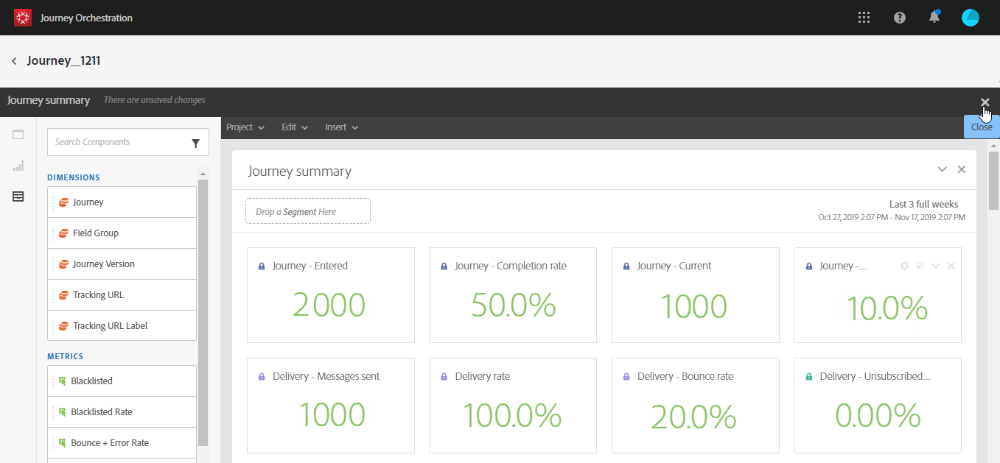

# 시작{#concept_y4b_4qt_52b}

>[!CAUTION]
>
>**Adobe Journey Optimizer를 찾고 계신가요**? [여기](https://experienceleague.adobe.com/ko/docs/journey-optimizer/using/ajo-home){target="_blank"}를 클릭하여 Journey Optimizer 설명서를 확인할 수 있습니다.
>
>
>_이 설명서는 Journey Optimizer로 대체된 이전 Journey Orchestration 자료를 참조합니다. Journey Orchestration 또는 Journey Optimizer 액세스에 대한 질문이 있는 경우 계정 팀에 문의하십시오._

[!DNL Journey Orchestration]에는 각기 특정 작업을 수행하는 두 가지 유형의 사용자가 있습니다. 그중 하나는 **기술 사용자**&#x200B;이고 다른 하나는 **비즈니스 사용자입니다**. 제품 프로필과 권한을 통해 사용자 액세스를 관리합니다. 사용자 액세스를 구성하는 방법에 대해 알아보려면 [이 페이지](../about/access-management.md)를 참조하십시오.

[!DNL Journey Orchestration]을 구성 및 사용하는 주요 단계는 다음과 같습니다.

1. **이벤트 구성**

   필요한 정보와 정보 처리 방법을 정의해야 합니다. 이 구성은 반드시 진행해야 하며, **기술 사용자**&#x200B;가 이 단계를 수행해야 합니다.

   자세한 정보는 이 [페이지](../event/about-events.md)를 참조하십시오.

   

1. **데이터 소스 구성**

   여정에 사용할 조건 등의 추가 정보를 검색하려면 시스템에 대한 연결을 정의해야 합니다. 기본 제공 Adobe Experience Platform 데이터 소스도 프로비저닝 시에 구성됩니다. 여정 내 이벤트의 데이터만 활용하는 경우에는 이 단계를 수행할 필요가 없습니다. 이 단계가 필요한 경우에는 **기술 사용자**&#x200B;가 이 단계를 수행해야 합니다.

   자세한 정보는 이 [페이지](../datasource/about-data-sources.md)를 참조하십시오.

   

1. **작업 구성**

   서드파티 시스템을 사용하여 메시지를 전송하는 경우 [!DNL Journey Orchestration]과의 연결을 구성해야 합니다. [이 페이지](../action/about-custom-action-configuration.md)를 참조하십시오.

   Adobe Campaign Standard를 사용하여 메시지를 전송하는 경우 기본 작업을 구성해야 합니다. [이 페이지](../action/working-with-adobe-campaign.md)를 참조하십시오.

   이러한 단계는 **기술 사용자**&#x200B;가 수행해야 합니다.

   

1. **여정 디자인**

   다양한 이벤트, 오케스트레이션 및 작업 활동을 조합하여 여러 단계로 구성된 크로스 채널 시나리오를 작성할 수 있습니다. 이 단계는 **비즈니스 사용자**&#x200B;가 수행해야 합니다.

   자세한 내용은 [이 페이지](../building-journeys/journey.md)를 참조하십시오.

   

1. **여정 테스트 및 게시**

   여정을 만든 후에는 유효성을 검사하고 활성화해야 합니다. 이 단계는 **비즈니스 사용자**&#x200B;가 수행해야 합니다.

   자세한 내용은 [여정 테스트](../building-journeys/testing-the-journey.md) 및 [여정 게시](../building-journeys/publishing-the-journey.md) 페이지를 참조하십시오.

   

1. **여정 모니터링**

   전용 보고 도구를 사용하여 여정의 효율성을 측정합니다. 이 단계는 **비즈니스 사용자**&#x200B;가 수행해야 합니다.

   자세한 내용은 [이 페이지](../reporting/about-journey-reports.md)를 참조하십시오.

   
