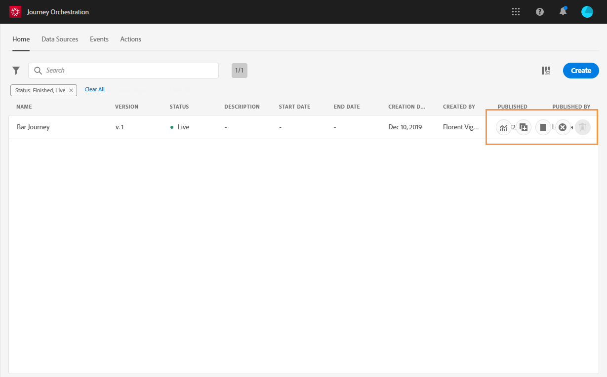

# 유저 인터페이스{#concept_rcq_lqt_52b}

>[!CONTEXTUALHELP]
>id=&quot;jo_home&quot;
>title=&quot;여정 목록&quot;
>abstract=&quot;경로 목록을 사용하면 모든 여정을 한 번에 볼 수 있으며 진행 상태를 확인하고 기본적인 작업을 수행할 수 있습니다. 여행을 복제, 중지 또는 삭제할 수 있습니다. 여정에 따라 특정 작업을 사용할 수 없을 수 있습니다. 예를 들어, 완료된 여정을 중지하거나 삭제할 수 없습니다. 검색 막대를 사용하여 여정을 검색할 수도 있습니다.&quot;
>additional-url=&quot;https://images-tv.adobe.com/mpcv3/38af62cb-9390-4bc0-a576-d336849adb97_1574809570.1920x1080at3000_h264.mp4&quot; text=&quot;데모 비디오 보기&quot;

>[!NOTE]
>
>Chrome을 인터넷 브라우저로 사용하는 것이 좋습니다.
>
>이 설명서는 제품의 최근 변경 사항을 반영하도록 자주 업데이트됩니다. 그러나 일부 스크린샷은 제품의 인터페이스와 약간 다를 수 있습니다.

## 인터페이스 살펴보기{#section_jsq_zr1_ffb}

경로 지정 오케스트레이션 인터페이스에 액세스하려면 오른쪽 상단의 **[!UICONTROL App Selector]** 아이콘을 클릭합니다. 오른쪽 **[!UICONTROL Journey Orchestration]**&#x200B;아래에서 &quot;경험 플랫폼&quot; 을 클릭합니다.

또한 **[!UICONTROL Quick access]** 섹션의 Experience Cloud 홈 페이지에서 경로 오케스트레이션에 액세스할 수 있습니다.

상단 메뉴를 사용하면 경로 관리(Journey Orchestration)의 다양한 기능을 탐색할 수 있습니다.( **[!UICONTROL Home]**&#x200B;여정),**[!UICONTROL Data Sources]**, **[!UICONTROL Events]**, **[!UICONTROL Actions]**

화면의 오른쪽 위 모서리에 있는  아이콘을 클릭하여 컨텍스트 도움말을 표시합니다. 여정 운영 목록 화면(여정, 이벤트, 작업 및 데이터 소스)에서 사용할 수 있습니다. 이를 통해 현재 기능에 대한 빠른 설명을 보고 관련 문서 및 비디오에 액세스할 수 있습니다.

## 검색 및 필터링{#section_lgm_hpz_pgb}

검색 막대를 **[!UICONTROL Home]**,**[!UICONTROL Data Sources]****[!UICONTROL Events]****[!UICONTROL Actions]** 및목록에서 항목을 검색할 수 있습니다.

목록의 왼쪽 상단에 있는 필터 아이콘을 클릭하여 액세스할 **[!UICONTROL Filters]** 수 있습니다. 필터 메뉴를 사용하면 표시된 요소를 다른 기준에 따라 필터링할 수 있습니다. 특정 유형 또는 상태의 요소, 만든 요소 또는 지난 30일 동안 수정된 요소만 표시하도록 선택할 수 있습니다.

및 **[!UICONTROL Data Sources]**&#x200B;목록에서 **[!UICONTROL Events]** 작성 필터를 **[!UICONTROL Actions]** 사용하여 **** 작성 날짜 및 사용자를 필터링합니다. 예를 들어 지난 30일 동안 만든 이벤트만 표시하도록 선택할 수 있습니다.

경로 목록(아래 **[!UICONTROL Home]**)에서 경로 **[!UICONTROL Creation filters]**&#x200B;외에, 상태 및 버전(**[!UICONTROL Status and version filters]**)에 따라 표시된 여정을 필터링할 수도 있습니다. 특정 이벤트, 필드 그룹 또는 작업(**[!UICONTROL Activity filters]** 및 **[!UICONTROL Data filters]**)을 사용하는 여행만 표시하도록 선택할 수도 있습니다. **[!UICONTROL Publication filters]** 게시 날짜 또는 사용자를 선택할 수 있습니다. 예를 들어, 어제 게시된 최신 버전의 라이브 여행만 표시하도록 선택할 수 있습니다. 을 참조하십시오.

>[!NOTE]
>
>표시된 열은 목록 오른쪽 상단의 구성 단추를 사용하여 개인화할 수 있습니다. 개인화는 각 사용자에 대해 저장됩니다.

및 **[!UICONTROL Last update]** **[!UICONTROL Last update by]** 열을 사용하면 여행의 마지막 업데이트가 언제 발생했고 어떤 사용자가 작업을 수행했는지 표시할 수 있습니다.

이벤트, 데이터 소스 및 작업 구성 창에서는 해당 특정 이벤트, 필드 그룹 또는 작업을 사용하는 여정 수를 **[!UICONTROL Used in]** 필드에 표시합니다. 단추를 클릭하여 해당 여정의 목록을 표시할 수 **[!UICONTROL View journeys]** 있습니다.

다른 목록에서 각 요소에 대해 기본 작업을 수행할 수 있습니다. 예를 들어 항목을 복제하거나 삭제할 수 있습니다.

## XDM 필드 이름 표시{#friendly-names-display}

XDM 필드 이름은 [이벤트 페이로드를](../event/defining-the-payload-fields.md)정의하고 [표현식 편집기에서](../datasource/field-groups.md) 필드를 선택할 때 필드 이름 및 표시 이름 아래에 스키마에서 정의됩니다 .
필드를 선택하면 해당 기술 이름과 필드 이름이 표시됩니다.

표시 이름을 대체할 친숙한 이름을 정의하기 위해 스키마를 설정할 때 &quot;xdm:alternateDisplayInfo&quot;와 같은 설명자를 제공할 수 있습니다. 또한 스키마 필드의 &quot;title&quot; 및 &quot;description&quot; 값을 수정할 수도 있습니다.

친숙한 이름을 사용할 수 있으면 필드가 로 표시됩니다 `<friendly-name>(<name>)`. 친숙한 이름을 사용할 수 없는 경우 표시 이름이 표시됩니다(예: `<display-name>(<name>)`). 정의된 이름이 없으면 필드의 기술 이름만 표시됩니다 `<name>`.

API 호출을 통해 친숙한 이름 설명자를 구성할 수 있습니다. 자세한 내용은 스키마 레지스트리 [개발자 안내서를](https://www.adobe.io/apis/experienceplatform/home/xdm/xdmservices.html#!api-specification/markdown/narrative/technical_overview/schema_registry/schema_registry_developer_guide.md)참조하십시오.

>[!NOTE]
>
>스키마 결합에서 필드를 선택하면 친숙한 이름이 검색되지 않습니다.

## 다양한 단축키 사용{#section_ksq_zr1_ffb}

다음은 고객 여정 오케스트레이션 인터페이스에서 사용할 수 있는 다른 단축키입니다.

_경로, 작업, 데이터 소스 또는 이벤트 목록에서 다음을 수행합니다._

* c **를** 눌러 새로운 여정, 작업, 데이터 소스 또는 이벤트를 만듭니다.

_여정에서 활동을 구성할 때:_

캔버스가 자동으로 저장됩니다. 캔버스 왼쪽 상단에 저장 상태가 표시됩니다.

* Esc **를** 눌러 구성 창을 닫고 변경 내용을 취소합니다. 이것은 **[!UICONTROL Cancel]** 단추와 같습니다.
* 창 외부를 **[!UICONTROL Enter]** 누르거나 클릭하여 구성 창을 닫습니다. 변경 사항이 저장됩니다. 이것은 **[!UICONTROL Ok]** 단추와 같습니다.
* 스페이스 바를 **[!UICONTROL Delete]** 누르거나 **백스페이스**&#x200B;공간을 **[!UICONTROL Enter]** 누르면을 눌러 삭제를 확인할 수 있습니다.

_팝업:_

* Esc **키를 눌러** 닫습니다(취소 **버튼과 동일한** ).
* 을 **[!UICONTROL Enter]** 눌러 저장하거나 확인( **[!UICONTROL Ok]** 또는 **[!UICONTROL Save]** 버튼과 동일)합니다.

_이벤트에서 데이터 소스 또는 작업 구성 창:_

* 저장하지 않고 **escape** 키를 눌러 구성 창을 닫습니다.
* 을 눌러 수정 내용을 **[!UICONTROL Enter]** 저장하고 구성 창을 닫습니다.
* 구성할 다른 필드 사이를 이동하려면 **Tab** 키를 누릅니다.

_간단한 표현식 편집기_

* 왼쪽에 있는 필드를 두 번 클릭하여 쿼리를 추가합니다(드래그 앤 드롭에 해당합니다).

_XDM 필드를 검색할 때:_

* &quot;node&quot;를 선택하면 노드의 모든 필드가 선택됩니다.

_모든 텍스트 영역에서:_

* Ctrl/ **Command + A** 키 조합을 사용하여 텍스트를 선택합니다. 페이로드 미리 보기에서 페이로드를 선택합니다.

_검색 막대가 있는 화면에서:_

* Ctrl/ **Command + F** 키 조합을 사용하여 검색 막대를 선택합니다.

_여정의 캔버스에서:_

* Ctrl/ **Command + A** 키 조합을 사용하여 모든 활동을 선택합니다.
* 하나 이상의 활동을 선택한 경우 **[!UICONTROL Delete]** 또는 **백스페이스** 기능을 눌러 삭제합니다. 그런 다음 을 눌러 확인 팝업에서 **[!UICONTROL Enter]** 확인할 수 있습니다.
* 왼쪽 팔레트에서 활동을 두 번 클릭하여 사용 가능한 첫 번째 위치(위쪽에서 아래쪽으로)에 추가합니다.
