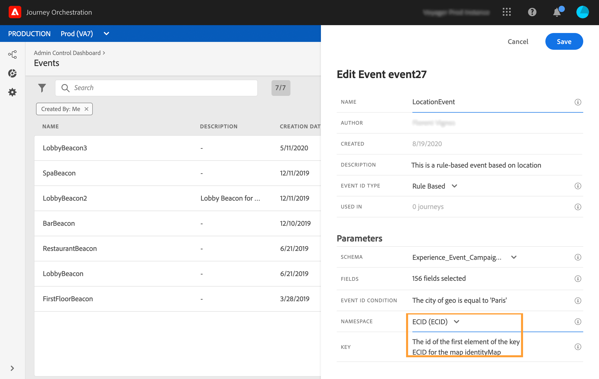

# 규칙 기반 이벤트{#simplified-events}

경험 이벤트를 설정하는 방법을 간소화했습니다. eventID를 사용할 필요가 없는 새 메서드가 도입되었습니다. 이제 Journey Orchestration에서 이벤트를 설정할 때 규칙 기반 이벤트를 정의할 수 있습니다.

이 새로운 유형의 이벤트는 eventID를 생성하지 않습니다. 간단한 표현식 편집기를 사용하면 시스템에서 사용자의 여정을 트리거할 관련 이벤트를 식별하는 데 사용할 규칙을 간단하게 정의할 수 있습니다. 이 규칙은 이벤트 페이로드에서 사용할 수 있는 필드(예: 프로필의 위치 또는 프로필 장바구니에 추가된 항목 수)를 기반으로 할 수 있습니다.

이 새 방법은 대부분 사용자에게 투명하게 표시됩니다. 이벤트 정의 화면의 새 필드만 변경됩니다.

>[!CAUTION]
>
>매핑 규칙은 규칙 기반 이벤트에 대해 정의됩니다. 이 보고서는 한 여정에서 처리할 수 있는 적격한 이벤트 수를 분당 400k로 제한합니다. 자세한 내용은 알파 프로그램 연락처에 문의하십시오.

## Adobe Analytics 데이터 활용{#analytics-data}

>[!NOTE]
>
>이 섹션은 Adobe Analytics 데이터를 사용해야 하는 고객에게만 적용됩니다.

이미 플랫폼에 스트리밍하고 있는 모든 Adobe Analytics 행동 이벤트 데이터를 활용하여 고객 여정 및 경험을 자동화할 수 있습니다.

이를 수행하려면 Adobe Experience Platform에서 활용할 보고서 세트를 활성화해야 합니다.

1. Adobe Experience Platform에서 Adobe Analytics 섹션 **[!UICONTROL Sources]** 에서 **[!UICONTROL Add data]** 을 선택합니다. 사용 가능한 Adobe Analytics 보고서 세트 목록이 표시됩니다.

1. 활성화할 보고서 세트를 선택하고 을 클릭한 **[!UICONTROL Next]** 다음 을 클릭합니다 **[!UICONTROL Finish]**.

1. 소스 데이터 ID를 알파 프로그램 연락처와 공유합니다.

이렇게 하면 해당 보고서 세트에 대한 Analytics 소스 커넥터가 활성화됩니다. 데이터가 들어올 때마다 경험 이벤트로 전환되고 Adobe Experience Platform으로 전송됩니다.

Adobe Analytics 소스 커넥터에 대한 자세한 내용은 [설명서](https://docs.adobe.com/help/en/experience-platform/sources/connectors/adobe-applications/analytics.html) 및 [자습서를 참조하십시오](https://docs.adobe.com/content/help/en/experience-platform/sources/ui-tutorials/create/adobe-applications/analytics.html).

## 규칙 기반 이벤트 구성{#configuring-rule-based}

1. 왼쪽 메뉴에서 **[!UICONTROL Admin]** 아이콘을 클릭한 다음 을 클릭합니다 **[!UICONTROL Events]**. 그러면 이벤트 목록이 표시됩니다.

   

1. 새 이벤트를 만들려면 **[!UICONTROL Add]**&#x200B;를 클릭합니다. 그러면 화면 오른쪽에 이벤트 구성 창이 열립니다.

   

1. 이벤트 이름을 입력합니다. 설명을 추가할 수도 있습니다.

   

1. In the new **[!UICONTROL Event ID type]** field, select **[!UICONTROL Rule Based]**.

   

   >[!NOTE]
   >
   >유형은 eventID가 필요한 기존 메서드입니다 **[!UICONTROL System Generated]** . [이 섹션](../event/about-events.md)을 참조하십시오.

1. 페이로드를 **[!UICONTROL Schema]** 정의합니다 **[!UICONTROL Fields]**. [이 섹션](../event/defining-the-payload-fields.md)을 참조하십시오.

   

   >[!NOTE]
   >
   >이 옵션을 선택하면 eventID 유형 mixin **[!UICONTROL System Generated type]**&#x200B;이 있는 스키마만 사용할 수 있습니다. 유형을 선택하면 모든 **[!UICONTROL Rule Based]** 경험 이벤트 스키마를 사용할 수 있습니다.

1. 필드 내부를 **[!UICONTROL Event ID condition]** 클릭합니다. 간단한 표현식 편집기를 사용하여, 시스템이 여정을 트리거할 이벤트를 식별하는 데 사용할 조건을 정의합니다.

   

   우리의 예에서, 우리는 프로필의 도시를 근거로 조건들을 작성했습니다. 즉, 시스템이 이 조건(필드 및 값)과 일치하는 이벤트를 받을 때마다&#x200B;**[!UICONTROL City]** Journey Orchestration에 **[!UICONTROL Paris]** 전달됩니다.

1. 및 **[!UICONTROL Namespace]** 을 정의합니다 **[!UICONTROL Key]**. 네임스페이스 [선택](../event/selecting-the-namespace.md) 및 이벤트 키 [정의를 참조하십시오](../event/defining-the-event-key.md).

   

이벤트 구성 및 경로 생성에 대한 다른 단계는 변경되지 않습니다.

이제 이벤트가 구성되고 다른 이벤트와 마찬가지로 여정으로 이동할 준비가 되었습니다. 규칙과 일치하는 이벤트가 시스템에 전송될 때마다 Journey Orchestration으로 전달되어 사용자의 여행을 트리거합니다.

## 규칙 기반 이벤트에 대한 테스트 모드{#test-rule-based}

규칙 기반 이벤트를 사용하는 여정에 대해서도 테스트 모드를 사용할 수 있습니다.

이벤트를 트리거할 때 **이벤트 구성** 화면에서 테스트에 전달할 이벤트 매개 변수를 정의할 수 있습니다. 오른쪽 상단 모서리의 도구 설명 아이콘을 클릭하여 이벤트 ID 조건을 볼 수 있습니다. 규칙 평가의 일부인 각 필드 옆에는 도구 설명이 있습니다.

테스트 모드 사용 방법에 대한 자세한 내용은 [이 페이지를 참조하십시오](../building-journeys/testing-the-journey.md).
