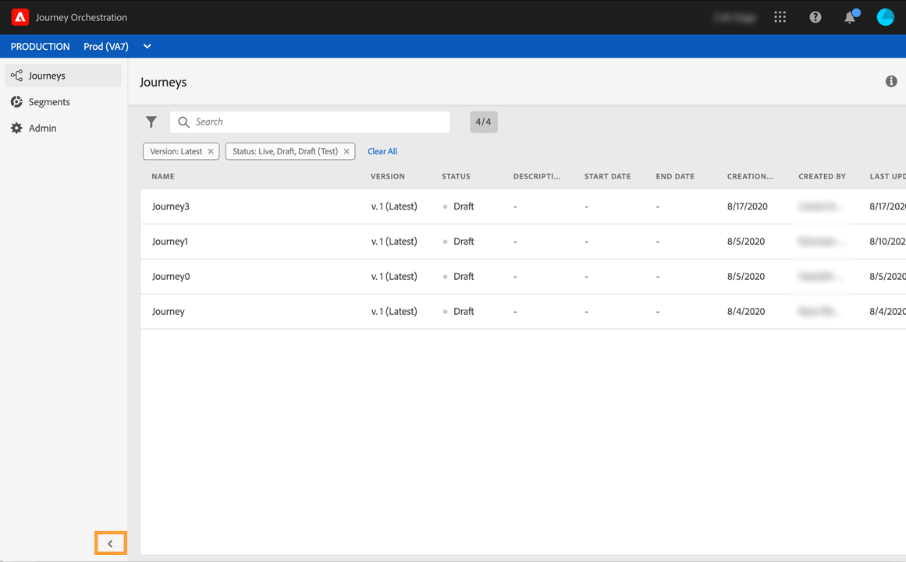

# 알파 버전 인터페이스 {#discovering-alpha-interface} 검색

## 알파 버전 인터페이스 {#about-alpha-interface} 정보

Adobe Experience Platform과 일관된 인터페이스를 제공하기 위해 [!DNL Journey Orchestration] 메뉴 내의 탐색이 개선되었습니다. 변경 사항은 다음과 같습니다.

* 메뉴가 인터페이스 맨 위에서 왼쪽으로 이동되었습니다,
* 관리 기능을 하나의 대시보드로 그룹화하였습니다.

인터페이스(검색 및 필터링, Adobe Experience Platform 필드 검색, 바로 가기)에서 사용 및 탐색 방법에 대한 글로벌 개념이 [이 섹션](../about/user-interface.md)에 표시됩니다.

## [!DNL Journey Orchestration] 기능에 액세스하는 중 {#accessing-journey-orchestration-functionalities}

왼쪽에 있는 메뉴 모음에서 다른 기능에 액세스할 수 있습니다. 아이콘을 클릭하여 해당 메뉴에 액세스합니다. 왼쪽 하단에 있는 화살표를 클릭하여 메뉴 막대를 확장하거나 축소할 수 있습니다.

[!DNL Journey Orchestration]에 액세스하면 **[!UICONTROL Journeys]** 메뉴가 표시되므로 기존 여정에 액세스하거나 새 여행을 만들 수 있습니다. [경로 디자이너 사용](../building-journeys/using-the-journey-designer.md)을 참조하십시오.

**[!UICONTROL Segments]** 메뉴를 사용하여 Adobe Experience Platform 세그먼트에 액세스하고 만들 수 있습니다. [Adobe Experience Platform 세그먼트 정보](../segment/about-segments.md)를 참조하십시오.

**[!UICONTROL Admin]** 메뉴는 관리자 권한이 있는 모든 사용자가 사용할 수 있습니다( [액세스 관리](../about/access-management.md) 참조). 이 대시보드에는 [데이터 소스](../datasource/about-data-sources.md), [events](../event/about-events.md) 및 [액션](../action/action.md)을 설정할 수 있는 대시보드가 제공됩니다.

