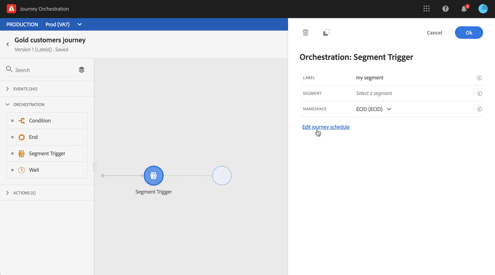

# 세그먼트 트리거 활동 {#segment-trigger-activity}

## 세그먼트 트리거 활동 정보 {#about-segment-trigger-actvitiy}

>[!NOTE]
>
>게시 시 또는 테스트 모드 활성화 시간에 캔버스에 기본적으로 제공되는 Adobe Campaign Standard 동작 활동이 있는 경우, 여행은 초당 13개의 입구에서 제한됩니다.  게시 시 또는 테스트 모드 활성화 시간에 캔버스에 즉시 사용 가능한 Adobe Campaign Standard 작업 활동이 없으면 여정이 초당 1,000개의 이벤트에서 재생 속도를 제한합니다.

세그먼트 트리거 활동을 사용하면 Adobe Experience Platform 세그먼트에 속하는 모든 개인이 여정을 시작할 수 있습니다. 여행 입구는 한 번 또는 정기적으로 실행될 수 있습니다.

Adobe Experience Platform에 골드 고객 세그먼트가 있다고 합시다. 세그먼트 트리거 활동을 사용하면 Gold 고객 세그먼트에 속한 모든 개인이 여정을 시작하고 모든 경로 기능을 활용할 수 있는 개인화된 여정으로 이동할 수 있습니다. 조건, 타이머, 이벤트, 작업.

## 활동 구성 {#configuring-segment-trigger-activity}

>[!NOTE]
>
>세그먼트 내보내기 대기 시간 때문에 1시간보다 짧은 기간에 세그먼트 기반 이동을 트리거할 수 없습니다.

1. 카테고리 **[!UICONTROL Orchestration]** 를 펼쳐서 캔버스에 **[!UICONTROL Segment Trigger]** 활동을 놓습니다.

   활동을 경로의 첫 번째 단계로 배치해야 합니다.

1. 활동을 구성합니다 **[!UICONTROL Scheduler type]**.

   기본적으로 세그먼트는 여정 **[!UICONTROL As soon as possible]**&#x200B;에 입장합니다. 즉, 여정이 게시된 후 1시간이 됩니다. 세그먼트가 특정 날짜/시간 또는 반복적인 기준으로 여정을 입력하도록 하려면 목록에서 원하는 옵션을 선택합니다.

   반복되는 여정의 경우 여정의 시작과 끝을 정의할 수도 있습니다.

   

1. 필드에서 **[!UICONTROL Segment]** 여정에 입력할 Adobe Experience Platform 세그먼트를 선택한 다음 을 클릭합니다 **[!UICONTROL Save]**.

   

1. 필드에서 **[!UICONTROL Namespace]** 개인을 식별하기 위해 사용할 네임스페이스를 선택합니다. For more on namespaces, refer to [this section](../event/selecting-the-namespace.md).

   >[!NOTE]
   >
   >다른 ID 사이에 선택된 ID(네임스페이스)가 없는 세그먼트에 속하는 개인은 해당 여정에 입장할 수 없습니다.

1. 을 **[!UICONTROL Ok]** 클릭하여 확인합니다. 그런 다음 사용 가능한 활동을 활용하여 고객 여정을 구축할 수 있습니다.

1. 여정이 준비되면 잠재적으로 테스트할 수 있습니다(여정 [테스트 참조](../building-journeys/testing-the-journey.md)).

   활동으로 시작하는 여정에서 테스트 모드를 활성화하면 선택한 세그먼트에 자격이 있는 프로필 중에서 100개의 테스트 프로필이 무작위로 선택됩니다. **[!UICONTROL Segment Trigger]** 테스트 로그를 사용하면 여정에서 개인 경로 및 발생할 수 있는 오류를 볼 수 있습니다(로그 [보기 참조](../building-journeys/testing-the-journey.md#viewing_logs)).

   >[!NOTE]
   >
   >군대 여정에 존재하는 시각적인 흐름 기능을 사용하면 100명의 사용자가 여행을 따라가는 것을 볼 수 없습니다.

1. 그런 다음 여정을 게시할 수 있습니다(경로 [게시 참조](../building-journeys/publishing-the-journey.md)). 세그먼트에 속하는 개인은 세그먼트 트리거 활동 스케줄러에서 지정한 날짜/시간에 대한 여정을 시작합니다.

   >[!IMPORTANT]
   >
   >Adobe Experience Platform 세그먼트는 하루에 한 번(**일괄** 세그먼트) 또는 실시간(**스트리밍된** 세그먼트)으로 계산된다는 점을 명심하십시오.
   >
   >선택한 세그먼트가 스트리밍되는 경우, 이 세그먼트에 속한 개인이 잠재적으로 실시간으로 해당 여정에 참여할 수 있습니다. 세그먼트가 배치인 경우, 이 세그먼트에 새로 자격을 갖춘 사람은 Adobe Experience Platform에서 세그먼트 계산이 실행될 때 여정에 잠재적으로 참여할 수 있습니다.
