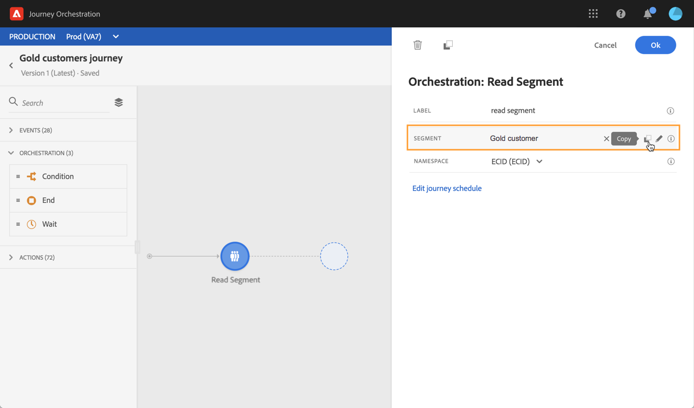

# 세그먼트 활동 읽기 {#segment-trigger-activity}

## 세그먼트 읽기 활동 정보 {#about-segment-trigger-actvitiy}

>[!NOTE]
>
>게시 시 또는 테스트 모드 활성화 시간에 캔버스에 기본적으로 제공되는 Adobe Campaign Standard 동작 활동이 있는 경우, 여행은 초당 13개의 입구에서 제한됩니다. 그렇지 않으면 여정은 초당 1000개의 이벤트로 조절됩니다.

세그먼트 읽기 활동을 사용하면 Adobe Experience Platform 세그먼트에 속하는 모든 개인이 여정을 시작하도록 할 수 있습니다. 여정의 시작은 한 번 또는 정기적으로 실행될 수 있습니다.

Adobe Experience Platform에 골드 고객 세그먼트가 있다고 합시다. 세그먼트 읽기 활동을 사용하면 골드 고객 세그먼트에 속한 모든 개인이 여정을 시작하고 모든 경로 기능을 활용할 수 있는 개인화된 여정으로 이동할 수 있습니다.조건, 타이머, 이벤트, 작업.

## 활동 구성 {#configuring-segment-trigger-activity}

>[!NOTE]
>
>세그먼트 내보내기 대기 시간 때문에 1시간보다 짧은 기간에 세그먼트 기반 이동을 트리거할 수 없습니다.

1. 카테고리 **[!UICONTROL Orchestration]** 를 펼쳐서 캔버스에 **[!UICONTROL Read Segment]** 활동을 놓습니다.

   활동을 경로의 첫 번째 단계로 배치해야 합니다.

1. 활동 **[!UICONTROL Label]** 에 을 추가합니다(선택 사항).

1. 필드에서 **[!UICONTROL Segment]** 여정에 입력할 Adobe Experience Platform 세그먼트를 선택한 다음 을 클릭합니다 **[!UICONTROL Save]**.

   >[!NOTE]
   >
   >목록에 표시된 열을 사용자 정의하고 정렬할 수 있습니다.

   

   세그먼트가 추가되면 이 **[!UICONTROL Copy]** 단추를 사용하여 이름과 ID를 복사할 수 있습니다.

   `{"name":"Gold customers,”id":"8597c5dc-70e3-4b05-8fb9-7e938f5c07a3"}`

   

1. 필드에서 **[!UICONTROL Namespace]** 개인을 식별하기 위해 사용할 네임스페이스를 선택합니다. For more on namespaces, refer to [this section](../event/selecting-the-namespace.md).

   >[!NOTE]
   >
   >다른 ID 사이에 선택된 ID(네임스페이스)가 없는 세그먼트에 속하는 개인은 여정에 입장할 수 없습니다.

1. 이 **[!UICONTROL Read Segment]** 활동을 통해 세그먼트가 여정에 들어갈 시간을 지정할 수 있습니다. 이렇게 하려면 링크를 클릭하여 경로 속성에 액세스한 다음 **[!UICONTROL Edit journey schedule]** **[!UICONTROL Scheduler type]** 필드를 구성합니다.

   

   기본적으로 세그먼트는 여정을 **[!UICONTROL As soon as possible]**&#x200B;입력합니다. 즉, 여정을 게시한 후 1시간이 됩니다. 세그먼트가 특정 날짜/시간 또는 반복 기준으로 여정을 입력하도록 하려면 목록에서 원하는 값을 선택합니다.

   >[!NOTE]
   >
   >캔버스에 활동이 **[!UICONTROL Schedule]** 드롭된 경우에만 섹션을 사용할 수 **[!UICONTROL Read Segment]** 있습니다.

   

## 고객 여정 테스트 및 게시 {#testing-publishing}

이 **[!UICONTROL Read Segment]** 활동을 통해 단일 프로필 또는 세그먼트에 자격이 있는 프로필 중에서 선택한 100개의 무작위로 테스트 프로필에서 여정을 테스트할 수 있습니다.

이렇게 하려면 테스트 모드를 활성화한 다음 왼쪽 창에서 원하는 옵션을 선택합니다.

그런 다음 테스트 모드를 평소대로 구성하고 실행할 수 있습니다. 여정을 테스트하는 방법에 대한 자세한 단계는 [이 섹션에 나와 있습니다](../building-journeys/testing-the-journey.md).

테스트가 실행되면 선택한 테스트 옵션에 따라 테스트 결과를 볼 수 있는 **[!UICONTROL Show logs]** 단추가 표시됩니다.

* **[!UICONTROL Single profile at a time]**:테스트 로그는 단일 테스트 모드를 사용할 때와 동일한 정보를 표시합니다. 이 작업에 대한 자세한 정보는 [이 섹션](../building-journeys/testing-the-journey.md#viewing_logs)을 참조하십시오

* **[!UICONTROL Up to 100 profiles at once]**:테스트 로그를 사용하면 Adobe Experience Platform에서 세그먼트 내보내기의 진행 상태를 추적할 수 있을 뿐만 아니라 여정에 참여한 모든 사람의 개별 진행 상태를 추적할 수 있습니다.

   한 번에 최대 100개의 프로파일을 사용하여 여정을 테스트해도 시각적인 흐름을 사용하여 고객 여정의 개별 진행 상황을 추적할 수 없습니다.

   

테스트가 성공하면 여정을 게시할 수 있습니다(경로 [게시 참조](../building-journeys/publishing-the-journey.md)). 세그먼트에 속하는 개인은 여정의 속성 **[!UICONTROL Scheduler]** 섹션에 지정된 날짜/시간에 대한 여정에 들어갑니다.

>[!NOTE]
>
>재귀적이지 않은(가능한 한 빨리 또는 &quot;한 번&quot;) 세그먼트 기반 경로의 새 버전을 수행할 때 이전에 여정에 입력한 모든 사람이 새 버전을 게시할 때 다시 입력하지 않습니다. 재입력할 수 있도록 허용하려면 이동을 복제해야 합니다.
