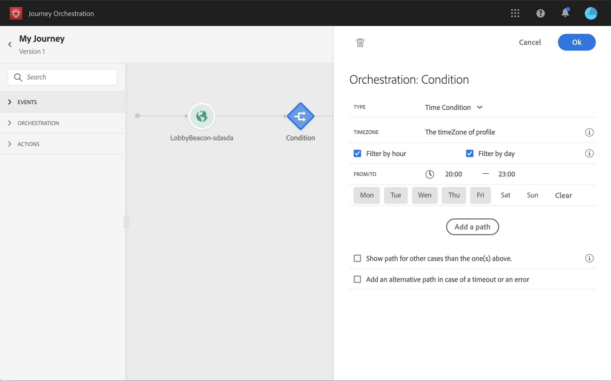

# 조건 활동{#section_e2n_pft_dgb}

4가지 유형의 조건을 사용할 수 있습니다.

* [데이터 소스 조건](#data_source_condition)
* [시간 조건](#time_condition)
* [비율 분할](#percentage_split)
* [날짜 조건](#date_condition)

## 조건 활동 정보 {#about_condition}

여러 조건을 정의하려면 **[!UICONTROL Add a path]**클릭합니다. 각 조건에 대해 활동 후 캔버스에 새 경로가 추가됩니다.

여행 디자인은 기능적으로 영향을 미칩니다. 조건 뒤에 몇 개의 경로가 정의되면 첫 번째 적격한 경로만 실행됩니다. 즉, 경로의 우선 순위를 서로 위나 아래에 배치하여 변경할 수 있습니다. 예를 들어, 첫 번째 경로의 조건이 &quot;The person is a VIP&quot;이고 두 번째 경로의 조건은 &quot;The person is a male&quot;인 경우 두 조건을 모두 충족하는 사람(VIP인 남성)이 이 이 단계를 통과하면 첫 번째 경로가 &quot;위&quot;이기 때문에 두 번째 경로에도 자격 조건을 갖추더라도 첫 번째 경로가 선택됩니다. 이 우선 순위를 변경하려면 다른 세로 순서로 활동을 이동합니다.

을 선택하여 정의된 조건에 해당되지 않는 대상에 대해 다른 경로를 만들 수 **[!UICONTROL Show path for other cases than the one(s) above]**있습니다. 분할 조건에서는 이 옵션을 사용할 수 없습니다. 비율[분할을](#percentage_split)참조하십시오.

단순 모드에서는 필드 조합을 기반으로 간단한 쿼리를 수행할 수 있습니다. 사용 가능한 모든 필드가 화면 왼쪽에 표시됩니다. 필드를 주 영역으로 드래그하여 놓습니다. 서로 다른 요소를 결합하려면 다른 그룹 및/또는 그룹 수준을 만들기 위해 요소를 서로 잠급니다. 그런 다음 논리 연산자를 선택하여 동일한 수준에 있는 요소를 결합할 수 있습니다.

* AND:두 기준의 교차. 모든 기준과 일치하는 요소만 고려됩니다.
* 또는:두 기준의 결합. 두 기준 중 하나 이상에 맞는 요소가 고려됩니다.

>[!NOTE]
>
>단순 편집기를 사용하여 시간 시리즈(예: 구매 목록, 메시지 클릭 수)에 대한 쿼리를 수행할 수 없습니다. 이 경우 고급 편집기를 사용해야 합니다. 을 참조하십시오.

## 데이터 소스 조건 {#data_source_condition}

이렇게 하면 데이터 소스의 필드 또는 이전에 여정에 배치된 이벤트를 기반으로 조건을 정의할 수 있습니다. 표현식 편집기를 사용하는 방법에 대해 알아보려면 를 참조하십시오 . 고급 표현식 편집기를 사용하여 컬렉션을 조작하거나 매개 변수를 전달해야 하는 데이터 소스를 사용하는 고급 조건을 설정할 수 있습니다. 을 참조하십시오.

## 시간 조건{#time_condition}

이렇게 하면 하루 중 시간 및/또는 요일에 따라 다른 작업을 수행할 수 있습니다. 예를 들어 주중에는 낮 동안 SMS 메시지를 전송하고, 주중에는 밤에 이메일을 보내도록 결정할 수 있습니다. 이 조건에 대한 특정 시간대를 정의할 수 있습니다. 을 참조하십시오.

## 비율 분할 {#percentage_split}

이 옵션을 사용하면 대상을 임의로 분할하여 각 그룹에 대해 다른 작업을 정의할 수 있습니다. 각 경로에 대한 분할 수와 다시 분할 영역을 정의합니다. 시스템은 이 여정의 활동에서 얼마나 많은 사람들이 이동할지 예측할 수 없기 때문에, 분할 계산은 통계적이다. 그 결과 분할의 오차 여백이 매우 낮습니다. 이 함수는 Java 임의 메커니즘을 기반으로 합니다(이 [페이지](https://docs.oracle.com/javase/7/docs/api/java/util/Random.html)참조).

>[!NOTE]
>
>비율 분할 조건에 경로를 추가할 단추가 없습니다. 경로 수는 분할 수에 따라 달라집니다. 분할 조건에서는 다른 사례에 대한 경로를 추가할 수 없으므로 추가할 수 없습니다. 사람들은 언제나 분열된 길로 갈 것이다.

## 날짜 조건 {#date_condition}

날짜를 기준으로 다른 흐름을 정의할 수 있습니다. 예를 들어, 사용자가 &quot;판매&quot; 기간 동안 단계를 입력하는 경우 특정 메시지를 보냅니다. 남은 1년 동안 다른 메시지를 보내시면 됩니다. 날짜 조건을 정의할 때는 시간대를 지정해야 합니다. 을 참조하십시오.

