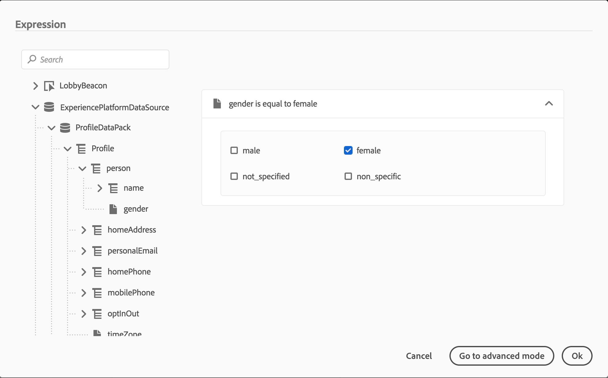

# 조건 활동{#section_e2n_pft_dgb}

네 가지 유형의 조건을 사용할 수 있습니다.

* [데이터 소스 조건](#data_source_condition)
* [시간 조건](#time_condition)
* [백분율 분할](#percentage_split)
* [날짜 조건](#date_condition)

## 조건 활동 정보 {#about_condition}

여정에서 여러 조건을 사용할 때 각 조건에 대한 레이블을 정의하여 보다 쉽게 식별할 수 있습니다.

클릭 **[!UICONTROL Add a path]** 여러 조건을 정의하려면 각 조건에 대해 활동 뒤에 캔버스에 새 경로가 추가됩니다.

여정 디자인은 기능에 영향을 줍니다. 조건 후에 여러 경로가 정의되면 첫 번째 적합한 경로만 실행됩니다. 즉, 경로의 우선 순위를 서로 위 또는 아래에 배치하여 변경할 수 있습니다.

예를 들어 첫 번째 경로의 조건 &quot;The person is a VIP&quot; 및 두 번째 경로의 조건 &quot;The person is a male&quot;을 예로 들어 보겠습니다. 두 조건을 모두 충족하는 사람(VIP인 남성)이 이 단계를 통과하면 첫 번째 경로가 &quot;위&quot;이므로 두 번째 경로에도 자격이 있어도 첫 번째 경로가 선택됩니다. 이 우선 순위를 변경하려면 활동을 다른 세로 순서로 이동합니다.

정의한 조건에 적합하지 않은 대상에 대해 다음을 확인하여 다른 경로를 만들 수 있습니다 **[!UICONTROL Show path for other cases than the one(s) above]**. 이 옵션은 분할 조건에서는 사용할 수 없습니다. 자세한 내용은 [백분율 분할](#percentage_split).

단순 모드에서는 필드 조합을 기반으로 간단한 쿼리를 수행할 수 있습니다. 사용 가능한 모든 필드가 화면 왼쪽에 표시됩니다. 필드를 기본 영역으로 끌어다 놓습니다. 다른 요소를 결합하려면 서로 인터로크하여 다른 그룹 및/또는 그룹 수준을 만듭니다. 그런 다음 논리 연산자를 선택하여 동일한 수준에서 요소를 결합할 수 있습니다.

* 및: 두 가지 기준의 교집합. 모든 기준과 일치하는 요소만 고려합니다.
* 또는: 두 가지 기준의 결합. 두 기준 중 하나 이상에 일치하는 요소를 고려합니다.

를 사용 중이라면 [Adobe Experience Platform 세그멘테이션 서비스](https://experienceleague.adobe.com/docs/experience-platform/segmentation/home.html) 세그먼트를 만들기 위해 여정 조건에서 세그먼트를 활용할 수 있습니다. 을(를) 참조하십시오. [조건에서 세그먼트 사용](../segment/using-a-segment.md).

>[!NOTE]
>
>단순 편집기를 사용하여 시계열(예: 구매 목록, 메시지 클릭 과거)에 대한 쿼리를 수행할 수 없습니다. 이를 위해서는 고급 편집기를 사용해야 합니다. [이 페이지](../expression/expressionadvanced.md)를 참조하십시오.

작업 또는 조건에 오류가 발생하면 개별 여정이 중지됩니다. 이 작업을 계속 진행할 수 있는 유일한 방법은 **[!UICONTROL Add an alternative path in case of a timeout or an error]** 상자를 선택하는 것입니다 . [이 섹션](../building-journeys/using-the-journey-designer.md#paths)을 참조하십시오.

단순 편집기에서 여정 속성 카테고리가 이벤트 및 데이터 소스 카테고리 아래에 있습니다. 이 카테고리에는 해당 프로필의 여정과 관련된 기술 필드가 포함되어 있습니다. 여정 ID 또는 발생한 특정 오류와 같은 라이브 여정 시스템에서 검색한 정보입니다. 자세한 내용은 [이 페이지](../expression/journey-properties.md)

## 데이터 소스 조건 {#data_source_condition}

데이터 소스의 필드 또는 이전에 여정에 배치된 이벤트를 기반으로 조건을 정의할 수 있습니다. 표현식 편집기를 사용하는 방법에 대해 알아보려면 [이 페이지](../expression/expressionadvanced.md). 고급 표현식 편집기를 사용하면 컬렉션을 조작하거나 매개 변수를 전달해야 하는 데이터 소스를 사용하는 더 고급 조건을 설정할 수 있습니다. [이 페이지](../datasource/external-data-sources.md)를 참조하십시오.

## 시간 조건{#time_condition}

이렇게 하면 요일 및/또는 요일에 따라 다른 작업을 수행할 수 있습니다. 예를 들어, 주중에는 낮에 SMS 메시지를 보내고, 주중에는 밤에 이메일을 보내도록 결정할 수 있습니다.

>[!NOTE]
>
>시간대는 더 이상 조건에 한정되지 않으며 이제 여정 속성의 여정 수준에서 정의됩니다. [이 페이지](../building-journeys/timezone-management.md)를 참조하십시오.

## 백분율 분할 {#percentage_split}

이 옵션을 사용하면 대상을 임의로 분할하여 각 그룹에 대해 다른 작업을 정의할 수 있습니다. 각 경로에 대해 분할 수 및 재분할 수를 정의합니다. 시스템에서 여정의 이 활동에서 유입되는 사람 수를 예상할 수 없으므로 분할 계산은 통계적입니다. 그 결과, 분할에는 오류 마진이 매우 낮습니다. 이 함수는 Java 무작위 메커니즘을 기반으로 합니다(다음 참조) [페이지](https://docs.oracle.com/javase/7/docs/api/java/util/Random.html)).

테스트 모드에서 분할에 도달하면 위쪽 분기가 항상 선택됩니다. 테스트에서 다른 경로를 선택하도록 하려면 분할 분기의 위치를 재구성할 수 있습니다. [이 페이지](../building-journeys/testing-the-journey.md)를 참조하십시오

>[!NOTE]
>
>백분율 분할 조건에 경로를 추가할 버튼이 없습니다. 경로 수는 분할의 수에 따라 달라집니다. 분할 조건에서는 다른 사례에 대한 경로를 추가할 수 없으므로 이 경로를 추가할 수 없습니다. 사람들은 항상 갈려 가는 길 중 하나를 택할 것이다.

## 날짜 조건 {#date_condition}

날짜를 기준으로 다른 흐름을 정의할 수 있습니다. 예를 들어 사용자가 &quot;판매&quot; 기간 동안 단계를 입력하는 경우 특정 메시지를 보내게 됩니다. 남은 기간 동안 다른 메시지를 보내드리겠습니다.

>[!NOTE]
>
>시간대는 더 이상 조건에 한정되지 않으며 이제 여정 속성의 여정 수준에서 정의됩니다. [이 페이지](../building-journeys/timezone-management.md)를 참조하십시오.

<!--
## Profile cap {#profile_cap}

Use this condition type to set a maximum number of profiles for a journey path. When this limit is reached, the selected profiles take a second path.

You can use this condition type to ramp up the volume of your deliveries. For example, you might have recently moved to another email service provider, IP address, or email domain or subdomain. Using this feature, you can establish your reputation as a sender and avoid that your deliveries be blocked or moved to the spam folder of the recipients' mailbox. Learn how to increase your email reputation with IP warming in the [Deliverability Best Practice Guide](https://experienceleague.adobe.com/docs/deliverability-learn/deliverability-best-practice-guide/additional-resources/generic-resources/increase-reputation-with-ip-warming.html){target="_blank"}.

The default cap is 1000. You must set an integer value that is greater than or equal to 1.

The counter applies only to the selected journey version. By default, the counter is reset to zero after 180 days. After a reset, the selected profiles take the first path again until the counter limit is reached. You can gradually increase this limit up to the total number of your subscribers. After your IP has warmed up, you can remove this condition.

The first path always has priority over the second path, even if you move the second path above the first path on the journey canvas.

-->