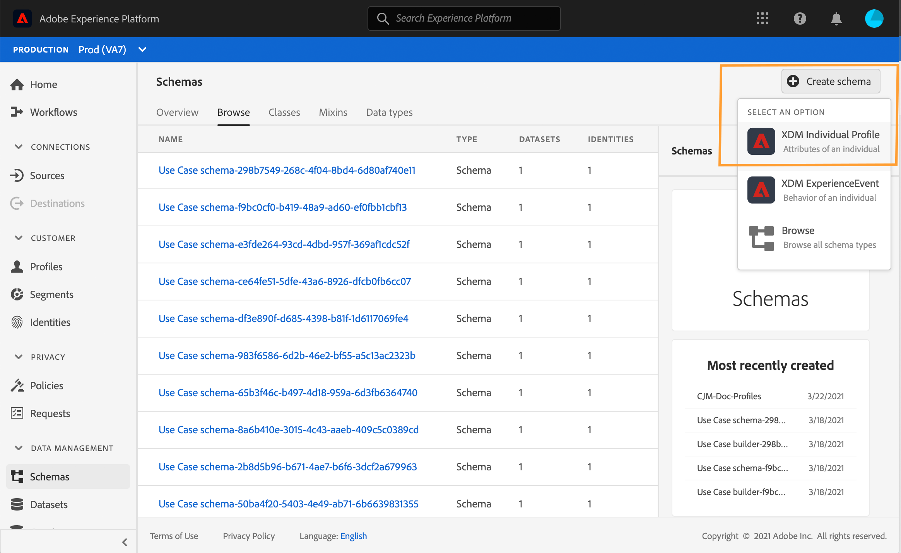
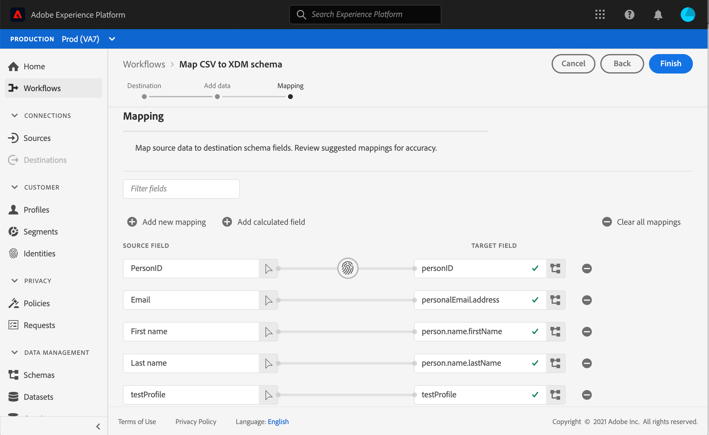

# 테스트 프로필 만들기 {#create-test-profiles}

여정에서 테스트 모드를 사용할 때는 테스트 프로필이 필요합니다. 테스트 모드 사용 방법에 대해 알아보려면 [이 섹션](../building-journeys/testing-the-journey.md).

Adobe Experience Platform에서 테스트 프로필을 만드는 방법은 다릅니다. 이 설명서에서는 다음 두 가지 방법에 중점을 둡니다. 업로드 [csv 파일](../building-journeys/creating-test-profiles.md#create-test-profiles-csv) 및 [API 호출](../building-journeys/creating-test-profiles.md#create-test-profiles-api). 데이터 세트에 JSON 파일을 업로드할 수도 있습니다. 자세한 내용은 [데이터 수집 설명서](https://experienceleague.adobe.com/docs/experience-platform/ingestion/tutorials/ingest-batch-data.html#add-data-to-dataset).

이러한 가져오기 방법을 사용하여 프로필 속성을 업데이트할 수도 있습니다. 이렇게 하면 기존 프로필을 테스트 프로필로 전환할 수 있습니다. 유사한 파일 또는 API 호출을 사용하고 &quot;true&quot; 값이 있는 &quot;testProfile&quot; 필드만 포함하면 됩니다.

테스트 프로필을 만드는 것은 Adobe Experience Platform에서 일반 프로필을 만드는 것과 비슷합니다. 자세한 내용은 [실시간 고객 프로필 설명서](https://experienceleague.adobe.com/docs/experience-platform/profile/home.html?lang=ko).

## 전제 조건{#test-profile-prerequisites}

프로필을 만들려면 먼저 Adobe Experience Platform에서 스키마와 데이터 세트를 만들어야 합니다.

먼저 다음을 수행해야 합니다 **스키마 만들기**. 다음 단계를 수행합니다.

1. Adobe Experience Platform에서 **[!UICONTROL Schemas]**를 입력합니다.
   
1. 클릭 **[!UICONTROL Create schema]**&#x200B;오른쪽 상단에서 스키마 유형을 선택합니다. 예를 들면 다음과 같습니다 **[!UICONTROL XDM Individual Profile]**.
   
1. 스키마 이름을 선택합니다.
1. 에서 **[!UICONTROL Mixins]** 섹션을 클릭합니다. **[!UICONTROL Add]**.
   
1. 적절한 mixin을 선택합니다. 를 추가해야 합니다. **[!UICONTROL Profile test details]** 믹신 **[!UICONTROL Add mixin]**을(를) 클릭합니다.
   
mixin 목록이 스키마 개요 화면에 표시됩니다.

   
1. 필드 목록에서 기본 ID로 정의할 필드를 클릭합니다.
   
1. 에서 **[!UICONTROL Field properties]** 오른쪽 패널에서 **[!UICONTROL Identity]** 및 **[!UICONTROL Primary Identity]** 옵션을 선택하고 네임스페이스를 선택합니다. 기본 ID를 이메일 주소로 지정하려면 **[!UICONTROL Email]** 네임스페이스. **[!UICONTROL Apply]**을(를) 클릭합니다.
   
1. 스키마를 선택하고 를 활성화합니다 **[!UICONTROL Profile]** 옵션 **[!UICONTROL Schema properties]**.
   
1. **[!UICONTROL Save]**&#x200B;을(를) 클릭합니다.

>[!NOTE]
>
>스키마 만들기에 대한 자세한 내용은 [XDM 설명서](https://experienceleague.adobe.com/docs/experience-platform/xdm/ui/resources/schemas.html#prerequisites).

그러면 다음 작업을 수행해야 합니다 **데이터 세트 만들기** 가져올 프로필 다음 단계를 수행합니다.

1. Adobe Experience Platform에서 **[!UICONTROL Datasets]**&#x200B;를 클릭한 다음 왼쪽 메뉴에서 **[!UICONTROL Create dataset]**.
   
1. 선택 **[!UICONTROL Create dataset from schema]**.
   
1. 앞에서 만든 스키마를 선택하고 **[!UICONTROL Next]**.
   
1. 이름을 선택한 다음 **[!UICONTROL Finish]**.
   
1. 를 활성화합니다 **[!UICONTROL Profile]** 선택 사항입니다.
   

>[!NOTE]
>
> 데이터 집합 만들기에 대한 자세한 내용은 [카탈로그 서비스 설명서](https://experienceleague.adobe.com/docs/experience-platform/catalog/datasets/user-guide.html#getting-started).

## csv 파일을 사용하여 테스트 프로필 만들기{#create-test-profiles-csv}

Adobe Experience Platform에서 다른 프로필 필드가 포함된 csv 파일을 데이터 세트에 업로드하여 프로필을 만들 수 있습니다. 이것이 가장 쉬운 방법입니다.

1. 스프레드시트 소프트웨어를 사용하여 간단한 csv 파일을 만듭니다.
1. 필요한 필드마다 열을 하나씩 추가합니다. 기본 ID 필드(&quot;personID&quot; 위의 예에서 )와 &quot;testProfile&quot; 필드를 &quot;true&quot;로 설정해야 합니다.
   
1. 프로필당 한 줄을 추가하고 각 필드의 값을 입력합니다.
   
1. 스프레드시트를 csv 파일로 저장합니다. 쉼표가 구분 기호로 사용되는지 확인하십시오.
1. Adobe Experience Platform에서 **[!UICONTROL Workflows]**를 입력합니다.
   
1. 선택 **[!UICONTROL Map CSV to XDM schema]**&#x200B;를 클릭한 다음 **[!UICONTROL Launch]**.
   
1. 프로필을 가져올 데이터 세트를 선택합니다. **[!UICONTROL Next]**을(를) 클릭합니다.
   
1. 클릭 **[!UICONTROL Choose files]** csv 파일을 선택합니다. 파일을 업로드하면 **[!UICONTROL Next]**.
   
1. 소스 csv 필드를 스키마 필드에 매핑한 다음 를 클릭합니다 **[!UICONTROL Finish]**.
   
1. 데이터 가져오기가 시작됩니다. 상태가 **[!UICONTROL Processing]** to **[!UICONTROL Success]**. 클릭 **[!UICONTROL Preview data set]**를 입력합니다.
   
1. 테스트 프로필이 올바르게 추가되었는지 확인합니다.
   

테스트 프로필이 추가되었으며 이제 여정을 테스트할 때 사용할 수 있습니다. [이 섹션](../building-journeys/testing-the-journey.md)을 참조하십시오.
>[!NOTE]
>
> csv 가져오기에 대한 자세한 내용은 [데이터 수집 설명서](https://experienceleague.adobe.com/docs/experience-platform/ingestion/tutorials/map-a-csv-file.html#tutorials).

## API 호출을 사용하여 테스트 프로필 만들기{#create-test-profiles-api}

API 호출을 통해 테스트 프로필을 만들 수도 있습니다. 이 [페이지](https://experienceleague.adobe.com/docs/experience-platform/profile/home.html)를 참조하십시오.

프로필 테스트 세부 사항 mixin이 포함된 프로필 스키마를 사용해야 합니다. testProfile 플래그는 이 mixin의 일부입니다.

프로필을 만들 때 값을 전달해야 합니다. testProfile = true.

기존 프로필을 업데이트하여 testProfile 플래그를 &quot;true&quot;로 변경할 수도 있습니다.

다음은 테스트 프로필을 만들기 위한 API 호출의 예입니다.

```
curl -X POST \
'https://dcs.adobedc.net/collection/xxxxxxxxxxxxxx' \
-H 'Cache-Control: no-cache' \
-H 'Content-Type: application/json' \
-H 'Postman-Token: xxxxx' \
-H 'cache-control: no-cache' \
-H 'x-api-key: xxxxx' \
-H 'x-gw-ims-org-id: xxxxx' \
-d '{
"header": {
"msgType": "xdmEntityCreate",
"msgId": "xxxxx",
"msgVersion": "xxxxx",
"xactionid":"xxxxx",
"datasetId": "xxxxx",
"imsOrgId": "xxxxx",
"source": {
"name": "Postman"
},
"schemaRef": {
"id": "https://example.adobe.com/mobile/schemas/xxxxx",
"contentType": "application/vnd.adobe.xed-full+json;version=1"
}
},
"body": {
"xdmMeta": {
"schemaRef": {
"contentType": "application/vnd.adobe.xed-full+json;version=1"
}
},
"xdmEntity": {
"_id": "xxxxx",
"_mobile":{
"ECID": "xxxxx"
},
"testProfile":true
}
}
}'
```
