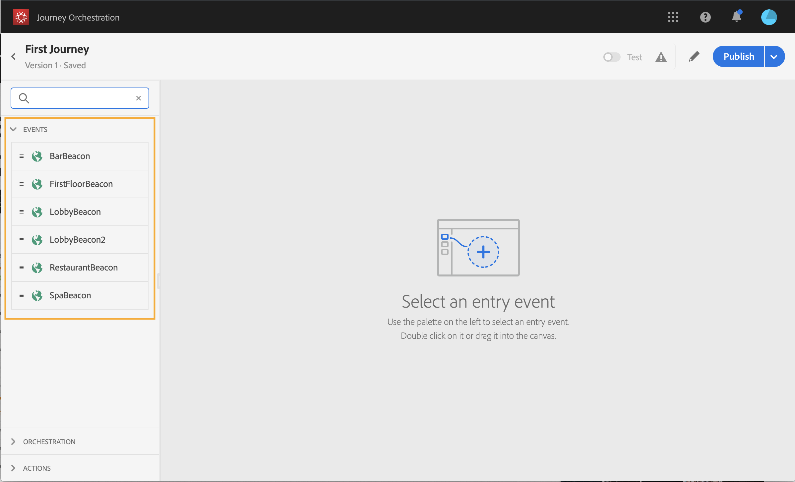
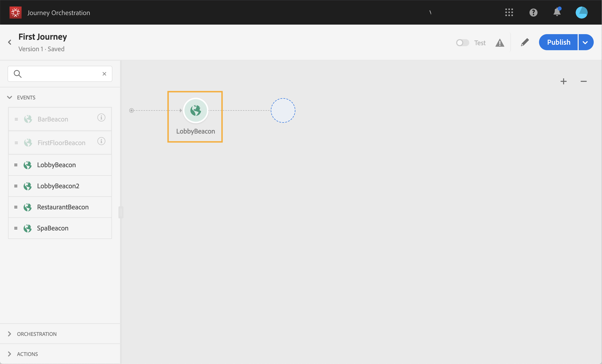

# 이벤트 활동 정보 {#concept_rws_1rt_52b}

기술 사용자가 구성한 이벤트( [이 페이지](../event/about-events.md)참조)는 모두 화면의 왼쪽에 있는 팔레트의 첫 번째 범주에 표시됩니다.

항상 이벤트 활동을 드래그 앤 드롭하여 이동을 시작합니다. 두 번 클릭할 수도 있습니다.

캔버스에서 이벤트 활동을 클릭하면 활동 구성 창이 표시됩니다. 기본적으로 동일한 이벤트를 여러 번 사용하면 캔버스의 이벤트 이름에 증분되는 번호가 추가됩니다. 또한 이 **[!UICONTROL Label]** 필드를 사용하여 캔버스의 활동 아래에 표시되는 이벤트 이름에 접미사를 추가할 수 있습니다. 이는 캔버스에서 이벤트를 식별하는 데 유용합니다. 특히 동일한 이벤트를 여러 번 사용하는 경우 유용합니다. 또한 오류 발생 시 보다 쉽게 디버깅할 수 있으며 보고서를 보다 쉽게 읽을 수 있습니다.

## 특정 시간 동안 이벤트 의견 수렴

여정에 배치된 이벤트 활동은 무한정 이벤트를 수신합니다. 특정 시간 동안에만 이벤트를 수신하려면 이벤트에 대한 제한 시간을 구성해야 합니다.

그러면 여정은 시간 초과에 지정된 시간 동안 이벤트를 수신하게 됩니다. 해당 기간 동안 이벤트가 수신되면 해당 사람은 이벤트 경로로 이동합니다. 그렇지 않으면 고객은 시간 제한 경로로 전환되거나 자신의 여정을 종료합니다.

이벤트에 대한 제한 시간을 구성하려면 다음 단계를 따르십시오.

1. 이벤트 속성에서 **[!UICONTROL Enable the event timeout]** 옵션을 활성화합니다.

1. 여정이 이벤트를 기다리는 시간을 지정합니다.

1. 지정된 시간 제한 내에 이벤트를 수신하지 못할 때 개인을 시간 제한 경로로 보내려면 **[!UICONTROL Set the timeout path]** 옵션을 활성화합니다. 이 옵션을 사용하지 않으면 시간 제한에 도달하면 개별 사용자에 대해 여행이 종료됩니다.

   

이 예에서는 고객에게 첫 번째 환영 푸시를 보냅니다. 그 다음 날 안으로 손님께서 식당에 들어오실 때만 식사 할인 푸시를 보내드립니다. 따라서 1일 제한 시간으로 레스토랑 이벤트를 구성했습니다.

* 레스토랑 이벤트가 환영 푸시 후 1시간이 채 되지 않는 경우, 식사 할인 푸시 활동이 전송됩니다.
* 다음 날 이내에 받은 레스토랑 이벤트가 없으면 이 사람은 시간 초과 경로를 통과합니다.

활동 후에 배치된 여러 이벤트에 대한 시간 초과를 구성하려면 이러한 이벤트 중 하나에 대해서만 시간 초과를 구성해야 **[!UICONTROL Wait]** 합니다.

시간 초과는 활동 후에 지정된 모든 이벤트에 **[!UICONTROL Wait]** 적용됩니다. 지정된 시간 제한 후 이벤트가 수신되지 않으면 개인은 하나의 시간 제한 경로로 전환되거나 이동을 끝냅니다.

