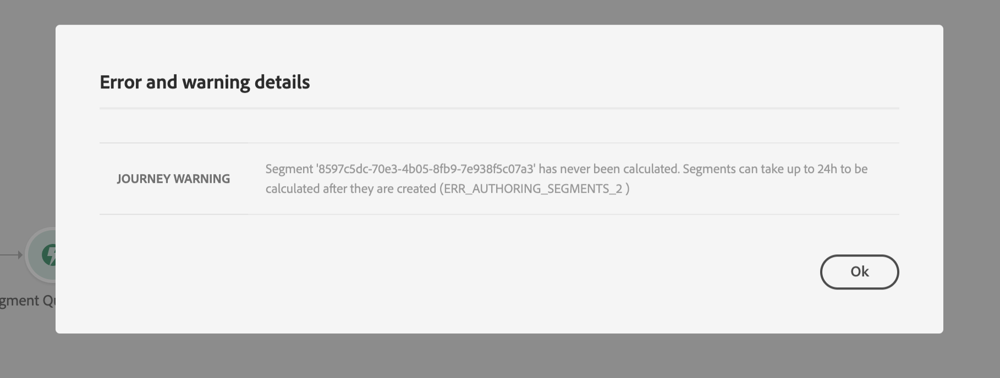

# 세그먼트 자격 이벤트 {#segment-qualification}

## 세그먼트 자격 이벤트 정보{#about-segment-qualification}

이러한 활동을 통해 Adobe Experience Platform 세그먼트의 입구와 출구로부터 고객의 의견을 들을 수 있으므로, 각 사용자가 여행 중에 입장을 바꾸거나 이동할 수 있습니다. 세그먼트 만들기에 대한 자세한 내용은 이 [섹션을 참조하십시오](../segment/about-segments.md).

&quot;실버 고객&quot; 세그먼트가 있다고 가정해 봅시다. 이러한 활동을 통해 모든 신규 실버 고객은 고객 여정에 참여하고 개인화된 메시지를 보낼 수 있습니다.

이 유형의 이벤트는 여정의 첫 번째 단계 또는 그 이상으로 배치할 수 있습니다.

Adobe Experience Platform의 고주파수 대상 옵션으로 세그먼트가 스트리밍되는 경우 입구와 출구는 실시간으로 청각됩니다. 세그먼트가 스트리밍되지 않으면 입장 및 퇴장은 세그먼트 계산 시 고려됩니다.

1. 카테고리 **[!UICONTROL Events]** 를 펼쳐서 캔버스에 **[!UICONTROL Segment qualification]** 활동을 놓습니다.

   

1. 활동 **[!UICONTROL Label]** 에 을 추가합니다. 데이터 소스에 이벤트에 설명을 추가합니다.

1. 필드를 **[!UICONTROL Segment]** 클릭하고 활용할 세그먼트를 선택합니다.

   

1. 필드에서 **[!UICONTROL Behavior]** 세그먼트 출입구, 종료 또는 둘 다를 수신하려는 경우 선택합니다.

1. 네임스페이스를 선택합니다. 이것은 이벤트가 여행의 첫 번째 단계로 지정되는 경우에만 필요합니다.

   

페이로드에는 조건 및 작업에 사용할 수 있는 다음 컨텍스트 정보가 포함되어 있습니다.

* 행동(입구, 종료)
* 자격 타임스탬프
* 세그먼트 ID

활동 뒤에 나오는 조건이나 작업에서 표현식 편집기를 사용할 경우 **[!UICONTROL Segment qualification]** 노드에 액세스할 수 **[!UICONTROL SegmentQualification]** 있습니다. 과( **[!UICONTROL Last qualification time]** 시작 또는 종료) 중 하나를 선택할 수 **[!UICONTROL status]** 있습니다.

조건 [활동을 참조하십시오](../building-journeys/condition-activity.md#about_condition).

## 세그먼트에 대한 우수 사례 {#best-practices-segments}

이 **[!UICONTROL Segment Qualification]** 활동은 Adobe Experience Platform 세그먼트에서 자격이 부여되거나 자격이 박탈되는 개인들의 여정 즉시 입장을 취할 수 있게 합니다.

이 정보의 수신 속도가 빠르다. 측정된 측정은 초당 받은 10,000개의 이벤트 속도를 보여줍니다. 그 결과, 여러분은 가장 높은 입구가 어떻게 일어날 수 있는지, 어떻게 그것을 피할 수 있는지 그리고 어떻게 그들을 위해 여러분의 여행을 준비시킬 수 있는지 확실히 알아야 합니다.

### 세그먼트 일괄 처리{#batch-speed-segment-qualification}

배치 세그먼트에 대한 세그먼트 자격 조건을 사용하는 경우 일일 계산 시 최대 입고가 발생합니다. 피크 크기는 매일 세그먼트에 들어오거나 나가는 개인의 수에 따라 달라집니다.

또한 배치 세그먼트가 새로 만들어지고 즉시 여정에 사용되는 경우 첫 번째 일괄 계산으로 인해 매우 많은 수의 개인이 해당 여정에 들어갈 수 있습니다.

### 스트리밍된 세그먼트{#streamed-speed-segment-qualification}

스트리밍된 세그먼트에 대한 세그먼트 자격을 사용하는 경우 세그먼트에 대한 지속적인 평가로 인해 입장구/출구의 높은 위험이 줄어듭니다. 하지만 세그먼트 정의가 많은 고객이 동시에 자격을 얻는 경우 최고점도 있을 수 있습니다.

### 오버로드를 방지하는 방법{#overloads-speed-segment-qualification}

다음은 데이터 소스, 사용자 지정 작업, Adobe Campaign Standard 작업 등, 여정에서 사용되는 시스템의 과부하 발생을 방지하는 데 도움이 되는 몇 가지 우수 사례입니다.

활동이 생성된 직후 배치 **[!UICONTROL Segment Qualification]** 세그먼트를 사용하지 마십시오. 첫 번째 계산 정점을 피합니다. 계산되지 않은 세그먼트를 사용하려는 경우 경로 캔버스에 노란색 경고가 표시됩니다.

데이터 소스 및 여정에 사용된 작업에 대한 매핑 규칙을 설정하여 오버로드를 방지합니다(이 [섹션 참조](../api/capping.md)). 매핑 규칙에 재시도가 없습니다. 다시 시도해야 하는 경우 조건 또는 작업의 상자를 선택하여 여정에서 대체 경로 **[!UICONTROL Add an alternative path in case of a timeout or an error]** 를 사용해야 합니다.

제작 과정에서 세그먼트를 사용하기 전에 항상 먼저 매일 이 세그먼트에 대해 자격이 있는 개인의 양을 평가해야 합니다. 이렇게 하려면 Adobe Experience Platform의 **[!UICONTROL Segments]** 섹션을 확인하고 오른쪽의 그래프를 볼 수 있습니다.

