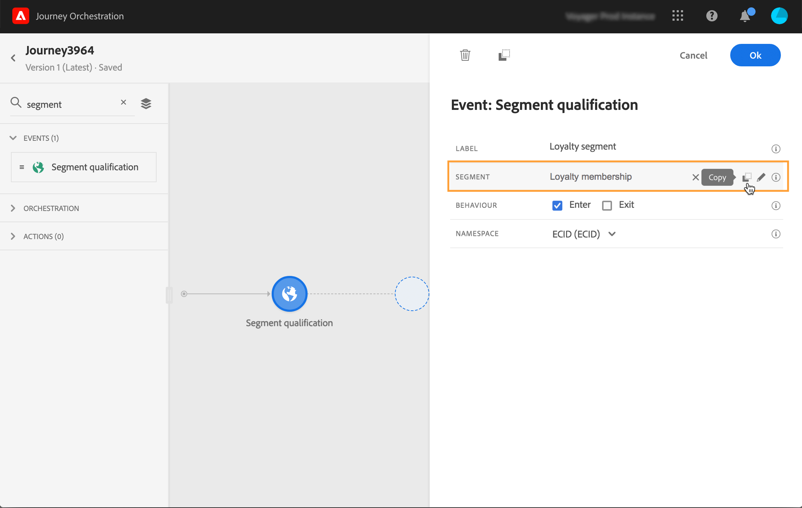

# 세그먼트 자격 이벤트 {#segment-qualification}

## 세그먼트 자격 이벤트 정보{#about-segment-qualification}

이 활동을 통해 여정은 사용자가 여정에서 진입하거나 앞으로 이동할 수 있도록 Adobe Experience Platform 세그먼트의 프로파일의 출입구와 출구로부터 의견을 들을 수 있습니다. 세그먼트 만들기에 대한 자세한 내용은 이 [섹션](../segment/about-segments.md)을 참조하십시오.

&quot;실버(silver) 고객&quot; 세그먼트가 있는 경우 이러한 활동을 통해 모든 신규 실버(Silver) 고객이 여정을 입력하고 일련의 개인화된 메시지를 보낼 수 있습니다.

이 유형의 이벤트는 여정의 첫 번째 단계 이상 또는 그 이상으로 배치할 수 있습니다.

>[!IMPORTANT]
>
>Adobe Experience Platform 세그먼트는 하루에 한 번(**일괄** 세그먼트) 또는 실시간(**스트리밍** Adobe Experience Platform의 빈도가 높은 대상 옵션을 사용하여 세그먼트)으로 계산된다는 점을 염두에 두십시오.
>
>선택한 세그먼트가 스트리밍되는 경우, 이 세그먼트에 속한 개인이 잠재적으로 실시간으로 여정에 들어갑니다. 세그먼트가 일괄 처리인 경우 이 세그먼트에 새로 자격이 있는 사람은 Adobe Experience Platform에서 세그먼트 계산이 실행될 때 잠재적으로 여정을 입력합니다.

1. **[!UICONTROL Events]** 카테고리를 펼치고 **[!UICONTROL Segment qualification]** 활동을 캔버스에 놓습니다.

   

1. 활동에 **[!UICONTROL Label]**&#x200B;을(를) 추가합니다. 데이터 소스에 이벤트에 설명을 추가합니다.

1. **[!UICONTROL Segment]** 필드를 클릭하고 활용할 세그먼트를 선택합니다.

   >[!NOTE]
   >
   >목록에 표시된 열을 사용자 정의하고 정렬할 수 있습니다.

   

   세그먼트가 추가되면 **[!UICONTROL Copy]** 단추를 사용하여 이름과 ID를 복사할 수 있습니다.

   `{"name":"Loyalty membership“,”id":"8597c5dc-70e3-4b05-8fb9-7e938f5c07a3"}`

   

1. **[!UICONTROL Behaviour]** 필드에서 세그먼트 입장, 종료 또는 둘 다를 수신할 것인지 선택합니다.

   >[!NOTE]
   >
   >**[!UICONTROL Enter]** 및 **[!UICONTROL Exit]**&#x200B;은 Adobe Experience Platform의 **실현됨** 및 **종료한 세그먼트 참여 상태에 해당됩니다.** 세그먼트를 평가하는 방법에 대한 자세한 내용은 [세그멘테이션 서비스 설명서](https://experienceleague.adobe.com/docs/experience-platform/segmentation/tutorials/evaluate-a-segment.html?lang=en#interpret-segment-results)를 참조하십시오.

1. 네임스페이스를 선택합니다. 이것은 이벤트가 여정의 첫 번째 단계로 지정된 경우에만 필요합니다.

   

페이로드에는 조건 및 작업에 사용할 수 있는 다음 컨텍스트 정보가 포함되어 있습니다.

* 비헤이비어(입구, 종료)
* 자격 타임스탬프
* 세그먼트 ID

**[!UICONTROL Segment qualification]** 활동 뒤에 오는 조건 또는 액션에서 표현식 편집기를 사용하는 경우 **[!UICONTROL SegmentQualification]** 노드에 액세스할 수 있습니다. **[!UICONTROL Last qualification time]**&#x200B;과 **[!UICONTROL status]**(시작 또는 종료) 중에서 선택할 수 있습니다.

[조건 활동](../building-journeys/condition-activity.md#about_condition)을 참조하십시오.

## 권장사항 {#best-practices-segments}

**[!UICONTROL Segment Qualification]** 활동을 통해 Adobe Experience Platform 세그먼트에서 자격이 부여되거나 자격이 없는 개인의 여정에 즉시 입장할 수 있습니다.

이 정보의 수신 속도는 높다. 측정에는 초당 받은 10,000개의 이벤트 속도가 표시됩니다. 그 결과, 여러분은 입구의 최고점이 어떻게 일어날 수 있는지, 어떻게 그것을 피하는지 그리고 어떻게 여정을 준비시킬 수 있는지 이해하도록 해야 한다.

### 세그먼트 일괄 처리{#batch-speed-segment-qualification}

배치 세그먼트에 대한 세그먼트 자격 조건을 사용하는 경우 일일 계산 시 최대 시작 시간이 발생합니다. 피크 크기는 매일 세그먼트를 시작(또는 종료)하는 개인의 수에 따라 달라집니다.

또한 배치 세그먼트가 새로 만들어지고 여정에서 즉시 사용되는 경우 첫 번째 계산 일괄 처리로 여정에 입장하는 개인 수가 매우 많을 수 있습니다.

### 스트리밍된 세그먼트{#streamed-speed-segment-qualification}

스트리밍된 세그먼트에 대한 세그먼트 자격 조건을 사용하는 경우 세그먼트에 대한 지속적인 평가로 인해 입장/퇴장의 높은 위험이 줄어듭니다. 하지만 세그먼트 정의가 많은 고객이 동시에 자격을 얻는 경우 최고점이 있을 수 있습니다.

스트리밍 세그멘테이션에 대한 자세한 내용은 이 [페이지](https://experienceleague.adobe.com/docs/experience-platform/segmentation/api/streaming-segmentation.html#api)를 참조하십시오.

### 오버로드를 방지하는 방법{#overloads-speed-segment-qualification}

다음은 여정에서 사용되는 시스템 오버로드를 방지하는 데 도움이 되는 몇 가지 우수 사례입니다(데이터 소스, 사용자 지정 작업, Adobe Campaign Standard 작업).

**[!UICONTROL Segment Qualification]** 활동에서 배치 세그먼트가 생성된 직후 사용하지 마십시오. 첫 번째 계산 최고점을 피합니다. 계산되지 않은 세그먼트를 사용하려는 경우 여정 캔버스에 노란색 경고가 표시됩니다.

데이터 소스 및 여정에 사용된 작업에 대한 매핑 규칙을 설정하여 오버로드를 방지합니다(이 [섹션](../api/capping.md) 참조). 예약 규칙에 재시도가 없습니다. 다시 시도해야 할 경우 조건 또는 작업의 **[!UICONTROL Add an alternative path in case of a timeout or an error]** 상자를 선택하여 여정에서 대체 경로를 사용해야 합니다.

프로덕션 여정에서 세그먼트를 사용하기 전에 항상 먼저 매일 이 세그먼트에 대해 자격이 있는 개인의 볼륨을 평가하십시오. 이렇게 하려면 Adobe Experience Platform에서 **[!UICONTROL Segments]** 섹션을 확인하고 오른쪽의 그래프를 볼 수 있습니다.

