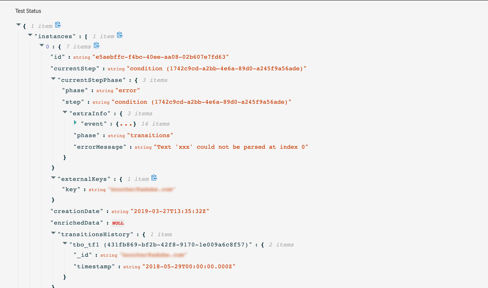

# 고객 여정 테스트{#testing_the_journey}

여행을 테스트하기 전에 모든 오류를 해결해야 합니다. 을 참조하십시오.

테스트 프로필을 사용하여 게시 전에 여행을 테스트할 수 있습니다. 이를 통해 개별 고객이 여행 중에 어떻게 진행되는지 분석하고 게시 전에 문제를 해결할 수 있습니다.

테스트 모드를 사용하려면 다음 단계를 따르십시오.

1. 여정을 테스트하기 전에, 여정이 유효한지, 오류가 없는지 확인하십시오. 오류가 있는 여정의 테스트를 실행할 수 없습니다. 을 참조하십시오. 오류가 발생하면 경고 기호가 표시됩니다.

1. 테스트 모드를 활성화하려면 오른쪽 상단 모서리에 있는 **[!UICONTROL Test]** 전환을 클릭합니다.

   

1. 왼쪽 **아래 모서리의 테스트** 대기 시간 매개 변수를 사용하여 각 대기 활동이 테스트 모드에서 지속될 시간을 정의합니다. 기본 시간은 10초입니다. 이렇게 하면 테스트 결과를 신속하게 얻을 수 있습니다. 이 매개 변수는 여행에서 하나 이상의 대기 활동을 삭제한 경우에만 나타납니다.

   

1. 이벤트를 구성하고 여정으로 **[!UICONTROL Trigger an event]** 전송하려면 을 클릭합니다. 테스트 프로필과 관련된 이벤트를 전송해야 합니다. 이벤트 [실행을](#firing_events)참조하십시오.

   

1. 이벤트가 수신되면 단추를 클릭하여 테스트 결과를 보고 확인합니다. **[!UICONTROL Show log]** 로그 [보기를](#viewing_logs)참조하십시오.

   

1. 오류가 있는 경우 테스트 모드를 비활성화하고 경로를 수정하고 다시 테스트합니다. 테스트가 확정되면 여정을 게시할 수 있습니다. 을 참조하십시오.

## 중요 정보 {#important_notes}

* 테스트를 거친 여정에 이벤트를 발생시키는 인터페이스가 제공되지만 Postman과 같은 타사 시스템에서 이벤트를 전송할 수도 있습니다.
* 실시간 고객 프로파일 서비스에서 &quot;테스트 프로파일&quot;로 플래그가 지정된 개인만이 테스트를 거친 여정에 참여할 수 있습니다. 테스트 프로필을 만드는 프로세스는 데이터 플랫폼에서 프로필을 만드는 프로세스와 동일합니다. 테스트 프로필 플래그가 사실인지 확인하기만 하면 됩니다. 데이터 플랫폼 인터페이스의 세그먼트 섹션을 사용하여 데이터 플랫폼에서 테스트 프로필 세그먼트를 만들고 비배타적 목록을 볼 수 있습니다. 현재 전체 목록을 표시할 수 없습니다.
* 테스트 모드는 네임스페이스를 사용하는 초안 여행에서만 사용할 수 있습니다. 실제로 테스트 모드는 사용자가 테스트 프로파일인지 여부를 확인해야 하므로 데이터 플랫폼에 도달해야 합니다.
* 테스트 세션 중에 여정에 입력할 수 있는 최대 테스트 프로필 수는 100개입니다.
* 테스트 모드를 비활성화하면 과거에 입력한 사람 또는 현재 테스트 중인 사람의 여정이 비어 있게 됩니다.
* 필요에 따라 테스트 모드를 활성화/비활성화할 수 있습니다.
* 테스트 모드가 활성화되면 경로를 수정할 수 없습니다. 테스트 모드에서는 경로를 직접 게시할 수 있으며, 이전에 테스트 모드를 비활성화할 필요가 없습니다.

## 이벤트 실행 {#firing_events}

이 **[!UICONTROL Trigger an event]** 단추를 사용하면 방문자가 해당 여정에 입장하도록 하는 이벤트를 구성할 수 있습니다.

사전 요구 사항으로, 데이터 플랫폼에서 테스트 프로필로 플래그가 지정된 프로파일을 알고 있어야 합니다. 실제로 테스트 모드는 이러한 프로필만 여정에서 허용하며 이벤트에는 ID가 포함되어야 합니다. 예상 ID는 이벤트 구성에 따라 다릅니다. 예를 들어 ECID일 수 있습니다.

여정에 여러 이벤트가 포함되어 있는 경우 드롭다운 목록을 사용하여 이벤트를 선택합니다. 그런 다음 각 이벤트에 대해 전달된 필드와 이벤트 전송 실행을 구성합니다. 이 인터페이스는 이벤트 페이로드에 올바른 정보를 전달하고 정보 유형이 올바른지 확인하는 데 도움이 됩니다. 테스트 모드는 나중에 사용하기 위해 테스트 세션에 사용된 마지막 매개 변수를 저장합니다.

이 인터페이스를 통해 간단한 이벤트 매개 변수를 전달할 수 있습니다. 이벤트에서 컬렉션이나 다른 고급 개체를 전달하려면 을 클릭하여 페이로드의 전체 코드를 **[!UICONTROL Code View]** 보고 수정할 수 있습니다. 예를 들어 기술 사용자가 준비한 이벤트 정보를 복사하여 붙여넣을 수 있습니다.

또한 이 인터페이스를 사용하여 타사 도구를 사용하지 않고도 이벤트 페이로드를 구성하고 이벤트를 트리거할 수 있습니다.

## 로그 보기 {#viewing_logs}

이 **[!UICONTROL Show log]** 단추를 사용하면 테스트 결과를 볼 수 있습니다. 이 페이지에는 JSON 형식으로 경로의 현재 정보가 표시됩니다. 단추를 사용하면 전체 노드를 복사할 수 있습니다. 페이지의 테스트 결과를 업데이트하려면 페이지를 수동으로 새로 고쳐야 합니다.

>[!NOTE]
>
>테스트 로그에서 타사 시스템(데이터 소스 또는 작업)을 호출할 때 오류가 발생하면 오류 코드와 오류 응답이 표시됩니다.

현재 경로 내에 있는 개인(기술적으로 인스턴스라고 함)의 수가 표시됩니다. 다음은 각 개인에 대해 표시되는 유용한 정보입니다.

* _ID_:여정에서 개인의 내부 ID. 이 기능은 디버깅 목적으로 사용할 수 있습니다.
* _currentstep_:개인이 여행 중인 단계. 보다 쉽게 식별하려면 활동에 레이블을 추가하는 것이 좋습니다.
* _currentstep_ > 단계:개인 경로의 상태(실행 중, 완료, 오류 또는 시간 초과)입니다. 자세한 내용은 아래를 참조하십시오.
* _currentstep_ > _extraInfo_:오류 및 기타 컨텍스트 정보에 대한 설명입니다.
* _externalKeys_:이벤트에 정의된 주요 공식의 값.
* _elementsData_:경로 지정 시 데이터 소스를 사용하는 경우 고객 여정에서 검색한 데이터
* _transitionHistory_:개인이 수행한 단계 목록. 이벤트의 경우 페이로드가 표시됩니다.

