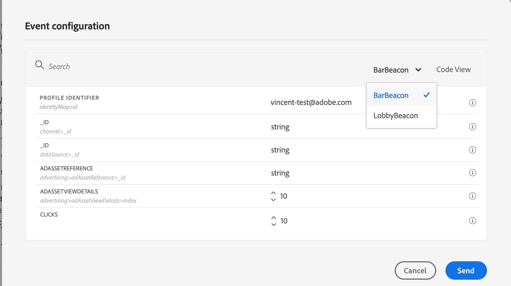

# 여정 테스트{#testing_the_journey}

여정을 테스트하기 전에 모든 오류를 해결해야 합니다. [이 섹션](../about/troubleshooting.md#section_h3q_kqk_fhb)을 참조하십시오.

테스트 프로필을 사용하여 게시 전에 여정을 테스트할 수 있습니다. 이를 통해 개인이 게시하기 전에 여정에서 어떻게 이동하는지 분석하고 문제를 해결할 수 있습니다.

테스트 프로필만 테스트 모드에서 여정을 입력할 수 있습니다. 새 테스트 프로필을 만들거나 기존 프로필을 테스트 프로필로 전환할 수 있습니다. 이 [섹션](../building-journeys/creating-test-profiles.md)을 참조하십시오.

테스트 모드를 사용하려면 다음 단계를 수행합니다.

1. 여정을 테스트하기 전에 유효하고 오류가 없는지 확인하십시오. 오류가 있는 여정 테스트를 실행할 수 없습니다. [이 섹션](../about/troubleshooting.md#section_h3q_kqk_fhb)을 참조하십시오. 오류가 있으면 경고 기호가 표시됩니다.

1. 테스트 모드를 활성화하려면 오른쪽 상단 모서리에 있는 **[!UICONTROL Test]** 토글을 클릭합니다.

   

1. 왼쪽 아래 모서리에 있는 **[!UICONTROL Wait time]** 매개 변수를 사용하여 각 대기 활동 및 이벤트 시간 제한이 테스트 모드에서 지속되는 시간을 정의합니다. 기본 시간은 대기 및 이벤트 시간 초과에 대한 10초입니다. 이렇게 하면 테스트 결과가 빠르게 확인됩니다. 이 매개 변수는 여정에서 하나 이상의 대기 활동을 삭제한 경우에만 나타납니다.

   

   >[!NOTE]
   >
   >반응 이벤트를 여정에 사용하면 대기 시간 기본값과 최소값은 40초입니다. [이 섹션](../building-journeys/reaction-events.md)을 참조하십시오.

1. 이벤트를 구성하고 여정으로 보내려면 **[!UICONTROL Trigger an event]** 을 클릭하십시오.

   

1. 필요한 다양한 필드를 구성합니다. **프로필 식별자** 필드에 테스트 프로필을 식별하는 데 사용되는 필드의 값을 입력합니다. 예를 들어 이메일 주소일 수 있습니다. 테스트 프로필과 관련된 이벤트를 보내야 합니다. [이벤트 실행](#firing_events)을 참조하십시오.

   

1. 이벤트가 수신되면 **[!UICONTROL Show log]** 버튼을 클릭하여 테스트 결과를 보고 확인합니다. [로그 보기](#viewing_logs)를 참조하십시오.

   

1. 오류가 있는 경우 테스트 모드를 비활성화하고 여정를 수정한 후 다시 테스트하십시오. 테스트가 확정되면 여정을 게시할 수 있습니다. [이 페이지](../building-journeys/publishing-the-journey.md)를 참조하십시오.

## 중요 정보 {#important_notes}

* 테스트한 여정에 이벤트를 실행하기 위한 인터페이스가 제공되지만, Postman과 같은 타사 시스템에서 이벤트를 전송할 수도 있습니다.
* 실시간 고객 프로필 서비스에서 &quot;테스트 프로필&quot;로 플래그가 지정된 개인만 테스트된 여정을 입력할 수 있습니다. 이 [섹션](../building-journeys/creating-test-profiles.md)을 참조하십시오.
* 테스트 모드는 네임스페이스를 사용하는 초안 여정에서만 사용할 수 있습니다. 테스트 모드는 여정을 입력하는 사람이 테스트 프로필인지 여부를 확인해야 하므로 Adobe Experience Platform에 연결할 수 있어야 합니다.
* 테스트 세션 중에 여정을 입력할 수 있는 최대 테스트 프로필 수는 100개입니다.
* 테스트 모드를 비활성화하면 이전에 테스트 모드에 들어갔거나 현재 테스트 모드에 있는 모든 사용자의 여정이 비어 있게 됩니다. 또한 보고를 지웁니다.
* 테스트 모드를 필요한 만큼 활성화/비활성화할 수 있습니다.
* 테스트 모드가 활성화되면 여정을 수정할 수 없습니다. 테스트 모드에서는 여정을 직접 게시할 수 있으며, 이전에 테스트 모드를 비활성화할 필요가 없습니다.

## 프로필을 테스트 프로필로 전환{#turning-profile-into-test}

기존 프로필을 테스트 프로필로 전환할 수 있습니다. Adobe Experience Platform에서는 API 호출을 통해 프로필 속성을 업데이트할 수 있지만 인터페이스를 통해 수행할 수 없습니다.

이렇게 하는 가장 쉬운 방법은 **프로필 업데이트** 작업 활동을 사용하고 테스트 프로필 부울 필드를 false에서 true로 변경하는 것입니다. [이 섹션](../building-journeys/update-profiles.md#using-the-test-mode)을 참조하십시오.

## 테스트 프로필 만들기{#create-test-profile}

새 테스트 프로필을 만들려면 Adobe Experience Platform에서 프로필을 만들 때와 절차가 동일합니다. API 호출을 통해 수행됩니다. 이 [페이지](https://docs.adobe.com/content/help/ko-KR/experience-platform/profile/home.html)를 참조하십시오

프로필 테스트 세부 사항 mixin이 포함된 프로필 스키마를 사용해야 합니다. testProfile 플래그는 이 mixin의 일부입니다.

프로필을 만들 때 값을 전달해야 합니다.testProfile = true.

기존 프로필을 업데이트하여 testProfile 플래그를 &quot;true&quot;로 변경할 수도 있습니다.

다음은 테스트 프로필을 만들기 위한 API 호출의 예입니다.

```
curl -X POST \
'https://dcs.adobedc.net/collection/xxxxxxxxxxxxxx' \
-H 'Cache-Control: no-cache' \
-H 'Content-Type: application/json' \
-H 'Postman-Token: xxxxx' \
-H 'cache-control: no-cache' \
-H 'x-api-key: xxxxx' \
-H 'x-gw-ims-org-id: xxxxx' \
-d '{
"header": {
"msgType": "xdmEntityCreate",
"msgId": "xxxxx",
"msgVersion": "xxxxx",
"xactionid":"xxxxx",
"datasetId": "xxxxx",
"imsOrgId": "xxxxx",
"source": {
"name": "Postman"
},
"schemaRef": {
"id": "https://example.adobe.com/mobile/schemas/xxxxx",
"contentType": "application/vnd.adobe.xed-full+json;version=1"
}
},
"body": {
"xdmMeta": {
"schemaRef": {
"contentType": "application/vnd.adobe.xed-full+json;version=1"
}
},
"xdmEntity": {
"_id": "xxxxx",
"_mobile":{
"ECID": "xxxxx"
},
"testProfile":true
}
}
}'
```

## 이벤트 실행 {#firing_events}

**[!UICONTROL Trigger an event]** 단추를 사용하면 사용자가 여정을 입력하도록 하는 이벤트를 구성할 수 있습니다.

>[!NOTE]
>
>테스트 모드에서 이벤트를 트리거하면 실제 이벤트가 생성되며, 이것은 이 이벤트를 수신하는 다른 여정에도 이 이벤트가 도달함을 의미합니다.

Adobe Experience Platform에서 테스트 프로필로 플래그가 지정된 프로필을 전제 조건으로 알고 있어야 합니다. 실제로 테스트 모드에서는 여정의 이러한 프로필만 허용하며 이벤트에는 ID가 포함되어야 합니다. 예상 ID는 이벤트 구성에 따라 다릅니다. 예를 들어 ECID 또는 이메일 주소일 수 있습니다. 이 키의 값은 **프로필 식별자** 필드에 추가해야 합니다.

>[!NOTE]
>
>열거형이 필요한 필드에 대한 드롭다운이 표시됩니다. 사용 가능한 값 중 하나를 선택하면 됩니다.

여정에 여러 이벤트가 포함되어 있는 경우 드롭다운 목록을 사용하여 이벤트를 선택하십시오. 그런 다음 각 이벤트에 대해 전달된 필드와 이벤트 전송 실행을 구성합니다. 인터페이스는 이벤트 페이로드에서 올바른 정보를 전달하고 정보 유형이 올바른지 확인하는 데 도움이 됩니다. 테스트 모드에서는 나중에 사용할 수 있도록 테스트 세션에 사용되는 마지막 매개 변수가 저장됩니다.


인터페이스를 사용하면 간단한 이벤트 매개 변수를 전달할 수 있습니다. 이벤트에서 컬렉션이나 다른 고급 개체를 전달하려면 **[!UICONTROL Code View]** 을 클릭하여 페이로드의 전체 코드를 확인하고 수정할 수 있습니다. 예를 들어 기술 사용자가 준비한 이벤트 정보를 복사하여 붙여넣을 수 있습니다.


기술 사용자는 이 인터페이스를 사용하여 타사 도구를 사용하지 않고도 이벤트 페이로드를 작성하고 이벤트를 트리거할 수도 있습니다.

**[!UICONTROL Send]** 단추를 클릭하면 테스트가 시작됩니다. 여정에서 개인의 진행 상태는 시각적 플로우로 표시됩니다. 개별 경로가 여정을 이동할 때 점진적으로 녹색으로 바뀝니다. 오류가 발생하면 해당 단계에 경고 기호가 표시됩니다. 커서를 위에 놓으면 오류에 대한 자세한 정보를 표시하고 전체 세부 정보(가능한 경우)에 액세스할 수 있습니다.


이벤트 구성 화면에서 다른 테스트 프로필을 선택하고 테스트를 다시 실행하면 시각적 흐름이 지워지고 새 개인의 경로가 표시됩니다.

테스트에서 여정을 열 때 표시된 경로가 마지막으로 실행된 테스트에 해당합니다.

시각적 흐름은 이벤트가 인터페이스를 통해 트리거되는지 아니면 외부에서 트리거되는지(예: Postman 사용) 여부에따라 작동합니다.

## 규칙 기반 여정 {#test-rule-based} 테스트 모드

규칙 기반 이벤트를 사용하는 여정에 대해서도 테스트 모드를 사용할 수 있습니다. 규칙 기반 이벤트에 대한 자세한 내용은 [이 페이지](../event/about-events.md)를 참조하십시오.

이벤트를 트리거할 때 **이벤트 구성** 화면에서 테스트에 전달할 이벤트 매개 변수를 정의할 수 있습니다. 오른쪽 상단 모서리의 도구 설명 아이콘을 클릭하여 이벤트 ID 조건을 볼 수 있습니다. 규칙 평가의 일부인 각 필드 옆에 도구 설명이 있습니다.


테스트 모드 사용 방법에 대한 자세한 내용은 [이 페이지](../building-journeys/testing-the-journey.md)를 참조하십시오.

## 로그 보기 {#viewing_logs}

**[!UICONTROL Show log]** 단추를 사용하여 테스트 결과를 볼 수 있습니다. 이 페이지에는 여정의 현재 정보가 JSON 형식으로 표시됩니다. 버튼을 사용하면 전체 노드를 복사할 수 있습니다. 여정의 테스트 결과를 업데이트하려면 페이지를 수동으로 새로 고쳐야 합니다.


>[!NOTE]
>
>서드파티 시스템(데이터 소스 또는 작업)을 호출할 때 오류가 발생하면 테스트 로그에 오류 코드와 오류 응답이 표시됩니다.

현재 여정 내에 있는 개인의 수(기술적으로 인스턴스라고 함)가 표시됩니다. 다음은 각 개인에게 표시되는 유용한 정보입니다.

* _Id_:여정에서 개인의 내부 ID입니다. 디버깅 용도로 사용할 수 있습니다.
* _currentstep_:개인이 여정에서 있는 단계입니다. 보다 쉽게 식별할 수 있도록 활동에 레이블을 추가하는 것이 좋습니다.
* _currentstep_  > 단계:개인의 여정 상태(실행 중, 완료, 오류 또는 시간 초과)입니다. 자세한 내용은 아래를 참조하십시오.
* _currentstep_  >  _extraInfo_:오류 및 기타 상황별 정보에 대한 설명입니다.
* _currentstep_  >  _fetchErrors_:이 단계 동안 발생한 데이터 가져오기 오류에 대한 정보입니다.
* _externalKeys_:이벤트에 정의된 키 수식의 값입니다.
* _enhancedData_:여정이 데이터 소스를 사용하는 경우 여정이 검색한 데이터입니다.
* _transitionHistory_:개인이 수행한 단계 목록입니다. 이벤트의 경우 페이로드가 표시됩니다.
* _actionExecutionErrors_ :발생한 오류에 대한 정보입니다.

개별 여정의 다양한 상태는 다음과 같습니다.

* _실행_ 중:개인이 현재 여정에 있습니다.
* _완료됨_:개인이 여정 끝에 있습니다.
* _오류_:오류로 인해 개인이 여정에서 중지됩니다.
* _시간 초과_:개인이 너무 많은 시간이 걸린 단계 때문에 여정에서 정지됩니다.

테스트 모드를 사용하여 이벤트가 트리거되면 소스 이름으로 데이터 세트가 자동으로 생성됩니다.

테스트 모드를 사용하여 이벤트가 트리거되면 소스 이름으로 데이터 세트가 자동으로 생성됩니다.

테스트 모드에서는 경험 이벤트가 자동으로 만들어지고 Adobe Experience Platform으로 전송됩니다. 이 경험 이벤트의 소스 이름은 &quot;Journey Orchestration 테스트 이벤트&quot;입니다.

여러 여정에서 트리거되는 여러 이벤트의 경우

여러 여정에서 전송된 여러 이벤트가 서로 다른 스키마가 있는 경우 시나리오가 있습니다. 스키마 맵을 1개의 데이터 세트에 매핑할 수 있습니까? 그렇지 않으면 여러 데이터 세트가 필요합니다.

대상 데이터 세트가 경험 이벤트에 포함되지 않은 경우 이러한 데이터 세트에 대한 자동 생성 및 이름 지정이 수행됩니다. 그래서 우리는 오늘 &quot;Voymanager를 위해 자동으로 생성된 데이터 세트&quot;를 보게 됩니다.

소스 이름을 지정하면 자동으로 생성됩니다. 여러 이벤트가 있는 경우 를 연결하고 &quot;Journey Orchestration 테스트 이벤트 - 스키마 이름&quot;으로 지정해야 합니다. 이렇게 하면 자동으로 &quot;Journey Orchestration 테스트 이벤트에 대해 자동으로 생성된 데이터 세트 - 스키마 이름&quot;으로 바뀝니다.
