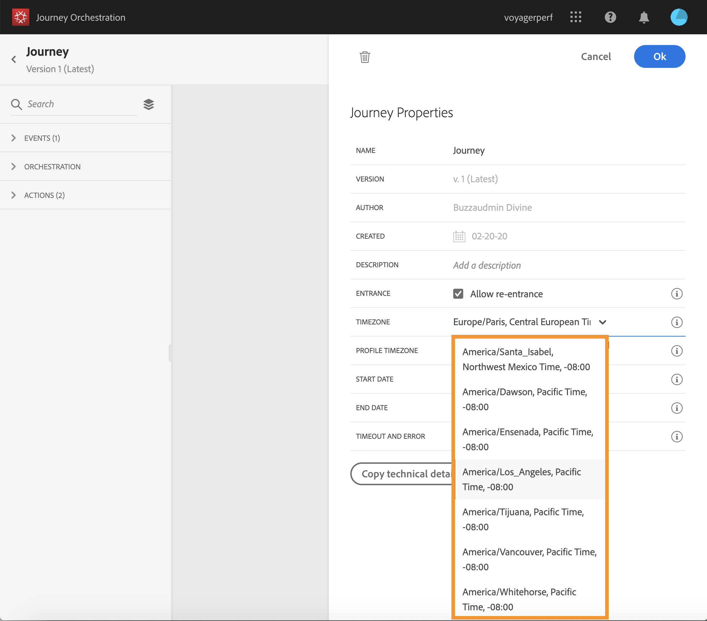

# 시간대 관리 {#timezone_management}

여정의 [속성](../building-journeys/changing-properties.md)에서 시간대를 정의할 수 있습니다.

속성에 액세스하려면 화면 오른쪽 상단에 있는 연필 아이콘을 클릭합니다.

이 시간대는 다음과 같은 시간 요소를 포함하는 여정의 모든 활동에 사용됩니다.

* [시간 조건](../building-journeys/condition-activity.md#time_condition)
* [날짜 조건](../building-journeys/condition-activity.md#date_condition)
* [사용자 지정 대기](../building-journeys/wait-activity.md#custom)
* [고정 날짜 대기](../building-journeys/wait-activity.md#fixed_date)

시간대를 선택하거나 사용자 프로필에 정의된 시간대를 사용하도록 선택할 수 있습니다.

## 고정 표준 시간대 {#fixed-timezone} 정의

시간대를 수정할 수도 있습니다. 사전 정의된 시간대를 지우고 드롭다운 목록에서 시간대를 선택합니다. 고정 시간대를 사용하는 경우 여정에 들어오는 모든 개인에 대해 동일하게 적용됩니다.

이렇게 하려면 **[!UICONTROL Properties]**&#x200B;에서 시간대를 선택합니다.

## 프로파일을 사용하여 여정 표준 시간대 {#timezone-from-profiles} 정의

여정의 시작 이벤트에 네임스페이스가 있는 경우, 여정이 Adobe Experience Platform의 실시간 고객 프로필 서비스에 도달할 수 있음을 의미하며, 시간대는 여정에 흐르는 개별 프로필에 지정된 시간대로 미리 정의됩니다.

Adobe Experience Platform 프로필에 시간대가 정의된 경우 여정에서 검색할 수 있습니다.

개인의 프로필에 시간대가 포함되어 있지 않으면 검색된 시간대가 시간대 필드에 정의된 시간대가 됩니다.

이렇게 하려면 **[!UICONTROL Properties]**&#x200B;에서 **[!UICONTROL Use Profile timezone in timers and conditions]**&#x200B;을 선택합니다.

## 표현식 {#timezone-in-expressions}에 시간대 사용

여정의 시작 날짜와 종료 날짜는 특정 시간대에 연결할 수 없습니다. 인스턴스의 표준 시간대에 자동으로 연결됩니다.
