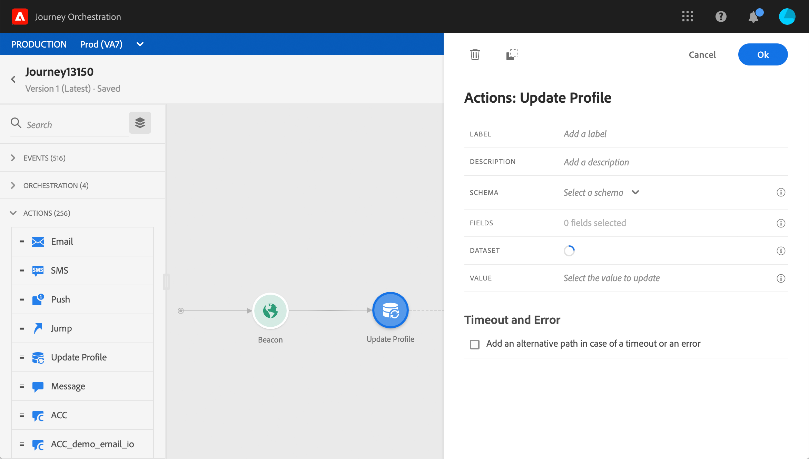
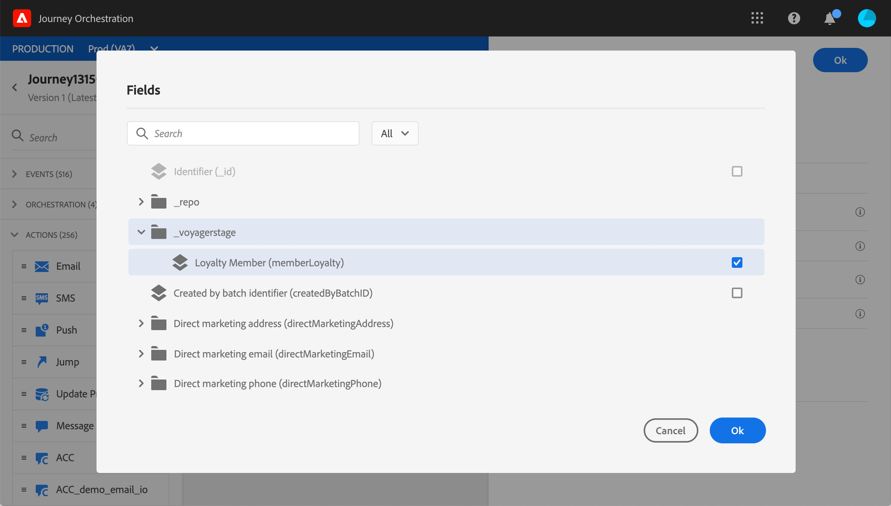
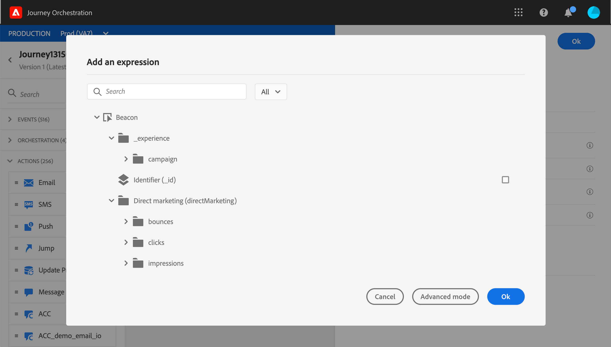
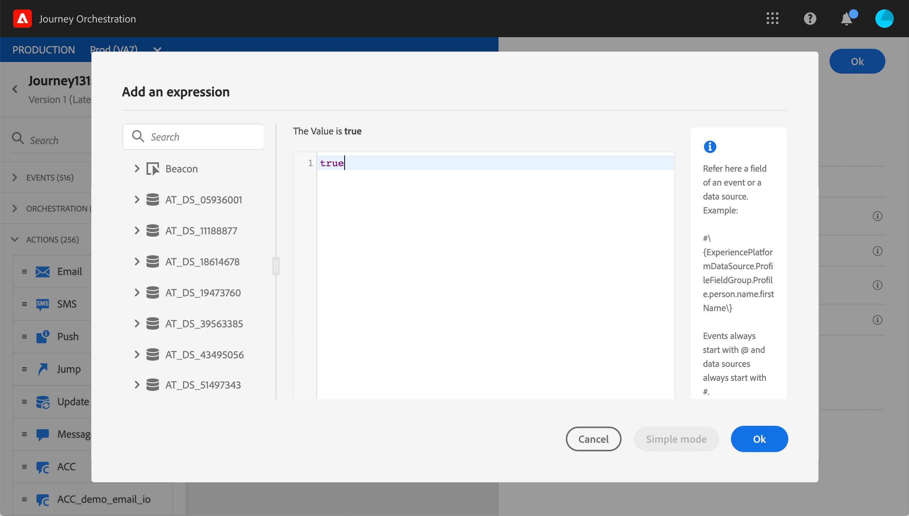
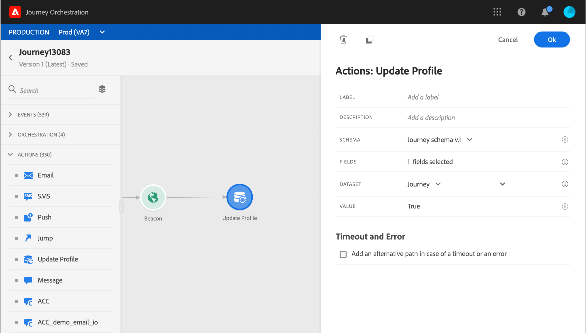

# 프로필 업데이트 {#update-profile}

>[!CAUTION]
>
>**Adobe Journey Optimizer를 찾고 계신가요**? [여기](https://experienceleague.adobe.com/ko/docs/journey-optimizer/using/ajo-home){target="_blank"}를 클릭하여 Journey Optimizer 설명서를 확인할 수 있습니다.
>
>
>_이 설명서는 Journey Optimizer로 대체된 이전 Journey Orchestration 자료를 참조합니다. Journey Orchestration 또는 Journey Optimizer 액세스에 대한 질문이 있는 경우 계정 팀에 문의하십시오._

**[!UICONTROL Update profile]** 작업 활동을 사용하면 이벤트, 데이터 원본 또는 특정 값을 사용하여 얻은 정보로 기존 Adobe Experience Platform 프로필을 업데이트할 수 있습니다.

## 중요 정보

* **프로필 업데이트** 작업은 네임스페이스가 있는 이벤트로 시작하는 여정에서만 사용할 수 있습니다.
* 작업은 기존 필드만 업데이트하며 새 프로필 필드는 만들지 않습니다.
* **프로필 업데이트** 작업을 사용하여 구매 등의 경험 이벤트를 생성할 수 없습니다.
* 다른 작업과 마찬가지로 오류나 시간 초과 시 대체 경로를 정의할 수 있으며 두 작업을 동시에 배치할 수는 없습니다.
* Platform으로 전송된 업데이트 요청은 빠르지만 1초 이내에 즉시/즉각적으로 전송되지 않습니다. 보통 몇 초는 걸리지만, 어떤 때는 보장이 없이 더 걸릴 수도 있습니다. 따라서 예를 들어, 작업이 바로 전에 배치된 프로필 업데이트 작업에 의해 업데이트된 &quot;필드 1&quot;을 사용하는 경우 작업에서 &quot;필드 1&quot;이 업데이트될 것으로 예상해서는 안 됩니다.
* 테스트 모드에서는 프로필 업데이트가 시뮬레이트되지 않습니다. 업데이트가 테스트 프로필에서 수행됩니다.
* **프로필 업데이트** 활동은 열거형으로 정의된 XDM 필드를 지원하지 않습니다.

## 프로필 업데이트 사용

1. 이벤트로 시작하여 여정을 디자인합니다. 이 [섹션](../building-journeys/journey.md)을 참조하세요.

1. 팔레트의 **작업** 섹션에서 **프로필 업데이트** 활동을 캔버스에 놓습니다.

   

1. 목록에서 스키마를 선택합니다.

1. 업데이트할 필드를 선택하려면 **필드**&#x200B;를 클릭하십시오. 필드는 하나만 선택할 수 있습니다.

   

1. 목록에서 데이터 세트를 선택합니다.

   >[!NOTE]
   >
   >**프로필 업데이트** 작업은 프로필 데이터를 실시간으로 업데이트하지만 데이터 세트는 업데이트되지 않습니다. 프로필이 데이터 세트와 관련된 레코드이므로 데이터 세트를 선택해야 합니다.

1. 사용할 값을 정의하려면 **값** 필드를 클릭합니다.

   * 단순 표현식 편집기를 사용하여 데이터 소스 또는 수신 이벤트에서 필드를 선택할 수 있습니다.

     

   * 특정 값을 정의하거나 고급 함수를 사용하려면 **고급 모드**&#x200B;를 클릭하세요.

     

이제 **프로필 업데이트**&#x200B;가 구성되었습니다.

