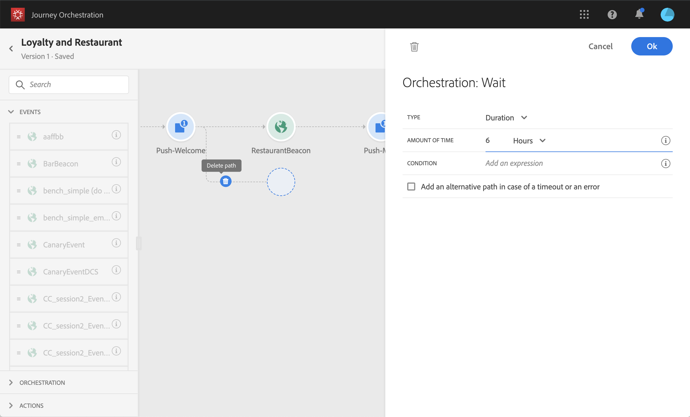

# 여정 디자이너 사용 {#concept_m1g_5qt_52b}

여정 홈 메뉴를 사용하면 **여정 목록**&#x200B;을 볼 수 있습니다. 새 여정을 만들거나 기존을 클릭하여 **여정 디자이너의 인터페이스**&#x200B;를 엽니다. 디자이너는 다음 영역으로 구성됩니다.팔레트, 캔버스 및 활동 구성 창.

## 여정 목록 {#journey_list}

**여정 목록**&#x200B;을 사용하면 모든 여정을 한 번에 볼 수 있으며, 상태를 확인하고 기본 작업을 수행할 수 있습니다. 여정 복제, 정지, 삭제도 가능합니다. 특정 작업은 수행할 수 없는 여정도 있습니다. 예를 들어 닫힌 여정은 삭제하거나 재시작할 수 없습니다. 여기에서 새 버전을 만들거나 복제하거나 중지할 수 있습니다. 검색 창에서 여정을 검색할 수도 있습니다.

목록 왼쪽 위의 필터 아이콘을 클릭하면 **[!UICONTROL Filters]**&#x200B;에 액세스할 수 있습니다. 필터 메뉴를 사용하면 다양한 기준(상태, 만든 항목, 지난 30일 동안 수정된 항목, 최신 버전만 등)에 따라 표시되는 여정을 필터링할 수 있습니다. 특정 이벤트, 필드 그룹 또는 작업을 사용하는 여정만 표시하도록 선택할 수도 있습니다. 목록에 표시된 열을 구성할 수 있습니다. 모든 필터 및 열은 사용자별로 저장됩니다.

여정의 모든 버전이 버전 번호와 함께 목록에 나타납니다. [이 페이지](../building-journeys/journey-versions.md)를 참조하십시오.

>[!NOTE]
>
>다른 브라우저 탭에서 여정 캔버스를 열려면 **Control** 또는 **Command** 키를 누른 상태에서 여정을 클릭합니다.

## 팔레트 {#palette}

**팔레트**&#x200B;는 화면의 왼쪽에 있습니다. 사용 가능한 모든 활동은 여러 카테고리로 정렬됩니다.**[!UICONTROL Events]**, **[!UICONTROL Orchestration]** 및 **[!UICONTROL Actions]**. 이름을 클릭하여 다른 카테고리를 확장/축소할 수 있습니다. 여정에서 활동을 사용하려면 팔레트에서 캔버스로 드래그하여 놓습니다. 팔레트에서 활동을 두 번 클릭하여 캔버스에 추가할 수도 있습니다(다음 단계에서 사용 가능). 여정을 게시하기 전에 팔레트에서 추가된 각 활동을 구성해야 합니다. 캔버스에 활동을 놓고 구성을 완료하지 않으면 캔버스에 남아 있지만 이 활동에 대한 구성이 완료되지 않았음을 나타내는 빨간색 경고가 표시됩니다.

>[!NOTE]
>
>여정을 설정할 때는 규칙이 있습니다. 허용되지 않은 구성은 무시됩니다. 예를 들어 작업을 병렬로 배치하거나, 활동을 이전 단계에 연결하여 루프를 만들거나, 이벤트가 아닌 다른 항목으로 여정을 시작하는 등의 작업을 수행할 수 없습니다.

왼쪽 위 모서리의 **[!UICONTROL Filter items]** 아이콘을 사용하여 다음 필터를 표시할 수 있습니다.

* **사용 가능한 항목만 표시**:팔레트에서 사용할 수 없는 요소를 숨기거나 표시합니다. 예를 들어 여정에 사용된 요소와 다른 네임스페이스를 사용하는 이벤트. 기본적으로 사용할 수 없는 항목은 숨겨집니다. 표시를 선택하면 회색으로 표시됩니다.

* **최근 항목만 표시**:이 필터를 사용하면 기본 이벤트 외에 마지막으로 사용된 5개의 이벤트와 작업만 표시할 수 있습니다. 각 사용자에게만 해당됩니다. 기본적으로 모든 항목이 표시됩니다.

**[!UICONTROL Search]** 필드를 사용할 수도 있습니다.

## 캔버스 {#canvas}

**캔버스**&#x200B;는 여정 디자이너의 중앙 영역입니다. 활동을 삭제하고 구성할 수 있는 영역이 이 영역입니다. 캔버스에서 활동을 클릭하여 구성합니다. 오른쪽에 활동 구성 창이 열립니다. 오른쪽 상단에 있는 &quot;+&quot; 및 &quot;-&quot; 버튼을 사용하여 확대하거나 축소할 수 있습니다. 캔버스에서 모든 활동은 **[!UICONTROL End]** 활동을 제외한 다음 단계를 그 뒤에 추가할 수 있습니다([이 페이지](../building-journeys/end-activity.md) 참조).

## 활동 구성 창 {#configuration_pane}

팔레트에서 활동을 클릭하면 **활동 구성 창**&#x200B;이 나타납니다. 필수 필드를 입력합니다. 활동을 삭제하려면 **[!UICONTROL Delete]** 아이콘을 클릭합니다. 수정 내용을 취소하려면 **[!UICONTROL Cancel]**&#x200B;을 클릭하고, 확인하려면 **[!UICONTROL Ok]**&#x200B;을 클릭합니다. 활동을 삭제하려면 활동 하나(또는 여러 개)를 선택하고 백스페이스 키를 누릅니다. Esc 키를 누르면 활동 구성 창이 닫힙니다.

캔버스에서 작업 및 이벤트 활동은 아래에 표시되는 이벤트 또는 작업의 이름이 있는 아이콘으로 표시됩니다. 활동 구성 창에서 **[!UICONTROL Label]** 필드를 사용하여 활동 이름에 접미어를 추가할 수 있습니다. 이러한 레이블은 특히 여정에서 동일한 이벤트 또는 작업을 여러 번 사용하는 경우 이벤트 및 작업의 사용에 대해 문맥화하는 데 도움이 됩니다. 또한 [!DNL Journey Orchestration] 보고에서 추가한 레이블을 볼 수도 있습니다. 조건 활동에 대한 레이블을 정의할 수도 있습니다.

## 위쪽 막대 작업 {#top_actions}

여정의 상태에 따라 오른쪽 상단 모서리에 있는 단추를 사용하여 여정에 대해 다른 작업을 수행할 수 있습니다.**[!UICONTROL Publish]**, **[!UICONTROL Duplicate]**, **[!UICONTROL Delete]**, **[!UICONTROL Journey properties]**, **[!UICONTROL Test]**. 이러한 단추는 활동이 선택되지 않은 경우에 나타납니다. 일부 단추는 상황에 따라 표시됩니다. 테스트 모드가 활성화되면 테스트 모드 로그 단추가 표시됩니다([이 페이지](../building-journeys/testing-the-journey.md) 참조). 여정이 활성, 중지 또는 닫히면 보고 단추가 표시됩니다.

## 캔버스에서 패스 사용 {#paths}

일부 활동(**[!UICONTROL Condition]**, **[!UICONTROL Action]** 활동)에서는 오류 또는 시간 초과에 대한 대체 작업을 정의할 수 있습니다. 활동 구성 창에서 다음 상자를 선택합니다.**[!UICONTROL Add an alternative path in case of a timeout or an error]**. 활동 후에 다른 경로가 추가됩니다. 제한 시간 기간은 여정 속성에 정의됩니다(관리자 사용자의 [이 페이지](../building-journeys/changing-properties.md) 참조). 예를 들어 이메일을 보내는 데 시간이 너무 오래 걸리거나 오류가 있는 경우 SMS를 전송하기로 결정할 수 있습니다.

다양한 활동(이벤트, 작업, 대기)을 통해 여러 경로를 그 뒤에 추가할 수 있습니다. 이렇게 하려면 활동 위에 커서를 놓고 &quot;+&quot; 기호를 클릭합니다. 이벤트와 대기 활동만 동시에 설정할 수 있습니다. 여러 이벤트가 동시에 설정되면, 선택한 경로가 첫 번째 이벤트 중 하나가 됩니다.

이벤트를 수신할 때 이벤트를 무한히 기다리지 않는 것이 좋습니다. 이것은 필수가 아니라 단지 좋은 연습이다. 특정 시간 동안에만 하나 또는 여러 개의 이벤트를 수신하려는 경우 하나 또는 여러 개의 이벤트를 동시에 배치할 것입니다. [이 섹션](../building-journeys/event-activities.md#section_vxv_h25_pgb)을 참조하십시오.

패스를 삭제하려면 해당 패스 위에 커서를 놓고 **[!UICONTROL Delete arrow]** 아이콘을 클릭합니다.

캔버스에서 두 활동의 연결이 끊어지면 경고가 표시됩니다. 경고 아이콘에 커서를 두면 오류 메시지가 표시됩니다. 문제를 해결하려면 연결이 끊어진 활동을 이동하고 이전 활동에 연결하기만 하면 됩니다.

## 활동 복사 및 붙여넣기 {#copy-paste}

여정 활동을 하나 또는 여러 개 복사하고 동일한 여정 또는 다른에 붙여넣을 수 있습니다. 이전 여정에 이미 구성된 다양한 활동을 재사용하려면 시간을 절약할 수 있습니다.

**중요 정보**

* 다른 탭과 브라우저에 복사/붙여 넣을 수 있습니다. 동일한 인스턴스 내에서만 활동을 복사/붙여넣을 수 있습니다.
* 대상 여정에 다른 네임스페이스를 사용하는 이벤트가 있는 경우에는 이벤트를 복사/붙여 넣을 수 없습니다.
* 붙여넣은 활동은 대상 여정에 없는 데이터를 참조할 수 있습니다. 예를 들어 다른 샌드박스에 복사/붙여넣기를 수행하면 됩니다. 항상 오류를 확인하고 필요한 조정을 수행합니다.
* 작업은 실행 취소할 수 없습니다. 붙여넣은 활동을 삭제하려면 해당 활동을 선택하고 삭제해야 합니다. 따라서 필요한 활동만 복사하기 전에 선택해야 합니다.
* 모든 여정의 활동을 복사할 수 있으며, 읽기 전용 활동도 복사할 수 있습니다.
* 연결되어 있지 않은 활동도 선택할 수 있습니다. 연결된 활동은 붙여넣은 후에도 연결되어 유지됩니다.

활동을 복사/붙여 넣는 단계는 다음과 같습니다.

1. 여정을 엽니다.
1. 클릭하는 동안 마우스를 이동하여 복사할 활동을 선택합니다. **Ctrl/Command** 키를 누른 상태에서 각 활동을 클릭할 수도 있습니다. 모든 활동을 선택하려면 **Ctrl/Command + A**를 사용합니다.
   
1. **Ctrl/Command + C**를 누릅니다.
활동을 하나만 복사하려면 활동을 클릭하고 활동 구성 창의 왼쪽 상단에 있는 **복사** 아이콘을 사용할 수 있습니다.
   
1. 여정에서 **Ctrl/Command + V**&#x200B;를 눌러 기존 노드에 연결하지 않고 활동을 붙여넣습니다. 붙여넣은 활동은 같은 순서로 배치됩니다. 붙여넣기를 마친 후에는 활동이 선택된 상태로 유지되므로 쉽게 이동할 수 있습니다. 빈 자리 표시자에 커서를 놓고 **Ctrl/Command + V**를 누를 수도 있습니다. 붙여넣은 활동은 노드에 연결됩니다.
   

