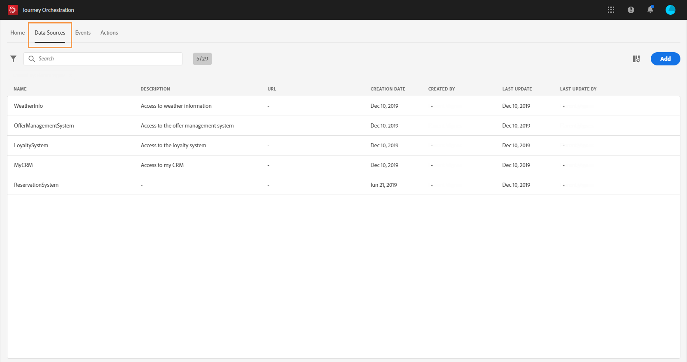

# 데이터 소스 {#concept_s1s_dqt_52b}

>[!CONTEXTUALHELP]
>id="jo_datasources"
>title="데이터 소스"
>abstract="데이터 소스는 항상 기술 사용자가 구성해야 합니다. 데이터 소스를 구성하면 경로에서 사용할 추가 정보 검색을 위해 시스템에 대한 연결을 정의할 수 있습니다. 이러한 추가 정보에는 조건 정의, 작업의 매개 변수 및 개인화 데이터, 사용자 지정 대기 정의, 시간대 정의 등이 있습니다."

데이터 소스를 구성하면 경로에서 사용할 추가 정보 검색을 위해 시스템에 대한 연결을 정의할 수 있습니다. 이러한 추가 정보에는 다음과 같은 항목이 포함됩니다.

* [조건 정의](../building-journeys/condition-activity.md)
* [작업](../action/action.md)의 매개 변수 및 개인화 데이터
* [사용자 지정 대기 정의](../building-journeys/wait-activity.md#custom)
* [시간대 정의](../building-journeys/timezone-management.md)

경로가 이벤트 페이로드에서 전송되는 로컬 데이터만 활용하는 경우에는 이 구성을 수행하지 않아도 됩니다. 예를 들어 경로에 이벤트, 그리고 해당 이벤트의 데이터만 사용하는 이메일 활동이 차례로 포함되어 있다면 데이터 소스를 구성할 필요가 없습니다.

데이터 소스에는 다음의 두 가지 유형이 있습니다.

* 실시간 고객 프로필 서비스에 대한 연결을 정의하는 사전 구성된 Adobe Experience Platform 데이터 소스입니다. 데이터 소스(기본 데이터 소스). 를 참조하십시오.
* 외부 시스템에 대한 연결을 정의할 수 있는 외부 데이터 소스. 이러한 소스는 직접 만들 수 있습니다. 를 참조하십시오.

각 데이터 소스에서는 필드 그룹을 사용하여 검색할 정보를 정의합니다. 필드 그룹은 데이터 소스에서 검색할 수 있는 필드 세트입니다. 을 참조하십시오.

For more information on how to configure an Adobe Experience Platform Data Source and an external data source and how to find and use data in a journey, watch this [tutorial video](https://docs.adobe.com/content/help/ko-KR/journey-orchestration-learn/tutorials/configure-data-sources.html).

데이터 소스를 구성하는 주요 단계는 다음과 같습니다.

>[!NOTE]
>
>데이터 소스는 항상 **기술 사용자**&#x200B;가 구성해야 합니다.

1. 상단 메뉴에서 **[!UICONTROL Data Sources]** 탭을 클릭합니다.

   데이터 소스 목록이 표시됩니다. 인터페이스에 대한 자세한 내용은 를 참조하십시오.

   

1. 기본 데이터 소스에 필드 그룹을 추가하거나( 참조) 새 외부 데이터 소스( 참조) 및 관련 필드 그룹( 참조)을 만들 수 있습니다.

   

1. **[!UICONTROL Save]**&#x200B;을 클릭합니다.

   이제 데이터 소스가 구성되었으며 경로에서 사용할 수 있는 상태가 되었습니다.
