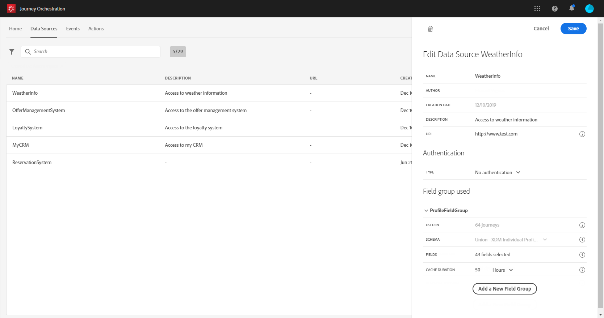

# Adobe Experience Platform 데이터 소스 {#concept_zrb_nqt_52b}

Adobe Experience Platform 데이터 소스는 실시간 고객 프로필 서비스에 대한 연결을 정의합니다. 이 데이터 소스는 내장되어 있으며 사전 구성되어 있습니다. 삭제할 수 없습니다. 이 데이터 소스는 실시간 고객 프로필 서비스에서 데이터를 검색하고 사용하도록 설계되었습니다(예: 여정에 입력한 사람이 여성인지 확인). 프로필 데이터 및 경험 이벤트 데이터를 사용할 수 있습니다. 실시간 고객 프로필 서비스에 대한 자세한 내용은 다음을 참조하십시오. [페이지](https://experienceleague.adobe.com/docs/experience-platform/profile/home.html?lang=ko).

>[!NOTE]
>
>1년 전에 생성된 1,000개의 최신 경험 이벤트를 검색할 수 있습니다.

실시간 고객 프로필 서비스에 연결할 수 있도록 하려면 키를 사용하여 사용자를 식별하고 키를 컨텍스트화하는 네임스페이스를 사용해야 합니다. 따라서 여정이 키와 네임스페이스가 포함된 이벤트로 시작하는 경우에만 이 데이터 소스를 사용할 수 있습니다. [이 페이지](../building-journeys/journey.md)를 참조하십시오.

&quot;ProfileFieldGroup&quot;이라는 사전 구성된 필드 그룹을 편집하고, 새 필드 그룹을 추가하고, 초안 또는 라이브 여정에서 사용되지 않는 필드 그룹을 제거할 수 있습니다. [이 페이지](../datasource/field-groups.md)를 참조하십시오.

기본 데이터 소스에 필드 그룹을 추가하는 주요 단계는 다음과 같습니다.

1. 데이터 소스 목록에서 기본 제공 Adobe Experience Platform 데이터 소스를 선택합니다.

   화면 오른쪽에 데이터 소스 구성 창이 열립니다.

   

1. 클릭 **[!UICONTROL Add a New Field Group]** 검색할 새 일련의 필드를 정의할 수 있습니다. [이 페이지](../datasource/field-groups.md)를 참조하십시오.

   

1. 에서 스키마 선택 **[!UICONTROL Schema]** 드롭다운. 이 필드에는 Adobe Experience Platform에서 사용할 수 있는 프로필 및 경험 이벤트 스키마가 나열됩니다. 에서 스키마 생성이 수행되지 않음 [!DNL Journey Orchestration]. Adobe Experience Platform에서 수행됩니다.
1. 사용할 필드를 선택합니다.
1. **[!UICONTROL Save]**&#x200B;을 클릭합니다.

필드 그룹 이름에 커서를 놓으면 오른쪽에 두 개의 아이콘이 표시됩니다. 필드 그룹을 삭제 및 복제할 수 있습니다. 다음 사항에 주의하십시오. **[!UICONTROL Delete]** 아이콘은 라이브 또는 초안 여정(에 표시되는 정보)에서 필드 그룹을 사용하지 않는 경우에만 사용할 수 있습니다. **[!UICONTROL Used in]** field).
