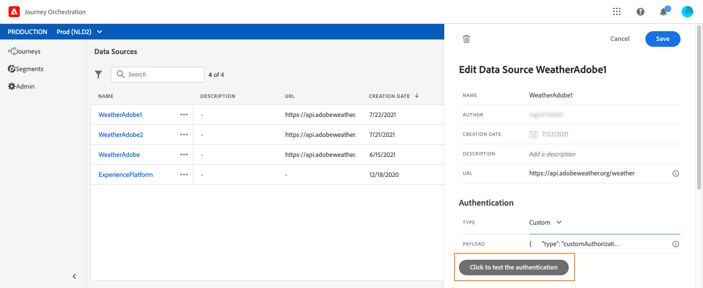

# 외부 데이터 소스 {#concept_t2s_kqt_52b}

외부 데이터 소스를 사용하면 서드파티 시스템에 대한 연결을 정의할 수 있습니다. 호텔 예약 시스템을 사용하여 특정인의 객실 투숙 여부를 확인하는 경우를 예로 들 수 있습니다. 내장된 Adobe Experience Platform 데이터 소스와 달리 외부 데이터 소스를 원하는 만큼 만들 수 있습니다.

POST 또는 GET을 사용하며 JSON을 반환하는 REST API가 지원됩니다. 그리고 API 키와 기본/사용자 지정 인증 모드가 지원됩니다.

실시간 날씨 데이터에 따라 경로 동작을 사용자 지정하는 데 사용하려는 날씨 API 서비스의 예제를 살펴보겠습니다.

아래에 API 호출의 두 가지 예제가 나와 있습니다.

* _https://api.adobeweather.org/weather?city=London,uk&amp;appid=1234_
* _https://api.adobeweather.org/weather?lat=35&amp;lon=139&amp;appid=1234_

이 호출에는 기본 URL(_https://api.adobeweather.org/weather_), 매개 변수 세트 2개(도시에 해당하는 &quot;city&quot;와 위도/경도에 해당하는 &quot;lat/long&quot;), 그리고 API 키(appid)가 포함되어 있습니다.

새 외부 데이터 소스를 만들고 구성하는 주요 단계는 다음과 같습니다.

1. 새 외부 데이터 소스를 만들려면 데이터 소스 목록에서 **[!UICONTROL Add]**&#x200B;를 클릭합니다.

   

   화면 오른쪽에 데이터 소스 구성 창이 열립니다.

   

1. 데이터 소스의 이름을 입력합니다.

   >[!NOTE]
   >
   >공백이나 특수 문자는 사용하지 말고 이름은 30자까지만 입력하십시오.

1. 원하는 경우 데이터 소스에 이벤트에 설명을 추가합니다.
1. 외부 서비스의 URL을 추가합니다. 이 예제에서는 _https://api.adobeweather.org/weather_&#x200B;를 추가합니다.

   >[!CAUTION]
   >
   >보안상 HTTPS를 사용하는 것이 좋습니다. 또한 공개적으로 제공되지 않는 Adobe 주소 및 IP 주소는 사용할 수 없습니다.

   

1. 외부 서비스 구성에 따라 인증을 구성합니다. **[!UICONTROL No authentication]**, **[!UICONTROL Basic]**, **[!UICONTROL Custom]**, **[!UICONTROL API key]** 중에서 선택할 수 있습니다. 사용자 지정 인증 모드에 대한 자세한 내용은 [](../datasource/external-data-sources.md#section_wjp_nl5_nhb)를 참조하십시오. 이 예제에서는 다음 옵션을 선택합니다.


   * **[!UICONTROL Type]**: &quot;API 키&quot;
   * **[!UICONTROL Value]**: &quot;1234&quot;(API 키의 값)
   * **[!UICONTROL Name]**: &quot;appid&quot;(API 키 매개 변수 이름)
   * **[!UICONTROL Location]**: &quot;쿼리 매개 변수&quot;(API 키가 URL에 포함됨)

   

1. **[!UICONTROL Add a New Field Group]**&#x200B;를 클릭하여 각 API 매개 변수용 새 필드 그룹을 추가합니다. 필드 그룹 이름에는 공백이나 특수 문자를 사용하지 마십시오. 이 예제에서는 각 매개 변수 세트(city, long/lat)용으로 하나씩 두 개의 필드 그룹을 만들어야 합니다.

&quot;long/lat&quot; 매개 변수 세트의 경우 다음 정보를 사용하여 필드 그룹을 만듭니다.

* **[!UICONTROL Used in]**: 필드 그룹을 사용하는 경로 수를 표시합니다. **[!UICONTROL View journeys]** 아이콘을 클릭하여 이 필드 그룹을 사용하는 경로 목록을 표시할 수 있습니다.
* **[!UICONTROL Method]**: POST 또는 GET 메서드를 선택합니다. 여기서는 GET 메서드를 선택합니다.
* **[!UICONTROL Cache duration]**: 여기서는 10분 동안 날씨를 캐시합니다.
* **[!UICONTROL Response Payload]**: **[!UICONTROL Payload]** 필드 안을 클릭하여 호출에서 반환된 페이로드의 예제를 붙여넣습니다. 이 예제에서는 날씨 API 웹 사이트의 페이로드를 사용했습니다. 필드 유형이 올바른지 확인합니다. API를 호출할 때마다 시스템은 페이로드 예제에 포함된 모든 필드를 검색합니다. 현재 전달된 페이로드를 변경하려는 경우 **[!UICONTROL Paste a new payload]**&#x200B;를 클릭하면 됩니다.
* **[!UICONTROL Dynamic Values]**: 각 매개 변수를 쉼표로 구분하여 입력합니다. 이 예제에서는 &quot;long,lat&quot;를 입력합니다. 매개 변수 값은 실행 컨텍스트에 따라 달라지므로 경로에서 정의됩니다. [](../expression/expressionadvanced.md)를 참조하십시오.
* **[!UICONTROL Sent Payload]**: 이 예제에서는 이 필드가 표시되지 않습니다. POST 메서드를 선택해야 이 필드를 사용할 수 있습니다. 서드파티 시스템으로 전송할 페이로드를 붙여넣습니다.

매개 변수가 필요한 GET 호출의 경우 **[!UICONTROL Parameters]** 필드에 매개 변수를 입력하면 호출 끝에 매개 변수가 자동으로 추가됩니다. POST 호출의 경우에는 다음을 수행해야 합니다.

* 호출 시 전달할 매개 변수의 목록을 **[!UICONTROL Parameter]** 필드에 포함합니다. 아래 예제에서는 매개 변수가 &quot;identifier&quot;입니다.
* 전송되는 페이로드 본문에서도 정확히 동일한 구문을 사용하여 매개 변수를 지정합니다. 이렇게 하려면 &quot;param&quot;: &quot;매개 변수 이름&quot;(아래 예제에서는 &quot;identifier&quot;)을 추가해야 합니다. 아래 구문을 따르십시오.

   ```
   {"id":{"param":"identifier"}}
   ```


**[!UICONTROL Save]**&#x200B;을 클릭합니다.

이제 데이터 소스가 구성되었으며 경로에서 사용할 수 있는 상태가 되었습니다. 예를 들어 조건이나 이메일 개인화 등에 데이터 소스를 사용할 수 있습니다. 가령 기온이 섭씨 30도를 넘으면 특정 메시지를 보내도록 지정할 수 있습니다.

## 사용자 지정 인증 모드{#section_wjp_nl5_nhb}

>[!CONTEXTUALHELP]
>id="jo_authentication_payload"
>title="사용자 지정 인증"
>abstract="사용자 지정 인증 모드는 OAuth2 등의 API 래핑 프로토콜을 호출하는 복잡한 인증에 사용됩니다. 작업은 두 단계로 실행됩니다. 첫 단계에서는 엔드포인트 호출을 수행하여 액세스 토큰을 생성합니다. 두 번째 단계에서는 작업의 HTTP 요청에 액세스 토큰을 삽입합니다."

이 인증 모드는 작업의 실제 HTTP 요청에 삽입할 액세스 토큰을 검색하기 위한 복잡한 인증(대개 OAuth2 등의 API 래핑 프로토콜을 호출하는 데 사용됨)에 사용됩니다.

사용자 지정 인증을 구성할 때는 아래 버튼을 클릭하여 사용자 지정 인증 페이로드가 올바르게 구성되어 있는지 확인할 수 있습니다.



테스트가 정상적으로 완료되면 버튼이 녹색으로 바뀝니다.


이 인증을 사용할 때는 작업이 다음의 두 단계로 실행됩니다.

1. 끝점을 호출하여 액세스 토큰을 생성합니다.
1. 올바른 방식으로 액세스 토큰을 삽입하여 REST API를 호출합니다.

이 인증은 두 부분으로 구성되어 있습니다.

액세스 토큰 생성을 위해 호출할 끝점의 정의:

* endpoint: 끝점을 생성하는 데 사용할 URL
* 끝점에 대한 HTTP 요청 메서드(GET 또는 POST)
* header: 필요한 경우 이 호출에서 헤더로 삽입할 키/값 쌍
* body: 메서드가 POST인 경우 호출의 본문을 설명하는 요소. bodyParams(키/값 쌍)에 정의된 제한된 본문 구조가 지원됩니다. bodyType은 호출 본문의 형식과 인코딩을 설명합니다.
   * &#39;form&#39;: 콘텐츠 유형은 application/x-www-form-urlencoded(charset UTF-8)이며 키/값 쌍이 그대로 일련화됩니다(예: key1=value1&amp;key2=value2&amp;...).
   * &#39;json&#39;: 콘텐츠 유형은 application/json(charset UTF-8)이며 키/값 쌍이 json 개체 그대로 일련화됩니다(예: _{ &quot;key1&quot;: &quot;value1&quot;, &quot;key2&quot;: &quot;value2&quot;...}_).

작업의 HTTP 요청에서 액세스 토큰을 삽입해야 하는 방식의 정의:

* authorizationType: 생성된 액세스 토큰을 작업의 HTTP 호출에 삽입해야 하는 방법을 정의합니다. 가능한 값은 다음과 같습니다.

   * bearer: _Authorization: Bearer &lt;액세스 토큰>_&#x200B;과 같이 액세스 토큰을 권한 부여 헤더에 삽입해야 함을 나타냅니다.
   * header: 액세스 토큰을 header(tokenTarget 속성으로 정의된 헤더 이름)로 삽입해야 함을 나타냅니다. 예를 들어 tokenTarget이 myHeader이면 액세스 토큰은 _myHeader: &lt;액세스 토큰>_&#x200B;과 같이 헤더로 삽입됩니다.
   * queryParam: access 토큰을 queryParam(tokenTarget 속성으로 정의되는 쿼리 매개 변수 이름)으로 삽입해야 함을 나타냅니다. 예를 들어 tokenTarget이 myQueryParam이면 작업 호출의 URL은 _&lt;url>?myQueryParam=&lt;액세스 토큰>_&#x200B;이 됩니다.

* tokenInResponse: 인증 호출에서 액세스 토큰을 추출하는 방법을 나타냅니다. 이 속성은 다음 중 하나일 수 있습니다.
   * &#39;response&#39;: HTTP 응답이 액세스 토큰임을 나타냅니다.
   * json의 선택기. 응답이 json이면 XML 등의 기타 형식은 지원되지 않습니다. 이 선택기의 형식은 _json://&lt;액세스 토큰 속성의 경로>_&#x200B;입니다. 예를 들어 호출의 응답이 _{ &quot;access_token&quot;: &quot;theToken&quot;, &quot;timestamp&quot;: 12323445656 }_&#x200B;이면 tokenInResponse는 _json: //access_token_&#x200B;이 됩니다.

이 인증의 형식은 다음과 같습니다.

```
{
    "type": "customAuthorization",
    "authorizationType": "<value in 'bearer', 'header' or 'queryParam'>",
    (optional, mandatory if authorizationType is 'header' or 'queryParam') "tokenTarget": "<name of the header or queryParam if the authorizationType is 'header' or 'queryParam'>",
    "endpoint": "<URL of the authentication endpoint>",
    "method": "<HTTP method to call the authentication endpoint, in 'GET' or 'POST'>",
    (optional) "headers": {
        "<header name>": "<header value>",
        ...
    },
    (optional, mandatory if method is 'POST') "body": {
        "bodyType": "<'form'or 'json'>,
        "bodyParams": {
            "param1": value1,
            ...

        }
    },
    "tokenInResponse": "<'response' or json selector in format 'json://<field path to access token>'"
}
```

사용자 정의 인증 데이터 소스에 대한 토큰의 캐시 지속 시간을 변경할 수 있습니다. 다음은 사용자 정의 인증 페이로드의 예입니다. 캐시 지속 시간은 &quot;cacheDuration&quot; 매개 변수에 정의됩니다. 캐시에 생성된 토큰의 보존 기간을 지정합니다. 단위는 밀리초, 초, 분, 시간, 일, 개월, 년일 수 있습니다.

```
"authentication": {
    "type":"customAuthorization",
    "authorizationType":"Bearer",
    "endpoint":"http://localhost:${port}/epsilon/oauth2/access_token",
    "method":"POST",
    "headers": {
        "Authorization":"Basic EncodeBase64(${epsilonClientId}:${epsilonClientSecret})"
        },
    "body": {
        "bodyType":"form",
        "bodyParams": {
             "scope":"cn mail givenname uid employeeNumber",
             "grant_type":"password",
             "username":"${epsilonUserName}",
             "password":"${epsilonUserPassword}"
             }
        },
    "tokenInResponse":"json://access_token",
    "cacheDuration":
             { "duration":5, "timeUnit":"seconds" }
    }
```
