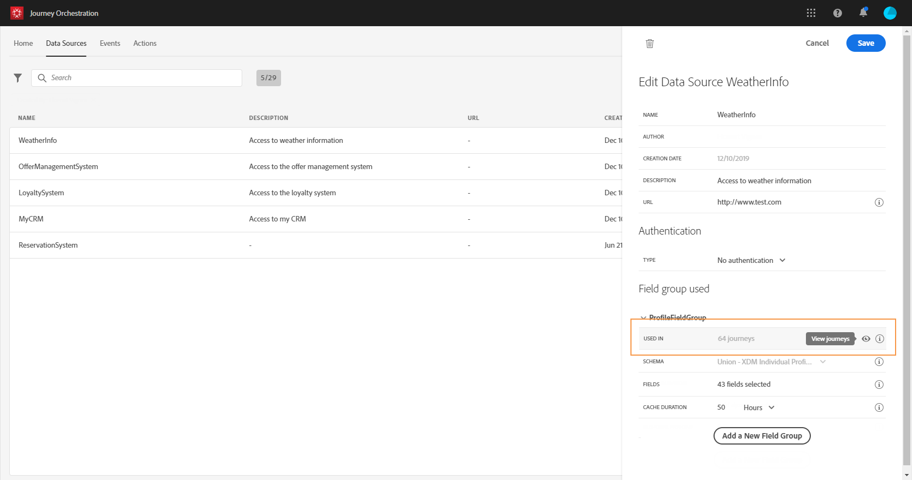

# 필드 그룹 {#concept_ntl_ypt_52b}

필드 그룹은 데이터 소스에서 검색하고 여정에서 사용할 수 있는 필드 세트입니다.

## 필드 그룹 정의 {#section_dsz_kjd_fjb}

각 데이터 소스에 대해 여러 필드 그룹을 정의할 수 있으며 각 필드 그룹은 캐시 지속 시간으로 정의할 수 있습니다.

예를 들어 전화 번호, 이메일, 이름 및 프로필 주소로 필드 그룹을 만들 수 있습니다. 그런 다음 여정에서 이 데이터를 사용하여 조건을 만들 수 있습니다. 예를 들어 프로필의 전화 번호가 비어 있지 않은 경우에만 SMS를 보낼 수 있습니다. 비어 있는 경우 이메일을 보낼 수 있습니다.

기본 이름이 자동으로 추가되더라도 필드 그룹에 이름을 지정하는 것이 좋습니다. 실제로 필드 그룹 이름은 [!DNL Journey Orchestration]에서 다른 사용자에게 표시됩니다. 필드 그룹에 관련 이름을 지정하는 것이 가장 좋습니다.

여정에서 데이터 소스 필드를 사용하면 시스템은 해당 필드 그룹에 대해 정의된 모든 필드를 검색합니다. 따라서 여정에 필요한 필드만 선택하는 것이 좋습니다. 이렇게 하면 여정의 요청 지연이 감소되어 성능이 향상됩니다. 나중에 필드 그룹에 더 많은 필드를 쉽게 추가할 수 있습니다.

**[!UICONTROL Cache duration]** 은 성능을 최적화하는 데 도움이 되므로 중요합니다. 캐시 지속 시간은 여정에서 필드 그룹의 데이터를 한 번 검색하면 시스템이 일시적으로 캐시한다는 의미입니다. 동일한 여정에서 나중에 동일한 데이터가 필요한 경우 시스템은 데이터 소스에 다른 요청을 하지 않습니다. 캐시 지속 기간의 구성은 각 사용 사례에 맞게 조정되어야 합니다. 호텔 예약 상태, 날씨 정보 또는 충성도 지점 수와 같은 실시간 데이터를 검색해야 하는 경우 이러한 필드를 포함하는 필드 그룹을 짧은 캐시 기간(예: 1초)에 연결합니다. 덜 자주 업데이트되는 필드(이름, 성별)의 경우 캐시 기간이 더 긴 두 번째 필드 그룹을 만듭니다(예: 5일).

필드 그룹을 사용하는 여정 수가 **[!UICONTROL Used in]** 필드에 표시됩니다. **[!UICONTROL View journeys]** 단추를 클릭하여 이 필드 그룹을 사용하는 여정 목록을 표시할 수 있습니다.

>[!NOTE]
>
>필드 그룹에 필드가 없으면 표현식 편집기에 표시되지 않습니다.

## 필드 그룹 라이프사이클 {#section_abk_njd_fjb}

초안 또는 라이브 여정에서 사용되지 않는 필드 그룹에서 필드를 추가하거나 제거할 수 있습니다.

추가할 수는 있지만 하나 이상의 초안 또는 라이브 여정에 사용되는 필드 그룹에서 필드를 제거할 수는 없습니다. 이렇게 하면 여정이 깨지지 않습니다.

하나 이상의 여정에 사용된 필드 그룹에서 필드를 삭제하려면 다음 단계를 수행합니다. &quot;필드 그룹 A&quot;라는 필드 그룹의 예를 살펴보겠습니다.

1. 필드 그룹 목록에서 &quot;필드 그룹 A&quot;에 커서를 놓고 오른쪽에 있는 **[!UICONTROL Duplicate]** 아이콘을 클릭합니다. 예를 들어 중복된 필드 그룹 이름을 &quot;필드 그룹 B&quot;로 지정합니다.
1. &quot;필드 그룹 B&quot;에서 더 이상 필요하지 않은 필드를 제거합니다.
1. &quot;필드 그룹 A&quot;에서 이 필드 그룹이 사용되는 위치를 확인합니다. 이 정보는 **[!UICONTROL Used in]** 필드에 표시됩니다.
1. &quot;필드 그룹 A&quot;를 사용하는 모든 여정을 엽니다.
1. 이러한 여정의 새 버전을 만듭니다. &quot;필드 그룹 A&quot;를 사용하여 모든 활동을 편집하고 &quot;필드 그룹 B&quot;를 선택합니다.
1. &quot;필드 그룹 A&quot;를 사용하는 이전 버전의 여정을 중지합니다. 그런 다음 &quot;필드 그룹 A&quot;를 사용하는 여정이 없어야 합니다.
1. 더 이상 사용되지 않는 &quot;필드 그룹 A&quot;를 제거합니다.
