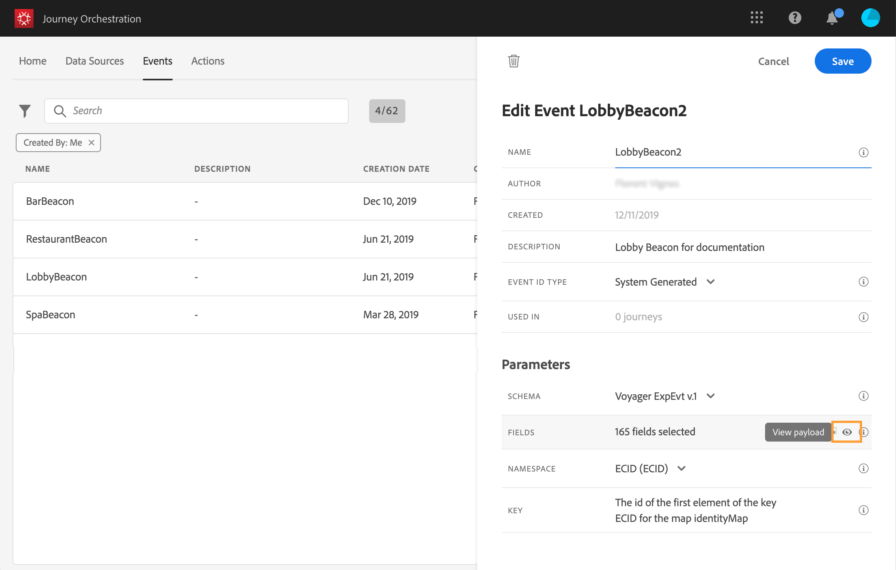

# 페이로드 미리 보기 {#concept_jgf_4yk_4fb}

>[!CAUTION]
>
>**Adobe Journey Optimizer를 찾고 계신가요**? [여기](https://experienceleague.adobe.com/ko/docs/journey-optimizer/using/ajo-home){target="_blank"}를 클릭하여 Journey Optimizer 설명서를 확인할 수 있습니다.
>
>
>_이 설명서는 Journey Optimizer로 대체된 이전 Journey Orchestration 자료를 참조합니다. Journey Orchestration 또는 Journey Optimizer 액세스에 대한 질문이 있는 경우 계정 팀에 문의하십시오._

페이로드 미리 보기를 사용하면 페이로드 정의의 유효성을 확인할 수 있습니다.

>[!NOTE]
>
>시스템 생성 이벤트의 경우 이벤트를 만들 때 페이로드 미리 보기를 보려면 이벤트를 저장한 다음 다시 엽니다. 이 단계는 페이로드에서 이벤트 ID를 생성하는 데 필요합니다.

1. 시스템에서 예상한 페이로드를 미리 보려면 **[!UICONTROL View Payload]** 아이콘을 클릭하십시오.

   

   선택한 필드가 표시됩니다.

   

1. 미리 보기를 확인하여 페이로드 정의의 유효성을 검사합니다.

1. 그런 다음 이벤트 전송을 담당하는 사람과 페이로드 미리 보기를 공유할 수 있습니다. 이 페이로드는 [!DNL Journey Orchestration]에 푸시하는 이벤트의 설정을 디자인하는 데 도움이 될 수 있습니다. [이 페이지](../event/additional-steps-to-send-events-to-journey-orchestration.md)를 참조하십시오.
