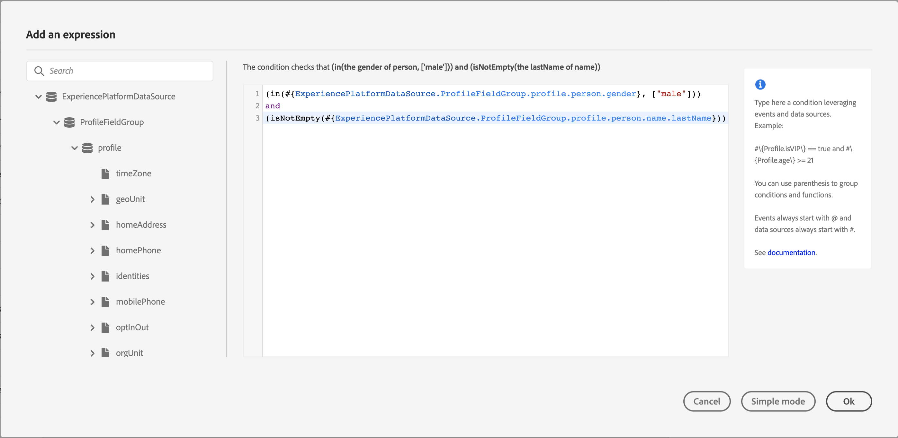

# 고급 표현식 편집기 정보 {#concept_uyj_trt_52b}

고급 표현식 편집기를 사용하면 데이터 소스 조건을 정의할 때 등 인터페이스의 다양한 화면에서 고급 표현식을 작성할 수 있습니다.
특정 데이터 조작이 필요한 작업 매개 변수를 정의해야 할 때마다 고급 표현식 편집기를 사용할 수도 있습니다. 이벤트로부터 얻은 데이터 또는 데이터 소스에서 검색된 추가 정보를 활용할 수 있습니다. 여정에서는 상황에 맞는 이벤트 필드 목록이 표시되며, 이 목록은 여정에 추가된 이벤트에 따라 달라집니다.

고급 표현식 편집기는 값을 조작하고 필요에 맞는 표현식을 정의할 수 있는 기본 함수 및 연산자를 제공합니다. 고급 표현식 편집기를 사용하면 외부 데이터 소스 매개 변수의 값을 정의하고, 맵 필드와 컬렉션(예: 경험 이벤트)을 조작할 수도 있습니다.

_고급 표현식 편집기 인터페이스_

고급 표현식 편집기를 사용하여 다음을 수행할 수 있습니다.

* 데이터 소스 및 이벤트 정보에 대한 [고급 조건](../building-journeys/condition-activity.md#about_condition) 만들기
* 사용자 지정 [대기 활동](../building-journeys/wait-activity.md#custom) 정의
* 작업 매개 변수 매핑 정의

가능한 경우 **[!UICONTROL Advanced mode]** / **[!UICONTROL Simple mode]** 버튼을 사용하여 두 모드 간을 전환할 수 있습니다. 단순 모드는 [여기](../building-journeys/condition-activity.md#about_condition)에 설명되어 있습니다.

>[!NOTE]
>
>조건은 단순 또는 고급 표현식 편집기에서 정의할 수 있으며, 항상 부울 형식을 반환합니다.
>
>작업 매개 변수는 필드를 선택하여 정의하거나 고급 표현식 편집기를 통해 정의할 수 있으며, 표현식에 따라 특정 데이터 형식을 반환합니다.

## 고급 표현식 편집기 액세스 {#section_fdz_4nj_cjb}

다양한 방법으로 고급 표현식 편집기에 액세스할 수 있습니다.

* 데이터 소스 조건을 만들 때 **[!UICONTROL Advanced mode]** 아이콘을 클릭하여 고급 편집기에 액세스할 수 있습니다.

   

* 사용자 지정 타이머를 만들 때 고급 편집기가 바로 나타납니다.
* 작업 매개 변수를 매핑할 때 **[!UICONTROL Advanced mode]**&#x200B;를 클릭합니다.

## 인터페이스 살펴보기{#section_otq_tnj_cjb}

이 화면에서 표현식을 직접 작성할 수 있습니다.

화면 왼쪽에 사용 가능한 필드와 함수가 표시됩니다.

* **[!UICONTROL Events]**: 인바운드 이벤트에서 받은 필드 중 하나를 선택합니다. 상황에 맞는 이벤트 필드 목록이 표시되며, 이 목록은 여정에 추가된 이벤트에 따라 달라집니다. [자세히 보기](../event/about-events.md)
* **[!UICONTROL Segments]**: 이벤트를 삭제한 경우  **[!UICONTROL Segment qualification]** 표현식에서 사용할 세그먼트를 선택합니다. [자세히 보기](../segment/using-a-segment.md)
* **[!UICONTROL Data Sources]**: 데이터 소스의 필드 그룹에서 사용 가능한 필드 목록 중에서 선택합니다. [자세히 보기](../datasource/about-data-sources.md)
* **[!UICONTROL Journey properties]**: 이 섹션은 지정된 프로필의 여정과 관련된 기술 필드를 다시 그룹화합니다. [자세히 보기](../expression/journey-properties.md)
* **[!UICONTROL Functions]**: 복잡한 필터링을 수행할 수 있는 기본 함수 목록 중에서 선택합니다. 함수는 카테고리별로 구성됩니다. [자세히 보기](../expression/functions.md)

자동 완성 메커니즘이 상황에 맞는 제안을 표시합니다.

구문 유효성 검사 메커니즘이 코드의 무결성을 확인합니다. 편집기 맨 위에 오류가 표시됩니다.

**고급 표현식 편집기를 사용하여 조건을 작성할 때의 매개 변수 필요성**

매개 변수를 호출해야 하는 외부 데이터 소스에서 필드를 선택하는 경우([이 페이지](../datasource/external-data-sources.md) 참조). 예를 들어 날씨 관련 데이터 소스에서 자주 사용되는 매개 변수는 &quot;city&quot;입니다. 따라서 이 city 매개 변수를 가져올 위치를 선택해야 합니다. 매개 변수에 함수를 적용하여 형식 변경 또는 연결을 수행할 수도 있습니다.

보다 복잡한 사용 사례에서는 기본 표현식에 데이터 소스의 매개 변수를 포함하려는 경우 &quot;params&quot; 키워드를 사용하여 해당 값을 정의할 수 있습니다. [이 페이지](../expression/field-references.md)를 참조하십시오.
