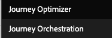

# Journey Orchestration 환경을 Adobe Journey Optimizer으로 업그레이드{#migration-jo}

## Adobe Journey Optimizer 소개

Adobe Journey Optimizer은 Adobe Experience Platform에 기본적으로 구축된 민첩하고 확장 가능한 애플리케이션으로서, 앱, 장치, 화면 또는 채널에서 개인화되고, 연결되어 있으며, 적시에 고객 여정을 통합 관리하고 제공할 수 &#x200B; 있습니다.

## Adobe Journey Orchestration 소개

Journey Orchestration은 Adobe Experience Platform에 구축된 서비스로, 이전 행동과 환경 설정에 따라 각 고객에 대해 개별 여정을 조정할 수 있습니다. Journey Orchestration은 Journey Optimizer의 이전 애플리케이션입니다.

## Adobe Journey Optimizer으로 이동해야 하는 이유는 무엇입니까?

**간소화된 인터페이스에 액세스** Experience Platform 기능을 사용하면 여정, 데이터 세트, 프로필, 경고 등에 빠르게 액세스할 수 있습니다. Adobe Experience Platform과 Journey Orchestration 간을 앞뒤로 하여 스키마나 데이터 세트에 액세스할 필요가 없으며, Adobe Journey Optimizer에서 모든 것을 바로 사용할 수 있습니다. 자세한 내용은 다음을 참조하십시오 [페이지](https://experienceleague.adobe.com/docs/journey-optimizer/using/get-started/user-interface.html).

<table>
<tr>
<th>이전</th>
<th>이후</th>
</tr>
<tr>
<td>
Journey Orchestration의 여정, 세그먼트 및 관리 섹션(데이터 소스, 이벤트 및 작업)에 액세스합니다. 세그먼트 및 데이터 세트는 Adobe Experience Platform에서 액세스할 수 있습니다. 
</td>
<td>
여정, 세그먼트, 관리자, 세그먼트 및 데이터 세트에 대한 액세스, <strong>Adobe Journey Optimizer 내</strong>. <strong>추가 Adobe Experience Platform 기능</strong> 여기에서 액세스할 수도 있습니다.
</td>
</tr>
</table>

**새 보고 인터페이스** 및 새 보고 기능에 액세스:

<table>
<tr>
<th>이전</th>
<th>이후</th>
</tr>
<tr>
<td></td>
<td>
<strong>전역 보기</strong> 선택한 기간 동안 여정 및 게재의 영향을 측정할 수 있습니다. 더 많은 실시간 지표의 경우, <strong>라이브 보기</strong>. 여정(이메일, SMS, 푸시)에서 사용되는 각 게재 채널에 대해, <strong>전용 섹션</strong> 보고서에서 지표를 볼 수 있습니다. 이는 기본 제공 을 사용하는 경우에만 적용됩니다 <strong>Adobe Journey Optimizer 메시징 기능</strong>. 자세한 내용은 계정 팀에 문의하십시오.
</td>
</tr>
</table>

보고 경험을 개선하거나 새로운 기능 릴리스에 따라 보강하기 위한 모든 진화는 새 보고 인터페이스에서만 사용할 수 있습니다. 이를 사용하여 보다 완벽한 Adobe Journey Optimizer 경험을 얻으십시오.

다른 전류의 이점 얻기 **Adobe Journey Optimizer 기능** 필드 수준 액세스 제어 및 개체 수준 액세스 제어 등의 새로운 기능이 제공됩니다. 자세한 내용은 계정 팀에 문의하십시오.

## Journey Orchestration 환경을 업그레이드하는 방법

1. 계정 팀에 연락하여 Adobe으로 계약을 무료로 업데이트합니다.

1. 엔지니어링 팀이 변경을 완료할 때까지 기다립니다.

1. Journey Optimizer의 제품 프로필을 사용하여 권한을 업데이트합니다. 다음을 참조하십시오 [페이지](https://experienceleague.adobe.com/docs/journey-optimizer/using/administration/ootb-product-profiles.html?lang=ko).

1. 이제 Adobe Journey Optimizer에 액세스할 수 있습니다.

## 자주 묻는 질문

## Journey Orchestration에서 Adobe Journey Optimizer으로 이동할 계획을 세워야 합니까?

마이그레이션, 작업 필요 없음, 다운타임 및 추가 투자 없음 Adobe와의 계약을 업데이트하기만 하면 됩니다. 나머지 작업은 Adobe에서 수행합니다. 이 프로세스를 시작하는 방법에 대한 지침은 계정 담당자에게 문의하십시오.

## 잔돈 후에 잃어버리나요?

아니요. 기존 Journey Orchestration 및 Adobe Experience Platform 개체를 모두 유지합니다. 스키마, 데이터 세트, 여정, 이벤트, 데이터 소스, 작업. 아무 것도 손실되지 않으며 모든 라이브 여정은 중단 없이 계속 작동합니다.

<table>
<tr>
<th>이전</th>
<th>이후</th>
</tr>
<tr>
<td></td>
<td></td>
</tr>
</table>

### 여전히 응용 프로그램 전환기에 Journey Orchestration이 표시됩니다. 정상입니까?

네, 정상입니다. 업그레이드 후 한 달 동안 Journey Orchestration에 대한 액세스 권한을 유지합니다. 이렇게 하면 모든 사용자 권한을 업데이트하고 Adobe Journey Optimizer에 대해 더 잘 알 수 있을 만큼 충분한 시간이 제공됩니다. 한 달 후에 액세스가 제거됩니다.

### 오늘 Adobe Campaign Standard에서 Journey Orchestration을 사용하면 어떻게 됩니까?

Adobe Journey Optimizer으로 이동하더라도 Adobe Journey Optimizer에서 고객 여정을 디자인하고 Adobe Campaign Standard에서 게재를 전송하도록 하여 여정과 Adobe Campaign Standard 간의 통합을 사용할 수 있습니다.

하지만 Adobe Journey Optimizer 보고 스택이 작동하는 방식으로 인해 보고 시 여정 데이터와 Campaign Standard 데이터가 결합되지 않습니다. 여정 정보는 Adobe Campaign Standard의 Adobe Journey Optimizer 보고서 및 게재 정보에서 사용할 수 있습니다. Experience Platform을 구성하여 Adobe Campaign Standard 데이터를 Adobe Experience Platform으로 가져와 Customer Journey Analytics([자세히 알아보기](https://business.adobe.com/products/experience-platform/customer-journey-analytics.html)) 또는 Tableau 또는 PowerBI와 같은 기타 타사 보고 도구.

Adobe Journey Optimizer 보고서는 Adobe Journey Optimizer의 기본 제공 메시징 기능(전용 Adobe Journey Optimizer 오퍼링에서 사용 가능)을 사용할 때 가장 잘 작동합니다. 여정 캔버스에서 메시지를 작성할 수 있는 방법에 대한 자세한 내용은 다음을 참조하십시오 [페이지](https://experienceleague.adobe.com/docs/journey-optimizer/using/messages/messages-in-journeys.html).

자세한 내용은 계정 팀에 문의하십시오.