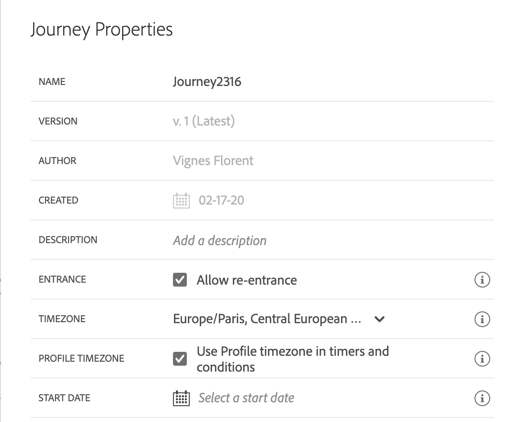

# 릴리스 정보 {#release-notes}

이 페이지에는 Journey Orchestration의 새로운 기능과 개선 사항이 모두 포함되어 있습니다.
최신 [설명서 업데이트](../release-notes/documentation-updates.md)도 확인할 수 있습니다.

## 2021년 1월 릴리스 {#january-release}

이벤트 구성에서 스키마를 선택하면 Journey Orchestration에서 이벤트를 제대로 수신해야 하는 필드만 선택됩니다. [자세한 내용](../event/defining-the-payload-fields.md)

이제 간단한 표현식 편집기에서 여정 속성 속성을 사용할 수 있습니다.

2개의 새 여정 속성 특성(sandboxName 및 organizationId)이 추가되었습니다. [자세한 내용](../expression/journey-properties.md)

Adobe Campaign Standard SLA에 맞게 Adobe Campaign Standard 통합이 설정되는 즉시 Adobe Campaign Standard 작업에 대해 초당 13회의 호출 규칙이 자동으로 정의됩니다. [자세한 내용](../action/working-with-adobe-campaign.md)

이제 이벤트 시간 초과 기간이 시간 초과 경로에 보다 명확하게 지정됩니다. [자세한 내용](../building-journeys/event-activities.md#listening-to-events-during-a-specific-time)

[getListItem](../functions/functiongetlistitem.md) 및 [split](../functions/functionsplit.md) 함수가 고급 표현식 편집기에서 사용할 수 있는 함수 목록에 추가되었습니다. 이렇게 하면 문자열 계산 사용 사례에서 더 많은 가능성이 제공됩니다.

## 2020년 11월 릴리스 {#november-release}

<table>
<thead>
<tr>
<th><strong>여정 간 이동</strong> </th>
</tr>
</thead>
<tbody>
<tr>
<td>

새 작업 활동을 사용하면 한 여정에서 다른 여정으로 개인 사용자를 푸시할 수 있습니다. <strong>Jump</strong> 활동을 통해 다음을 수행할 수 있습니다.

<ul>
<li>여러 개로 분할하여 매우 복잡한 여정의 디자인을 간소화 </li>
<li>공통 및 재사용 가능한 여정 패턴을 기반으로 여정 구축</li>
</ul>

자세한 내용은 <a href="../building-journeys/jump.md">자세한 설명서</a> 및 <a href="https://experienceleague.adobe.com/docs/journey-orchestration-learn/tutorials/building-a-journey/jumping-to-another-journey.html">자습서 비디오</a>를 참조하십시오.

</td>
</tr>
</tbody>
</table>

<table>
<thead>
<tr>
<th><strong>표현식 편집기에서 여정 속성 사용</strong> </th>
</tr>
</thead>
<tbody>
<tr>
<td>

고급 표현식 편집기에서 필드 및 함수 목록에 새 카테고리를 추가했습니다. 여정 ID 또는 발생한 특정 오류와 같은 라이브 여정 시스템에서 검색한 정보입니다. 여정을 구축하면 가능성이 높아집니다. 예를 들어 조건이나 작업에서 오류가 발생한 경우 서드파티 시스템에 경고할 수 있습니다.

자세한 내용은 <a href="../expression/journey-properties.md">세부 설명서</a>를 참조하십시오.

</td>
</tr>
</tbody>
</table>

<table>
<thead>
<tr>
<th><strong>규칙 기반 이벤트  (Beta)</strong> </th>
</tr>
</thead>
<tbody>
<tr>
<td>

이제 eventID를 사용하지 않고 이벤트를 보다 쉽게 설정하는 새로운 방법을 사용할 수 있습니다. 규칙 기반 이벤트는 조건에 따라 이벤트를 트리거해야 하는지 여부를 평가합니다. "시스템 생성"이라는 기존 방법을 계속 사용할 수 있습니다. 알파 프로그램을 통해 제한된 고객 집합에서 테스트한 이 기능은 이제 모든 고객에게 베타 버전으로 제공됩니다.

자세한 내용은 <a href="../event/about-events.md">세부 설명서</a>를 참조하십시오.

</td>
</tr>
</tbody>
</table>

### 기타 개선 사항

여정의 새 버전을 만들 때 제한 사항을 추가했습니다. 이러한 제한 사항은 여정에서 너무 많은 변경 사항을 방지하여 버전 간에 일관성을 유지합니다. [자세한 내용](../about/limitations.md#journey-versions-limitations)

Campaign Standard 메시지 활동을 포함하는 여정에서 더 이상 **세그먼트 자격** 활동을 사용할 수 없습니다. 이러한 제한은 Adobe Campaign Standard 인스턴스의 무결성을 보호합니다. 실제로, 세그먼트 자격 사용은 Campaign Standard 트랜잭션 메시지를 오버로드하게 하는 메시지를 매일 가장 많이 보낼 수 있습니다. [자세한 내용](../about/limitations.md#segment-qualification)

## 2020년 10월 릴리스 {#october-release}

<table>
<thead>
<tr>
<th><strong>이벤트 시간 제한</strong> </th>
</tr>
</thead>
<tbody>
<tr>
<td>

이제 여정이 특정 시간 동안에만 이벤트를 수신하도록 하기 위해 이벤트에 대한 시간 제한을 구성할 수 있습니다. 이를 위해 더 이상 이벤트 여정을 동시에 대기 활동을 추가할 필요가 없습니다.

자세한 내용은 <a href="../building-journeys/event-activities.md#listening-to-events-during-a-specific-time">세부 설명서</a>를 참조하십시오.

</td>
</tr>
</tbody>
</table>

### 기타 개선 사항

* 새 여정 버전을 게시하면 이전 버전이 자동으로 종료되고 닫힌 상태로 전환됩니다. [자세한 내용](../building-journeys/journey-versions.md)

## 2020년 9월 릴리스 {#september-release}

### GA 업데이트{#september-ga-update}

<table>
<thead>
<tr>
<th><strong>조건 활동 개선 사항</strong> </th>
</tr>
</thead>
<tbody>
<tr>
<td>

이제 여정에 조건을 추가할 때 레이블을 정의할 수 있습니다. 여정에서 여러 조건을 사용하는 경우 해당 조건을 보다 쉽게 식별할 수 있습니다.

자세한 내용은 <a href="../building-journeys/condition-activity.md#about_condition">세부 설명서</a>를 참조하십시오.

</td>
</tr>
</tbody>
</table>

### 알파 업데이트{#september-alpha-update}

알파의 범위를 검색하려면 이 [섹션](../alpha/alpha-overview.md)을 참조하십시오.

<table>
<thead>
<tr>
<th><strong>세그먼트 활동 읽기 개선 사항</strong> </th>
</tr>
</thead>
<tbody>
<tr>
<td>

<strong>세그먼트 읽기</strong> 활동에는 다음과 같은 사항이 개선되었습니다.

<ul>
<li>
이제 세그먼트 기반 여정이 캔버스 위에 표시되어 여정의 예약 유형을 미리 알려줍니다. 이 미리 알림을 클릭하여 예약 구성 메뉴에 액세스할 수 있습니다.

</li>
<li>
세그먼트 내보내기 진행 상태를 표시하기 위해 테스트 모드 로그의 세부 기간을 개선하였습니다.

</li>
</ul>

<strong>세그먼트 읽기</strong> 활동에 대한 자세한 내용은 <a href="../alpha/alpha-segment-trigger.md">자세한 설명서</a>를 참조하십시오.

</td>
</tr>
</tbody>
</table>

## 2020년 8월 릴리스 {#august-release}

### GA 업데이트{#august-ga-update}

이제 세그먼트 자격 이벤트의 페이로드에는 동작(시작, 종료), 자격 타임스탬프 및 세그먼트 ID와 같은 컨텍스트 정보가 포함되어 있으며 조건 및 작업에 사용할 수 있습니다. [자세한 내용](../building-journeys/segment-qualification-events.md)

### 알파 업데이트{#august-alpha-update}

알파의 범위를 검색하려면 이 [섹션](../alpha/alpha-overview.md)을 참조하십시오.

<table>
<thead>
<tr>
<th><strong>세그먼트 트리거 활동</strong> </th>
</tr>
</thead>
<tbody>
<tr>
<td>

세그먼트 트리거 활동에는 다음과 같은 사항이 개선되었습니다.

<ul>
<li>
활동의 이름이 "세그먼트 읽기"로 변경되었습니다. 

</li>
<li>
여정 스케줄러 구성이 활동의 속성에서 제거되었습니다. 이제 세그먼트 읽기 활동이 캔버스에 드롭된 경우 표시되는 전용 섹션의 여정의 속성에서 직접 액세스할 수 있습니다. 

</li>
<li>
이제 단일 프로필에서 여정을 테스트하고 시각적인 흐름을 사용하여 여정의 진행 상황을 추적할 수 있습니다.

</li>
</ul>

자세한 내용은 <a href="../alpha/alpha-segment-trigger.md">세부 설명서</a>를 참조하십시오.

</td>
</tr>
</tbody>
</table>

<table>
<thead>
<tr>
<th><strong>규칙 기반 이벤트</strong> </th>
</tr>
</thead>
<tbody>
<tr>
<td>

규칙 기반 이벤트에는 다음과 같은 사항이 개선되었습니다.

<ul>
<li>
이제 모든 Adobe Analytics 행동 이벤트 데이터를 활용하여 이미 플랫폼에 스트리밍 및 캡처하고 있으므로 고객을 위한 고객 여정을 트리거하고 경험을 자동화할 수 있습니다. <a href="../event/about-analytics.md">자세한 내용</a>

</li>
<li>
이제 테스트 모드에서 규칙 기반 이벤트를 트리거할 때 이벤트 ID 조건을 직접 볼 수 있습니다. 또한 규칙 평가의 일부인 각 필드 옆에 도구 설명이 추가되었습니다. <a href="../building-journeys/testing-the-journey.md#test-rule-based">자세한 내용</a>

</li>
<li>
향상된 경험을 위해 규칙 기반 이벤트 정의 화면이 재구성되었습니다. <a href="../event/about-creating.md">자세한 내용</a>

</li>
</ul>
</td>
</tr>
</tbody>
</table>

## 알파 릴리스 - 2020년 7월 {#alpha-release---july-2020}

알파 프로그램은 제한된 고객 세트에서 현재 테스트하는 기능을 제공합니다. 따라서 수신한 피드백을 바탕으로 제품을 개선할 수 있습니다. 모든 Journey Orchestration 고객이 이러한 기능을 사용할 수는 없습니다.

이러한 기능은 전용 [섹션](../alpha/alpha-overview.md)에 설명되어 있습니다.

<table>
<thead>
<tr>
<th><strong>향상된 사용자 인터페이스</strong> </th>
</tr>
</thead>
<tbody>
<tr>
<td>

Adobe Experience Platform과 일관된 인터페이스를 제공하기 위해 Journey Orchestration 메뉴 내의 탐색 기능이 다음과 같이 향상되었습니다.

<ul>
<li>
메뉴가 인터페이스 맨 위에서 왼쪽으로 이동되었습니다. 

</li>
<li>
관리 기능을 하나의 대시보드로 그룹화하였습니다.

</li>
</ul>

자세한 내용은 <a href="../alpha/alpha-interface.md">세부 설명서</a>를 참조하십시오.

</td>
</tr>
</tbody>
</table>

<table>
<thead>
<tr>
<th><strong>세그먼트 트리거 활동</strong> </th>
</tr>
</thead>
<tbody>
<tr>
<td>

세그먼트 트리거 활동을 사용하면 Adobe Experience Platform 세그먼트에 속하는 모든 개인이 여정을 시작할 수 있습니다. 여정의 시작은 한 번 또는 정기적으로 실행될 수 있습니다. <a href="../alpha/alpha-segment-trigger.md">자세한 내용</a>

</td>
</tr>
</tbody>
</table>

<table>
<thead>
<tr>
<th><strong>규칙 기반 이벤트</strong> </th>
</tr>
</thead>
<tbody>
<tr>
<td>

경험 이벤트를 설정하는 방법을 간소화했습니다. eventID를 사용할 필요가 없는 새 메서드가 도입되었습니다. 이제 Journey Orchestration에서 이벤트를 설정할 때 규칙 기반 이벤트를 정의할 수 있습니다. <a href="../event/about-events.md">자세한 내용</a>

</td>
</tr>
</tbody>
</table>

## 2분기 릴리스 - 2020년 6월 {#q2-release---june-2020}

<table>
<thead>
<tr>
<th><strong>Adobe Experience Platform 통합 개선 사항</strong> </th>
</tr>
</thead>
<tbody>
<tr>
<td>

다음과 같은 Adobe Experience Platform 통합 개선이 이루어졌습니다.

<ul>
<li>
새로운 활동을 통해 Adobe Experience Platform 세그먼트 출입구에서 수신 대기함으로써 사용자가 여정에 들어오거나 앞으로 이동하도록 할 수 있습니다. <a href="../building-journeys/segment-qualification-events.md">자세한 내용</a>

</li>
<li>
이제 새로운 <strong>세그먼트</strong> 탭 덕분에 Journey Orchestration 인터페이스를 벗어나지 않고도 Adobe Experience Platform 세그먼트를 만들고 편집할 수 있습니다. <a href="../segment/about-segments.md">자세한 내용</a>

</li>
<li>
단순 표현식 편집기에서 이제 Adobe Experience Platform 세그먼트가 탐색 트리에 직접 나열되므로 "이 사람이 세그먼트 A에 속합니까?"와 같은 조건을 쉽게 설정할 수 있습니다. <a href="../segment/using-a-segment.md">자세한 내용</a>

</li>
<li>
이제 Journey Orchestration이 여정 중에 실행된 단계를 Adobe Data Platform에 자동으로 전달합니다. 여기에는 발생한 잠재적 오류도 포함됩니다. 이 정보는 특정 여정 또는 모든 여정에 대해 여정 단계 이벤트에서 쿼리를 실행함으로써 보고 및 문제 해결을 수행하는 데 사용될 수 있습니다. <a href="../building-journeys/sharing-overview.md">자세한 내용</a>

</li>
<li>
이제 Journey Orchestration을 프로덕션 및 프로덕션이 아닌 Adobe Experience Platform 샌드박스에 연결할 수 있습니다. 샌드박스는 베타 기능입니다. <a href="../about/access-management.md#sandboxes">자세한 내용</a>

</li>
</ul>
</td>
</tr>
</tbody>
</table>

<table>
<thead>
<tr>
<th><strong>여정 디자이너 및 테스트 모드 개선 사항</strong> </th>
</tr>
</thead>
<tbody>
<tr>
<td>

여정 디자이너 및 테스트 모드가 다음과 같이 개선되었습니다.

<ul>
<li>
이제 1 또는 N 여정 활동을 선택하면서 붙여넣기 활동을 한 여정에서 다른 여정로 복사할 수 있습니다. <a href="../building-journeys/using-the-journey-designer.md#copy-paste">자세한 내용</a>

</li>
<li>
이제는 테스트 프로필이 여정에 들어가도록 만드는 이벤트를 시작한 후에 색상으로 표시되는 시각적 플로우를 통해 여정 내 진행 상황을 확인할 수 있습니다. 여정에서 오류가 발생하는 경우 오류의 세부 정보도 표시됩니다. <a href="../building-journeys/testing-the-journey.md#firing_events">자세한 내용</a>

</li>
<li><strong>Finished</strong> 여정 상태가 해당 상태의 의미를 더 잘 반영하도록 <strong>Closed (no entrance)</strong>로 이름이 바뀌었습니다.</li>
</ul>
</td>
</tr>
</tbody>
</table>

**기타 개선 사항**

서드파티 시스템에 너무 많은 API 호출을 보내지 않도록 &quot;최대 가용량&quot; 규칙을 설정하는 새로운 공개 API를 채택하고 있습니다. 최대 가용량 규칙을 사용하면 API 엔드포인트에 대한 밀리초당 최대 호출 수를 정의할 수 있습니다. [자세한 내용](../api/capping.md)

이제 액세스 제어를 통해 사용자 액세스를 더 세부적으로 관리할 수 있습니다. 발효 날짜: 2020년 6월 30일. [자세한 내용](../about/access-management.md#create-product-profile)

이제 APAC(호주 데이터 센터)에서 Journey Orchestration을 사용할 수 있습니다. 발효 날짜: 2020년 6월 30일

Journey Orchestration 인터페이스를 일본어로 사용할 수 있습니다.

## 1분기 릴리스 - 2020년 3월 {#q1-release---march-2020}

<table>
<thead>
<tr>
<th><strong>향상된 테스트 모드</strong> </th>
</tr>
</thead>
<tbody>
<tr>
<td>

테스트 모드가 다음과 같이 향상되었습니다.

<ul>
<li>이제는 여정 하나에서 여러 이벤트를 사용할 때 테스트 모드의 <strong>이벤트 구성</strong> 화면 내 드롭다운 목록에서 각 이벤트를 개별적으로 트리거할 수 있습니다. <a href="../building-journeys/testing-the-journey.md#firing_events">자세한 내용</a>
</li>
<li>
이제는 여정에서 <strong>대기</strong> 활동을 하나 이상 사용할 때 테스트 모드에서 이러한 각 활동을 진행할 시간을 정의할 수 있습니다. 기본 시간은 10초입니다. 왼쪽 아래에서 <strong>테스트의 대기 시간</strong> 매개 변수를 사용하여 이 시간을 변경할 수 있습니다. <a href="../building-journeys/testing-the-journey.md">자세한 내용</a>

</li>
<li>이제는 서드파티 시스템(데이터 소스 또는 작업)을 호출할 때 오류가 발생하면 <strong>테스트 로그</strong>에 오류 코드와 오류 응답이 표시됩니다. <a href="../building-journeys/testing-the-journey.md#viewing_logs">자세한 내용</a>
</li>
</ul>
</td>
</tr>
</tbody>
</table>

<table>
<thead>
<tr>
<th><strong>중앙 집중식 시간대 관리</strong> </th>
</tr>
</thead>
<tbody>
<tr> 
<td>

이제는 여정 속성 패널에서 중앙 집중식으로 시간대를 관리할 수 있습니다. 중앙 집중식 관리를 위해 여정 속성에 매개 변수 두 개가 추가되었습니다.

<ul>
<li><strong>시간대</strong> 드롭다운 목록에서 특정 시간대를 선택할 수 있습니다. 기본적으로는 브라우저의 시간대가 사용됩니다. </li>
<li><strong>프로필 시간대</strong> 확인란을 선택하면 여정을 입력하는 사용자의 Adobe Experience Platform 프로필 시간대(사용 가능한 경우)를 사용할 수 있습니다. 이 확인란을 선택하지 않으면 드롭다운 목록에서 정의한 시간대가 사용됩니다. 이 기능은 네임스페이스가 없는 이벤트를 사용하는 여정은 호환되지 않습니다.</li>
</ul>

자세한 내용은 <a href="../building-journeys/changing-properties.md#timezone">속성 변경</a> 및 <a href="../building-journeys/timezone-management.md">시간대 관리</a> 섹션을 참조하십시오.

</td>
</tr>
</tbody>
</table>

<table>
<thead>
<tr>
<th><strong>향상된 여정 디자이너</strong> </th>
</tr>
</thead>
<tbody>
<tr> 
<td>

여정 디자이너 왼쪽의 여정 <strong>팔레트</strong>가 다음과 같이 향상되었습니다.

<ul>
<li><strong>검색</strong> 창 옆의 새 아이콘을 클릭하면 팔레트에서 사용할 수 없는 요소(예: 여정에 사용되는 것과 다른 네임스페이스를 사용하는 이벤트)를 숨기거나 표시할 수 있습니다. 기본적으로 사용할 수 없는 항목은 숨겨집니다.</li>
<li>이제는 <strong>검색</strong> 필드를 사용할 때 각 캔버스 활동 범주의 결과 수가 표시됩니다.</li>
<li>활동 범주 간의 탐색 방식이 개선되었습니다.</li>
</ul>

이제는 여정 디자이너에서 여정의 최신 버전에 액세스하고 있는지를 확인할 수 있습니다. 이 정보는 버전 번호 옆에 표시됩니다.

이제는 여정 <strong>캔버스</strong>에서 두 활동의 연결이 끊기면 경고 메시지가 표시됩니다.

자세한 내용은 <a href="../building-journeys/using-the-journey-designer.md">세부 설명서</a>를 참조하십시오.

</td>
</tr>
</tbody>
</table>

<table>
<thead>
<tr>
<th><strong>상황별 도움말</strong> </th>
</tr>
</thead>
<tbody>
<tr>
<td>

이제 여정, 이벤트, 작업, 데이터 소스 등의 다양한 Journey Orchestration 목록 화면에서 상황별 도움말이 제공됩니다. 따라서 현재 사용 중인 기능의 간략한 설명을 확인하고 관련 문서와 비디오에 액세스할 수 있습니다.

상황별 도움말을 표시하려면 화면의 오른쪽 위의  아이콘을 클릭합니다. 

</td>
</tr>
</tbody>
</table>

**기타 개선 사항**

* 이제는 미국뿐 아니라 **EMEA**&#x200B;에서도 Journey Orchestration을 사용할 수 있습니다. 애플리케이션과 설명서는 프랑스어 및 독일어로 제공됩니다.

* 이제 Experience League가 제품에 통합되어 제공됩니다. 따라서 관련 콘텐츠에 간편하게 액세스할 수 있으며 Experience Cloud를 최대한 활용할 수 있습니다. [도움말] 탭 아래쪽에서 Journey Orchestration 설명서에 바로 액세스할 수 있습니다. 또한 [도움말] > [의견]을 클릭하여 문제를 보고하거나 Adobe와 아이디어를 공유할 수 있습니다.

* 이제는 여정, 데이터 소스, 작업, 이벤트 등의 모든 목록 화면에서 새 항목 만들기용 바로 가기(**c**)를 사용할 수 있습니다. [자세한 내용](../about/user-interface.md#section_ksq_zr1_ffb)

* 이제는 정지된 여정을 **삭제**&#x200B;할 수 있습니다. 그러면 삭제한 여정을 연관된 보고서를 사용할 수 없게 됩니다.

* 이제 **Adobe Experience Platform 필드**(XDM 형식)를 통해 검색할 때 필드 이름과 함께 표시 이름도 표시됩니다. 이 정보는 Experience Data Model의 스키마 정의에서 검색됩니다. 사용 가능한 경우 대체 표시 이름이 나타납니다. 사용자에게 친숙한 이 설명을 통해 필드를 더 쉽게 확인할 수 있으므로 eVar 필드 사용 시에 특히 유용합니다. [자세한 내용](../about/user-interface.md#friendly-names-display)

## GA 릴리스 - 2019년 12월 {#ga-release---december-2019}

이제 Journey Orchestration이 GA(일반 공급)됩니다.

이벤트나 데이터 소스에 저장된 상황별 데이터를 활용하여 실시간 오케스트레이션 사용 사례를 작성할 수 있습니다.

Journey Orchestration에서는 이벤트, Adobe Experience Platform의 정보 또는 서드파티 API 서비스의 데이터를 활용한 실시간 오케스트레이션이 가능합니다. 이 애플리케이션은 여러 단계로 진행되는 &#39;여정&#39;를 통해 소비자의 프로필과 행동을 토대로 하여 해당 사용자에 맞는 최적의 다음 작업을 결정합니다. 즉, 다음 작업을 수행하기에 가장 적절한 시점과 해당 작업의 유형이 모두 결정됩니다. Adobe Campaign Standard 트랜잭션 메시지 기능을 통해 소비자에게 푸시 알림을 보내거나(Adobe Campaign Standard 필요), 서드파티 시스템의 알림을 보내는 등의 작업을 예로 들 수 있습니다. 규칙과 Sensei 점수를 기반으로 이러한 사항을 결정합니다.

Journey Orchestration에 대해 자세히 알아보십시오.

추가 자료:

* [튜토리얼](https://docs.adobe.com/content/help/ko-KR/journey-orchestration-learn/tutorials/understanding-journey-orchestration.html)
* [커뮤니티](https://www.adobe.com/go/journeyorchestrationcommunity)
