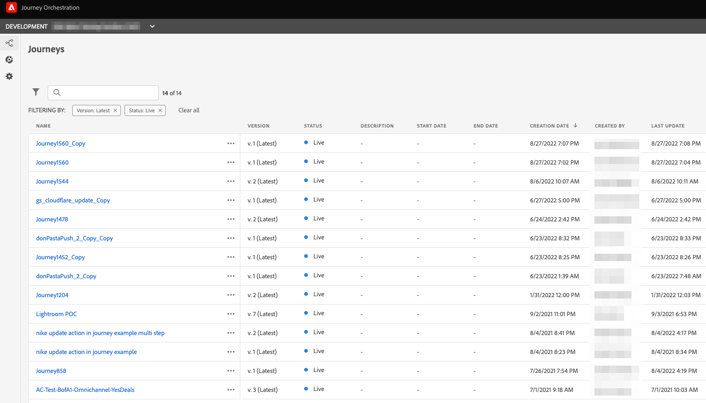

# Journey Orchestration 환경을 Adobe Journey Optimizer으로 업그레이드{#ugrade-ajo}

## Adobe Journey Optimizer란?

Adobe Journey Optimizer은 모든 앱, 장치, 화면 또는 채널에서 개인화되고, 연결되며, 시기적절한 고객 여정을 조정하고 전달하기 위해 Adobe Experience Platform에 기본적으로 구축된 민첩하고 확장 가능한 애플리케이션입니다&#x200B;.

## Journey Orchestration이란?

Journey Orchestration은 Adobe Experience Platform을 기반으로 구축된 서비스로, 이전 비헤이비어와 환경 설정을 기반으로 각 고객에 대한 개별 여정을 조정할 수 있습니다. Journey Orchestration은 Journey Optimizer에 대한 사전 응용 프로그램입니다.

## Adobe Journey Optimizer으로 이동해야 하는 이유는 무엇입니까?

여정, 데이터 세트, 프로필, 경고 등에 빠르게 액세스할 수 있는 Experience Platform 기능이 있는 **간소화된 인터페이스에 액세스**. 스키마나 데이터 세트에 액세스하기 위해 더 이상 Adobe Experience Platform과 Journey Orchestration을 왔다 갔다 할 필요가 없으므로 Adobe Journey Optimizer에서 모든 것을 직접 사용할 수 있습니다. 자세한 정보는 이 [페이지](https://experienceleague.adobe.com/docs/journey-optimizer/using/get-started/user-interface.html?lang=ko)를 참조하세요.

<table>
<tr>
<th>다음 이전</th>
<th>다음 이후</th>
</tr>
<tr>
<td>
Journey Orchestration의 여정, 세그먼트 및 관리 섹션(데이터 소스, 이벤트 및 작업)에 대한 액세스 권한. 세그먼트와 데이터 세트는 Adobe Experience Platform에서 액세스할 수 있습니다. 
</td>
<td>
여정, 세그먼트, 관리자, 세그먼트 및 데이터 세트, <strong>모두 Adobe Journey Optimizer 내</strong>에 액세스 <strong>추가 Adobe Experience Platform 기능</strong>도 여기에서 액세스할 수 있습니다.
</td>
</tr>
</table>

**새 보고 인터페이스** 및 새 보고 기능에 대한 액세스:

<table>
<tr>
<th>다음 이전</th>
<th>다음 이후</th>
</tr>
<tr>
<td></td>
<td>
<strong>전역 보기</strong>를 통해 선택한 기간 동안 여정 및 게재의 영향을 측정할 수 있습니다. 실시간 지표를 더 보려면 <strong>실시간 보기</strong>에 액세스할 수 있습니다. 여정에서 사용 중인 각 게재 채널(전자 메일, SMS, 푸시)에 대해 보고서에서 <strong>전용 섹션</strong>을 사용하여 지표를 볼 수 있습니다. 이는 기본 <strong>Adobe Journey Optimizer 메시징 기능</strong>을 사용하는 경우에만 적용됩니다. 자세한 내용은 계정 팀에 문의하십시오.
</td>
</tr>
</table>

새로운 기능 릴리스 이후 보고 경험을 개선하거나 보완하기 위한 모든 진화는 새로운 보고 인터페이스에서만 사용할 수 있습니다. 이를 사용하여 보다 완벽한 Adobe Journey Optimizer 경험을 구축하십시오.

다른 최신 **Adobe Journey Optimizer 기능**&#x200B;과 필드 수준 액세스 제어 및 개체 수준 액세스 제어와 같은 새로운 기능을 활용하십시오. 자세한 내용은 계정 팀에 문의하십시오.

## 내 Journey Orchestration 환경을 업그레이드하는 방법

1. 계정 팀에 연락하여 Adobe과의 계약을 업데이트합니다.

1. 엔지니어링 팀이 변경을 완료할 때까지 기다립니다.

1. Journey Optimizer의 제품 프로필을 사용하여 권한을 업데이트합니다. 이 [페이지](https://experienceleague.adobe.com/docs/journey-optimizer/using/administration/ootb-product-profiles.html?lang=ko)를 참조하세요.

1. 이제 Adobe Journey Optimizer에 액세스할 수 있습니다!

## 자주 묻는 질문

### Journey Orchestration에서 Adobe Journey Optimizer으로 이동할 계획을 수립해야 합니까?

아니요, 마이그레이션이 필요 없으며, 작업이 필요하지 않으며, 다운타임이 없고 추가 투자도 없습니다. Adobe과의 계약만 업데이트하면 되며, 나머지는 저희가 진행합니다. 이 프로세스를 시작하는 방법에 대한 지침은 계정 담당자에게 문의하십시오.

### 제가 변경후에 물건을 잃어버릴까요?

아니요. 기존의 모든 Journey Orchestration 및 Adobe Experience Platform 개체(스키마, 데이터 세트, 여정, 이벤트, 데이터 소스, 작업)를 유지합니다. 아무 것도 손실되지 않으며 모든 라이브 여정이 중단 없이 계속 작동합니다.

<table>
<tr>
<th>다음 이전</th>
<th>다음 이후</th>
</tr>
<tr>
<td></td>
<td></td>
</tr>
</table>

### 응용 프로그램 전환기에 Journey Orchestration이 여전히 표시되는데, 정상입니까?

네, 정상입니다. 업그레이드 후 며칠 동안 Journey Orchestration 항목이 계속 표시될 수 있습니다. Journey Optimizer을 사용하십시오.

### 오늘 Adobe Campaign Standard에서 Journey Orchestration을 사용하면 어떻게 됩니까?

Adobe Journey Optimizer으로 이동하더라도 Adobe Journey Optimizer에서 고객 여정을 디자인하고 Adobe Campaign Standard에서 게재를 보내도록 하여 여정과 Adobe Campaign Standard 간의 통합을 사용할 수 있습니다.

그러나 Adobe Journey Optimizer 보고 스택의 작동 방식으로 인해 보고는 여정 및 Campaign Standard 데이터를 결합하지 않습니다. 여정 정보는 Adobe Journey Optimizer 보고서에서 사용할 수 있고 게재 정보는 Adobe Campaign Standard에서 사용할 수 있습니다. Experience Platform을 구성하여 Adobe Campaign Standard 데이터를 Adobe Experience Platform으로 다시 가져올 수 있으므로 Customer Journey Analytics([자세히 알아보기](https://business.adobe.com/kr/products/experience-platform/customer-journey-analytics.html)) 또는 Tableau 또는 PowerBI와 같은 기타 타사 보고 도구에서 사용할 수 있습니다.

Adobe Journey Optimizer 보고서는 Adobe Journey Optimizer의 기본 메시징 기능(전용 Adobe Journey Optimizer 오퍼링에서 사용 가능)을 사용할 때 가장 잘 작동합니다. 여정 캔버스에서 메시지를 작성하는 방법에 대한 자세한 내용은 이 [페이지](https://experienceleague.adobe.com/docs/journey-optimizer/using/messages/messages-in-journeys.html?lang=ko)를 참조하세요.

자세한 내용은 계정 팀에 문의하십시오.
