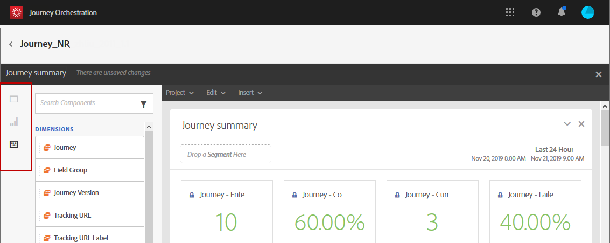

# 여정 보고서 {#concept_rfj_wpt_52b}

>[!NOTE]
>
>배달 데이터 및 세그먼트 구성 요소는 Adobe Campaign Standard이 있는 경우에만 채워집니다.

이 섹션에서는 보고서에 액세스하여 여정 효과를 측정하는 방법을 보여줍니다.

## 보고 인터페이스 {#reporting-interface}

상단 도구 모음에서 보고서를 수정, 저장 또는 인쇄할 수 있습니다.

**[!UICONTROL Project]** 탭을 사용하여 다음을 수행할 수 있습니다.

* **[!UICONTROL Open]**:이전에 만든 보고서 또는 템플릿을 엽니다.
* **[!UICONTROL Save As]**:템플릿을 수정할 수 있도록 템플릿을 복제합니다.
* **[!UICONTROL Refresh project]**:새 데이터 및 필터 변경 사항을 기반으로 보고서를 업데이트합니다.
* **[!UICONTROL Download CSV]**:보고서를 CSV 파일로 내보냅니다.
* **[!UICONTROL Print]**:보고서를 인쇄합니다.

**[!UICONTROL Edit]** 탭에서는 다음 작업을 수행할 수 있습니다.

* **[!UICONTROL Undo]**:대시보드에서 마지막 작업을 취소합니다.
* **[!UICONTROL Redo]**:대시보드에서 마지막  **[!UICONTROL Undo]** 작업을 취소합니다.
* **[!UICONTROL Clear all]**:대시보드의 모든 패널을 삭제합니다.

**[!UICONTROL Insert]** 표를 사용하면 대시보드에 그래프와 테이블을 추가하여 보고서를 사용자 지정할 수 있습니다.

* **[!UICONTROL New Blank Panel]**:대시보드에 새 빈 패널을 추가합니다.
* **[!UICONTROL New Freeform]**:대시보드에 새 자유 형식 테이블을 추가합니다.
* **[!UICONTROL New Line]**:대시보드에 새 선 그래프를 추가합니다.
* **[!UICONTROL New Bar]**:대시보드에 새 막대 그래프를 추가합니다.

왼쪽 탭에서는 보고서를 작성하고 필요에 따라 데이터를 필터링할 수 있습니다.

이러한 탭에서는 다음 항목에 액세스할 수 있습니다.

* **[!UICONTROL Panels]**:보고서에 빈 패널이나 자유 형식을 추가하여 데이터 필터링을 시작합니다. 자세한 내용은 [패널 추가](../reporting/creating-your-journey-reports.md#adding-panels) 섹션을 참조하십시오.
* **[!UICONTROL Visualizations]**:시각화 항목 선택 항목을 드래그 앤 드롭하여 보고서에 그래픽 차원을 제공합니다. 자세한 내용은 [시각화 추가](../reporting/creating-your-journey-reports.md#adding-visualizations) 섹션을 참조하십시오.
* **[!UICONTROL Components]**:다양한 차원, 지표, 세그먼트 및 기간으로 보고서를 사용자 정의합니다. 자세한 내용은 [구성 요소 추가](../reporting/creating-your-journey-reports.md#adding-components) 섹션을 참조하십시오.

## 여정 요약 템플릿 {#ootb-template}

보고서는 다음 두 카테고리로 분류됩니다.즉시 사용 가능한 템플릿 및 사용자 지정 보고서.
기본 템플릿인 **[!UICONTROL Journey summary]**&#x200B;은 가장 중요한 추적 데이터를 명확하게 볼 수 있도록 해줍니다.

각 표는 요약 번호와 차트로 표시됩니다. 각 시각화 설정에 세부 정보가 표시되는 방식을 변경할 수 있습니다.

보고서 맨 위에서 다음 KPI를 사용할 수 있습니다.

* **[!UICONTROL Journey - Entered]**:여정 시작 이벤트에 도달한 총 개인 수입니다.
* **[!UICONTROL Journey - Completion rate]**:여정의 끝에 도달한 총 개인 수(또는 조건이 일치하지 않는 개인)와 여정에 입력한 총 개인 수입니다.
* **[!UICONTROL Journey - Current]**:현재 여정에 있는 총 개인 수입니다.
* **[!UICONTROL Journey - Failed rate]**:실행되지 않은 총 여정 수를 실행 여정 수와 비교하여 보여 줍니다.
* **[!UICONTROL Delivery - Messages sent]**:보낸 총 메시지 수입니다.
* **[!UICONTROL Delivery rate]**:전송된 메시지와 비교하여 배달된 총 메시지 수입니다.
* **[!UICONTROL Delivery - Bounce rate]**:전송된 메시지와 비교하여 바운스된 총 메시지 수입니다.
* **[!UICONTROL Delivery - Unsubscribed rate]**:배달된 메시지와 비교하여 받는 사람이 구독하지 않은 총 횟수입니다.
* **[!UICONTROL Delivery - Open rate]**:배달된 메시지 수와 비교하여 열린 총 메시지 수입니다.
* **[!UICONTROL Delivery - Click rate]**:배달된 메시지의 수와 비교하여 배달되는 총 클릭 수입니다.

여정 흐름 시각화 기능을 사용하면 여정을 단계별로 대상 프로필의 경로를 볼 수 있습니다. 여정 하나를 타깃팅할 때만 사용할 수 있습니다. 자동으로 생성되며 수정할 수 없습니다.

**[!UICONTROL Journey summary]** 테이블에는 다음과 같은 여정에 사용할 수 있는 데이터가 포함되어 있습니다.

* **[!UICONTROL Entered]**:여정 시작 이벤트에 도달한 총 개인 수입니다.
* **[!UICONTROL Completion rate]**:여정에 입력한 총 개인 수와 비교하여 여정의 최종 흐름 제어에 도달한 총 개인 수입니다.
* **[!UICONTROL Current]**:현재 여정에 있는 총 개인 수입니다.
* **[!UICONTROL Failed]**:성공적으로 실행되지 않은 총 여정 수입니다.
* **[!UICONTROL Failed rate]**:실행되지 않은 총 여정 수를 실행 여정 수와 비교하여 보여 줍니다.

**[!UICONTROL Top events]** 테이블에는 가장 성공적인 이벤트와 여정에서 가장 성공적인 작업인 **[!UICONTROL Top action]**&#x200B;이 표시됩니다.

**[!UICONTROL Delivery - Sending summary]** 테이블에는 다음과 같은 여정 배달에 사용할 수 있는 데이터가 포함되어 있습니다.

* **[!UICONTROL Processed/sent]**:보낸 총 메시지 수입니다.
* **[!UICONTROL Delivered rate]**:전송된 메시지와 비교하여 배달된 총 메시지 수입니다.
* **[!UICONTROL Delivered]**:보낸 총 메시지 수와 관련하여 성공적으로 보낸 메시지 수입니다.
* **[!UICONTROL Bounce + error rate]**:전송된 메시지와 비교하여 바운스된 총 메시지 수입니다.
* **[!UICONTROL Bounces + errors]**:총 보낸 메시지 수와 관련하여 배달 중 누적된 총 오류 수 및 자동 반환 처리 중 누적된 총 오류입니다.

**[!UICONTROL Delivery - Tracking summary]** 테이블에는 다음과 같은 여정 게재의 성공을 추적하는 데 사용할 수 있는 데이터가 포함되어 있습니다.

* **[!UICONTROL Open Rate]**:연 메시지의 백분율입니다.
* **[!UICONTROL Open]**:배달에서 메시지를 연 횟수입니다.
* **[!UICONTROL Click trough rate]**:배달된 메시지의 수와 비교하여 배달되는 총 클릭 수입니다.
* **[!UICONTROL Click]**:게재에서 컨텐츠를 클릭한 횟수입니다.
* **[!UICONTROL Unsubscribe rate]**:배달된 메시지와 비교하여 받는 사람별 구독 취소 비율(%)입니다.
* **[!UICONTROL Unsubscribed]**:배달된 메시지와 비교하여 받는 사람이 구독하지 않은 총 횟수입니다.
