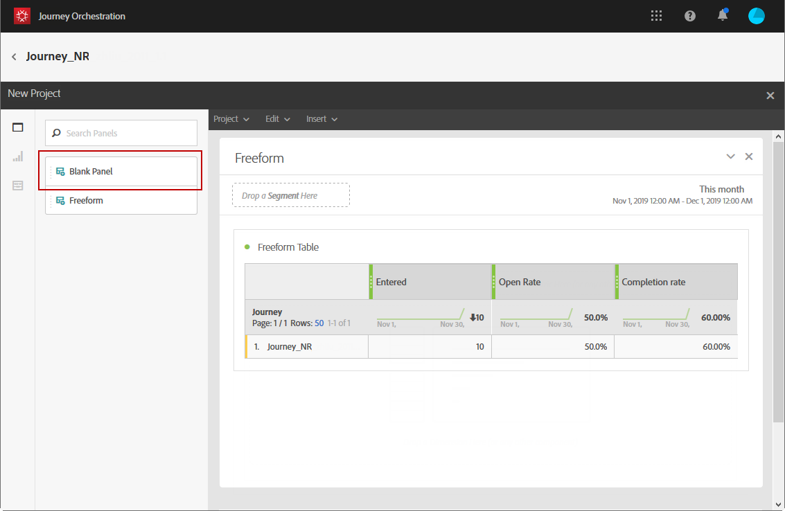

# 여정 보고서 만들기 {#concept_rfj_wpt_52b}

## 보고서 액세스 및 만들기 {#accessing-reports}

>[!NOTE]
>
>여정을 삭제하면 관련된 모든 보고서를 더 이상 사용할 수 없습니다.

이 섹션에서는 기본 보고서를 만들거나 사용하는 방법을 설명합니다. 패널, 구성 요소 및 시각화를 결합하여 여정의 성공을 더 잘 추적합니다.

여정 보고서에 액세스하고 게재의 성공을 추적하려면 다음을 수행하십시오.

1. 상단 메뉴에서 **[!UICONTROL Home]** 탭을 클릭합니다.

1. 보고할 여정을 선택합니다.

   을 클릭하여 보고서에 액세스할 수도 있습니다. **보고서** 여정 목록의 여정 위로 마우스를 가져가는 동안.

   

1. 다음을 클릭합니다. **[!UICONTROL Report]** 아이콘(화면 오른쪽 상단)을 클릭하여 탐색합니다.

   

1. 다음 **[!UICONTROL Journey summary]** 기본 제공 보고서가 화면에 표시됩니다. 사용자 지정 보고서에 액세스하려면 **[!UICONTROL Close]** 단추를 클릭합니다.

   

1. 다음을 클릭합니다. **[!UICONTROL Create new project]** 보고서를 처음부터 새로 만듭니다.

   

1. 다음에서 **[!UICONTROL Panels]** 탭하거나, 패널 또는 자유 형식 테이블을 필요에 따라 끌어서 놓습니다. 자세한 내용은 다음을 참조하십시오. [섹션](#adding-panels).

   

1. 그런 다음 차원과 지표를 드래그하여 놓아 데이터 필터링을 시작할 수 있습니다. **[!UICONTROL Components]** 탭을 사용하여 자유 형식 테이블을 만듭니다. 자세한 내용은 다음을 참조하십시오. [섹션](#adding-components).

   

1. 데이터를 보다 명확하게 보기 위해 **[!UICONTROL Visualizations]** 탭. 자세한 내용은 다음을 참조하십시오. [섹션](#adding-visualizations).

## 패널 추가{#adding-panels}

### 빈 패널 추가 {#adding-a-blank-panel}

보고서를 시작하려면 기본 제공 보고서 또는 사용자 지정 보고서에 패널 세트를 추가할 수 있습니다. 각 패널에는 다양한 데이터 세트가 포함되어 있으며 자유 형식 테이블 및 시각화로 구성됩니다.

이 패널을 통해 필요에 따라 보고서를 작성할 수 있습니다. 보고서에 원하는 만큼 패널을 추가하여 데이터를 다양한 기간으로 필터링할 수 있습니다.

1. **[!UICONTROL Panels]** 아이콘을 클릭합니다. 패널을 추가하려면 **[!UICONTROL Insert tab]** 및 선택 **[!UICONTROL New Blank Panel]**.

   

1. 을(를) 끌어다 놓습니다. **[!UICONTROL Blank Panel]** 을 클릭하여 대시보드에 넣습니다.

   

이제 자유 형식 테이블을 패널에 추가하여 데이터 타깃팅을 시작할 수 있습니다.

### 자유 형식 테이블 추가 {#adding-a-freeform-table}

자유 형식 테이블을 사용하면 다음에서 사용할 수 있는 다양한 지표 및 차원을 사용하여 데이터를 분석하는 테이블을 만들 수 있습니다. **[!UICONTROL Component]** 테이블.

각 테이블 및 시각화는 크기가 변경될 수 있으며, 보고서를 더 잘 사용자 지정하기 위해 이동할 수 있습니다.

1. **[!UICONTROL Panels]** 아이콘을 클릭합니다.

   

1. 을(를) 끌어다 놓습니다. **[!UICONTROL Freeform]** 항목을 대시보드에 넣습니다.

   다음을 클릭하여 테이블을 추가할 수도 있습니다. **[!UICONTROL Insert]** 탭 및 선택 **[!UICONTROL New Freeform]** 또는 를 클릭하여 **[!UICONTROL Add a freeform table]** 을 클릭합니다.

   

1. 에서 항목 드래그 앤 드롭 **[!UICONTROL Components]** 을 열과 행에 탭하여 표를 작성합니다.

   

1. 다음을 클릭합니다. **[!UICONTROL Settings]** 열에 데이터가 표시되는 방식을 변경하는 아이콘입니다.

   

   다음 **[!UICONTROL Column settings]** 는 다음으로 구성됩니다.

   * **[!UICONTROL Number]**: 열에서 요약 번호를 표시하거나 숨길 수 있습니다.
   * **[!UICONTROL Percent]**: 열에서 백분율을 표시하거나 숨길 수 있습니다.
   * **[!UICONTROL Interpret zero as no value]**: 값이 0일 때 표시하거나 숨길 수 있습니다.
   * **[!UICONTROL Background]**: 셀에서 가로 진행률 표시줄을 표시하거나 숨길 수 있습니다.
   * **[!UICONTROL Include retries]**: 결과에 재시도를 포함할 수 있습니다. 다음에만 사용할 수 있습니다. **[!UICONTROL Sent]** 및 **[!UICONTROL Bounces + Errors]**.

1. 하나 이상의 행을 선택하고 **[!UICONTROL Visualize]** 아이콘. 선택한 행을 반영하도록 시각화가 추가됩니다.

   

이제 필요한 만큼 구성 요소를 추가하고 시각화를 추가하여 데이터를 그래픽으로 표시할 수도 있습니다.

## 구성 요소 추가{#adding-components}

구성 요소를 사용하여 다양한 차원, 지표 및 기간을 사용하여 보고서를 사용자 지정할 수 있습니다.

1. 다음을 클릭합니다. **[!UICONTROL Components]** 탭으로 이동하여 구성 요소 목록에 액세스합니다.

   

1. 다음에 제시된 각 범주 **[!UICONTROL Components]** 탭에는 가장 많이 사용되는 5개의 항목이 표시되며, 범주 이름을 클릭하여 전체 구성 요소 목록에 액세스합니다.

   구성 요소 테이블은 다음 세 가지 카테고리로 나뉩니다.

   * **[!UICONTROL Dimensions]**: 게재 로그에서 수신자의 브라우저 또는 도메인, 게재 성공 등 세부 정보를 가져옵니다.
   * **[!UICONTROL Metrics]**: 메시지 상태에 대한 세부 정보를 가져옵니다. 예를 들어 메시지가 게재되고 사용자가 메시지를 연 경우.
   * **[!UICONTROL Time]**: 테이블에 대한 기간을 설정합니다.

1. 패널에 구성 요소를 드래그 앤 드롭하여 데이터 필터링을 시작합니다.

필요한 만큼 구성 요소를 드래그하여 놓고 서로 비교할 수 있습니다.

## 시각화 추가{#adding-visualizations}

다음 **[!UICONTROL Visualizations]** 탭에서는 영역, 도넛 및 그래프와 같은 시각화 항목을 끌어서 놓을 수 있습니다. 시각화는 데이터를 그래픽으로 표시합니다.

1. 다음에서 **[!UICONTROL Visualizations]** 탭에서 시각화 항목을 드래그하여 패널에 놓습니다.

   

1. 패널에 시각화를 추가하면 보고서가 자유 형식 테이블의 데이터를 자동으로 검색합니다. 시각화에 대한 설정을 선택합니다.
1. 자유 형식 테이블이 두 개 이상인 경우 **[!UICONTROL Data Source Settings]** 창. 이 창은 시각화 제목 옆에 있는 색상이 지정된 점을 클릭해도 사용할 수 있습니다.

   

1. 다음을 클릭합니다. **[!UICONTROL Visualization]** 그래프 유형 또는 그래프 유형에 표시되는 내용을 직접 변경할 수 있는 설정 버튼, 예:

   * **[!UICONTROL Percentages]**: 값을 백분율로 표시합니다.
   * **[!UICONTROL Anchor Y Axis at Zero]**: 값이 0보다 큰 경우에도 y축을 0으로 강제 적용합니다.
   * **[!UICONTROL Legend visible]**: 범례를 숨길 수 있습니다.
   * **[!UICONTROL Normalization]**: 값을 강제 일치시킵니다.
   * **[!UICONTROL Display Dual Axis]**: 그래프에 다른 축을 추가합니다.
   * **[!UICONTROL Limit Max Items]**: 표시되는 그래프 수를 제한합니다.
   * **[!UICONTROL Threshold]**: 그래프에 임계값을 설정할 수 있습니다. 검은색 점선으로 표시됩니다.

   

이 시각화를 사용하면 보고서에서 데이터를 더 명확하게 볼 수 있습니다.
