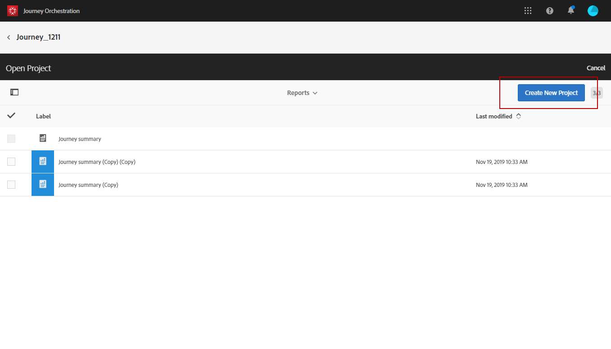

# 여정 보고서 만들기 {#concept_rfj_wpt_52b}

## 보고서 액세스 및 만들기 {#accessing-reports}

>[!NOTE]
>
>여정을 삭제하면 연결된 모든 보고서를 더 이상 사용할 수 없습니다.

이 섹션에서는 기본 보고서를 만들거나 사용하는 방법을 보여 줍니다. 패널, 구성 요소 및 시각화를 결합하여 여정의 성공을 추적할 수 있습니다.

여정 보고서에 액세스하고 배달의 성공 추적을 시작하려면 다음을 수행하십시오.

1. 상단 메뉴에서 **[!UICONTROL Home]** 탭을 클릭합니다.

1. 보고할 여정을 선택합니다.

   여정 목록에서 여정 위로 마우스를 가져가면 **보고서**&#x200B;를 클릭하여 보고서에 액세스할 수도 있습니다.

   

1. 화면 오른쪽 상단에 있는 **[!UICONTROL Report]** 아이콘을 클릭합니다.

   

1. **[!UICONTROL Journey summary]** 기본 보고서가 화면에 나타납니다. 사용자 지정 보고서에 액세스하려면 **[!UICONTROL Close]** 단추를 클릭합니다.

   

1. 보고서를 처음부터 만들려면 **[!UICONTROL Create new project]**&#x200B;을 클릭합니다.

   

1. **[!UICONTROL Panels]** 탭에서 필요한 만큼 많은 패널이나 자유 형식 테이블을 드래그하여 놓습니다. 자세한 내용은 이 [섹션](#adding-panels)을 참조하십시오.

   

1. 그런 다음 **[!UICONTROL Components]** 탭의 차원 및 지표를 자유 형식 테이블로 드래그하여 놓아 데이터 필터링을 시작할 수 있습니다. 자세한 내용은 이 [섹션](#adding-components)을 참조하십시오.

   

1. 데이터를 보다 명확하게 보려면 **[!UICONTROL Visualizations]** 탭에서 시각화를 추가할 수 있습니다. 자세한 내용은 이 [섹션](#adding-visualizations)을 참조하십시오.

## 패널 추가{#adding-panels}

### 빈 패널 {#adding-a-blank-panel} 추가

보고서를 시작하려면 기본 보고서나 사용자 지정 보고서에 패널 세트를 추가할 수 있습니다. 각 패널은 서로 다른 데이터 세트를 포함하며 자유 형식 테이블 및 시각화로 구성됩니다.

이 패널에서는 필요에 따라 보고서를 작성할 수 있습니다. 기간이 다른 데이터를 필터링하기 위해 보고서에 원하는 만큼 패널을 추가할 수 있습니다.

1. **[!UICONTROL Panels]** 아이콘을 클릭합니다. **[!UICONTROL Insert tab]**&#x200B;을 클릭하고 **[!UICONTROL New Blank Panel]**&#x200B;을 선택하여 패널을 추가할 수도 있습니다.

   

1. **[!UICONTROL Blank Panel]**&#x200B;을(를) 대시보드로 드래그하여 놓습니다.

   

이제 패널에 자유 형식 테이블을 추가하여 데이터 타깃팅을 시작할 수 있습니다.

### 자유 형식 테이블 {#adding-a-freeform-table} 추가

자유 형식 테이블을 사용하면 **[!UICONTROL Component]** 테이블에서 사용할 수 있는 다른 지표와 차원을 사용하여 데이터를 분석하는 테이블을 만들 수 있습니다.

각 테이블 및 시각화는 크기 조정이 가능하며, 보고서를 더 잘 사용자 정의하도록 이동할 수 있습니다.

1. **[!UICONTROL Panels]** 아이콘을 클릭합니다.

   

1. **[!UICONTROL Freeform]** 항목을 대시보드로 드래그하여 놓습니다.

   **[!UICONTROL Insert]** 탭을 클릭하고 **[!UICONTROL New Freeform]**&#x200B;을 선택하거나 빈 패널에서 **[!UICONTROL Add a freeform table]**&#x200B;를 클릭하여 표를 추가할 수도 있습니다.

   

1. **[!UICONTROL Components]** 탭의 항목을 열과 행으로 드래그하여 테이블을 만듭니다.

   

1. **[!UICONTROL Settings]** 아이콘을 클릭하여 데이터가 열에 표시되는 방식을 변경합니다.

   

   **[!UICONTROL Column settings]**&#x200B;은(는) 다음 항목으로 구성됩니다.

   * **[!UICONTROL Number]**:열에 요약 번호를 표시하거나 숨길 수 있습니다.
   * **[!UICONTROL Percent]**:열에 백분율을 표시하거나 숨길 수 있습니다.
   * **[!UICONTROL Interpret zero as no value]**:값이 0인 경우를 표시하거나 숨길 수 있습니다.
   * **[!UICONTROL Background]**:셀에서 가로 진행률 표시줄을 표시하거나 숨길 수 있습니다.
   * **[!UICONTROL Include retries]**:결과에 재시도를 포함시킬 수 있습니다. 이 값은 **[!UICONTROL Sent]** 및 **[!UICONTROL Bounces + Errors]**&#x200B;에만 사용할 수 있습니다.

1. 하나 이상의 행을 선택하고 **[!UICONTROL Visualize]** 아이콘을 클릭합니다. 선택한 행을 반영하도록 시각화가 추가됩니다.

   

이제 필요한 만큼 구성 요소를 추가하고 시각화를 추가하여 데이터를 그래픽으로 나타낼 수 있습니다.

## 구성 요소 추가{#adding-components}

구성 요소를 사용하면 다양한 차원, 지표 및 기간으로 보고서를 사용자 지정할 수 있습니다.

1. 구성 요소 목록에 액세스하려면 **[!UICONTROL Components]** 탭을 클릭합니다.

   

1. **[!UICONTROL Components]** 탭에 표시된 각 카테고리에 가장 많이 사용된 5개의 항목이 표시되고, 카테고리의 이름을 클릭하면 전체 구성 요소 목록에 액세스할 수 있습니다.

   구성 요소 테이블은 세 가지 카테고리로 분할됩니다.

   * **[!UICONTROL Dimensions]**:받는 사람의 브라우저 또는 도메인과 같은 배달 로그 또는 배달 성공과 같은 세부 정보를 가져옵니다.
   * **[!UICONTROL Metrics]**:메시지 상태에 대한 자세한 내용을 살펴보십시오. 예를 들어 메시지가 전달되고 사용자가 메시지를 연 경우
   * **[!UICONTROL Time]**:테이블 기간을 설정합니다.

1. 패널에 구성 요소를 드래그 앤 드롭하여 데이터 필터링을 시작합니다.

필요한 만큼 구성 요소를 드래그하여 놓고 서로 비교할 수 있습니다.

## 시각화 추가{#adding-visualizations}

**[!UICONTROL Visualizations]** 탭에서는 영역, 도넛 및 그래프와 같은 시각화 항목을 드래그하여 놓을 수 있습니다. 시각화는 데이터를 그래픽으로 표시합니다.

1. **[!UICONTROL Visualizations]** 탭에서 시각화 항목을 패널에 드래그하여 놓습니다.

   

1. 패널에 시각화를 추가하면 보고서가 자유 형식 테이블의 데이터를 자동으로 검색합니다. 시각화에 대한 설정을 선택합니다.
1. 두 개 이상의 자유 형식 테이블이 있는 경우 **[!UICONTROL Data Source Settings]** 창의 그래프에 추가할 사용 가능한 데이터 소스를 선택합니다. 시각화 제목 옆에 있는 색상 점을 클릭하여 이 창을 사용할 수도 있습니다.

   

1. **[!UICONTROL Visualization]** 설정 단추를 클릭하여 그래프 유형 또는 그래프 유형에 표시되는 내용을 직접 변경합니다(예:

   * **[!UICONTROL Percentages]**:값을 백분율로 표시합니다.
   * **[!UICONTROL Anchor Y Axis at Zero]**:값이 0보다 높더라도 y축을 0으로 강제 설정합니다.
   * **[!UICONTROL Legend visible]**:범례를 숨길 수 있습니다.
   * **[!UICONTROL Normalization]**:값이 일치하도록 강제 적용합니다.
   * **[!UICONTROL Display Dual Axis]**:그래프에 다른 축을 추가합니다.
   * **[!UICONTROL Limit Max Items]**:표시된 그래프 수를 제한합니다.
   * **[!UICONTROL Threshold]**:한계값을 그래프로 설정할 수 있습니다. 검은색 점선으로 표시됩니다.

   

이 시각화를 사용하면 보고서에서 데이터를 보다 명확하게 볼 수 있습니다.