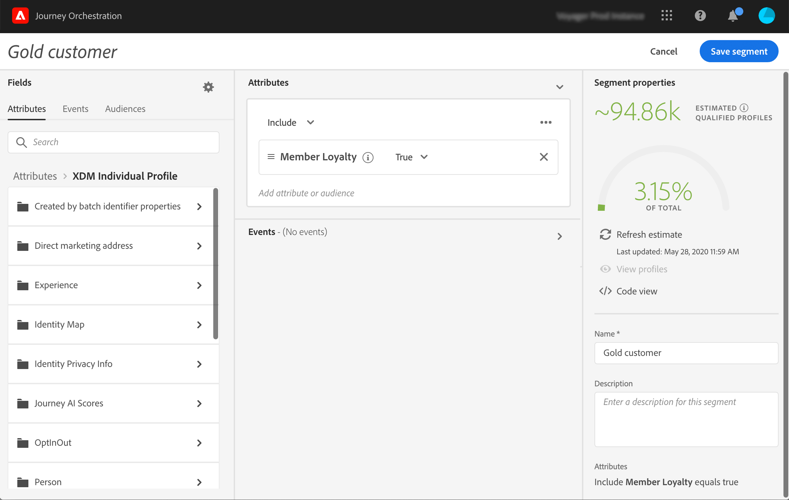

# 세그먼트 만들기 {#creating-a-segment}

[Adobe Experience Platform 세그멘테이션 서비스](https://docs.adobe.com/content/help/en/experience-platform/segmentation/home.html)를 사용하여 세그먼트를 만들거나 [!DNL Journey Orchestration]에서 직접 이러한 서비스에 액세스하여 만들 수 있습니다.

1. 상단 메뉴에서 **[!UICONTROL Segments]** 탭을 클릭합니다. Adobe Experience Platform 세그먼트 목록이 표시됩니다. 목록에서 특정 세그먼트를 검색할 수 있습니다.

   

1. **[!UICONTROL Add]**&#x200B;을 클릭하여 새 세그먼트를 만듭니다. 세그먼트 정의 화면에서는 세그먼트를 정의하는 데 필요한 모든 필드를 구성할 수 있습니다. 구성은 세그멘테이션 서비스의 구성과 동일합니다. [세그먼트 빌더 사용자 안내서](https://docs.adobe.com/content/help/en/experience-platform/segmentation/ui/overview.html)를 참조하십시오.

   

이제 세그먼트를 사용하여 조건을 만들거나 **[!UICONTROL Segment qualification]** 이벤트를 추가할 수 있습니다. [조건](../segment/using-a-segment.md) 및 [이벤트 활동](../building-journeys/segment-qualification-events.md)에서 세그먼트 사용을 참조하십시오.