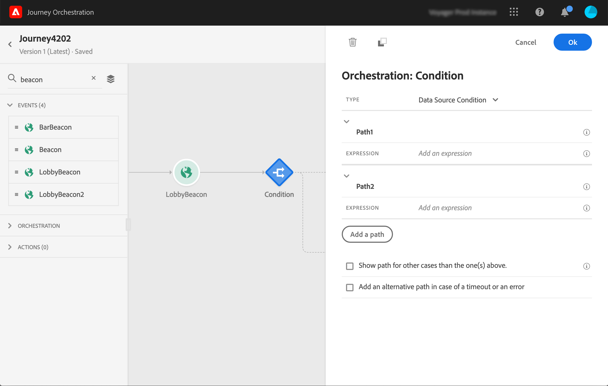
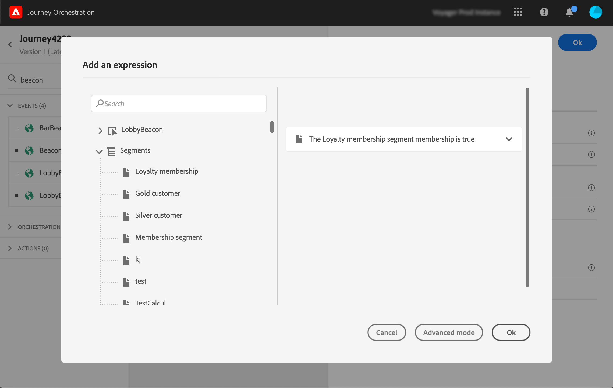

# 조건에서 세그먼트 사용 {#using-a-segment}

>[!CAUTION]
>
>**Adobe Journey Optimizer를 찾고 계신가요**? [여기](https://experienceleague.adobe.com/ko/docs/journey-optimizer/using/ajo-home){target="_blank"}를 클릭하여 Journey Optimizer 설명서를 확인할 수 있습니다.
>
>
>_이 설명서는 Journey Optimizer로 대체된 이전 Journey Orchestration 자료를 참조합니다. Journey Orchestration 또는 Journey Optimizer 액세스에 대한 질문이 있는 경우 계정 팀에 문의하십시오._

이 섹션에서는 여정 조건에서 세그먼트를 사용하는 방법을 설명합니다. 여정에서 **[!UICONTROL Segment qualification]** 이벤트를 사용하는 방법에 대해 알아보려면 이 [섹션](../building-journeys/segment-qualification-events.md)을 참조하세요.

여정 조건에서 세그먼트를 사용하려면 다음 단계를 따르십시오.

1. 여정을 열고 **[!UICONTROL Condition]** 활동을 삭제하고 **데이터 Source 조건**&#x200B;을 선택하세요.
   

1. 필요한 각 추가 경로에 대해 **[!UICONTROL Add a path]**&#x200B;을(를) 클릭합니다. 각 경로에 대해 **[!UICONTROL Expression]** 필드를 클릭합니다.

   

1. 왼쪽에서 **[!UICONTROL Segments]** 노드를 펼칩니다. 조건에 사용할 세그먼트를 끌어서 놓습니다. 세그먼트의 조건은 기본적으로 true입니다.

   

   >[!NOTE]
   >
   >**실현됨** 및 **기존** 세그먼트 참여 상태가 있는 개인만 세그먼트의 구성원으로 간주됩니다. 세그먼트를 평가하는 방법에 대한 자세한 내용은 [세그먼테이션 서비스 설명서](https://experienceleague.adobe.com/docs/experience-platform/segmentation/tutorials/evaluate-a-segment.html?lang=en#interpret-segment-results)를 참조하세요.

여정 조건 및 단순 표현식 편집기 사용 방법에 대한 자세한 내용은 [조건 활동](../building-journeys/condition-activity.md#about_condition)을 참조하세요.
