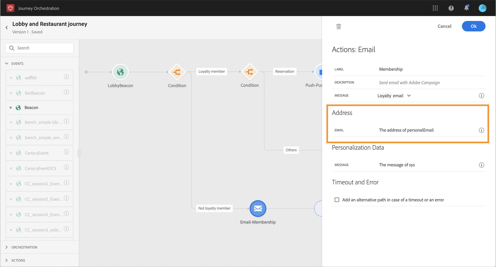

# 여정 구축 {#concept_owm_kdy_w2b}

이제 **비즈니스 사용자**&#x200B;가 여정을 구축할 수 있습니다. 여정은 다음과 같은 활동을 포함합니다.

* 두 가지 **[!UICONTROL Event]** 활동: &quot;LobbyBeacon&quot; 및 &quot;RestaurantBeacon&quot;
* 두 가지 **[!UICONTROL Condition]** 활동 
* 세 가지 **[!UICONTROL Push]** 활동 및 한 가지 **[!UICONTROL Email]** 활동(Adobe Campaign Standard 사용)
* **[!UICONTROL Wait]** 활동
* 네 가지 **[!UICONTROL End]** 활동 

>[!NOTE]
>
>**[!UICONTROL Push]** 및 **[!UICONTROL Email]** 활동은 Adobe Campaign Standard를 보유한 경우에만 팔레트에서 사용할 수 있습니다.

여정 작성 방법에 대한 자세한 내용은 [이 페이지](../building-journeys/journey.md)를 참조하십시오.

## 첫 단계{#section_ntb_ws1_ffb}

1. 상단 메뉴에서 **[!UICONTROL Home]** 탭과 **[!UICONTROL Create]**&#x200B;을(를) 클릭하여 새 여정을 만듭니다.

   

1. 오른쪽에 표시되는 구성 창에서 여정의 속성을 편집합니다. 이름을 추가하고 12월 1일부터 31일까지 한 달 동안 지속되도록 설정합니다.

   

1. 팔레트에서 캔버스로 &quot;LobbyBeacon&quot; 이벤트를 끌어다 놓으며 여정 디자인을 시작합니다. 팔레트에서 이벤트를 두 번 클릭하여 캔버스에 추가할 수도 있습니다.

   

1. 이제 24시간 동안 연락이 되지 않았는지와 충성도 멤버인지를 확인하는 조건을 추가해 보겠습니다. 조건 활동을 여정으로 끌어다 놓습니다.

   

1. **[!UICONTROL Data Source Condition]** 유형을 선택하고 **[!UICONTROL Expression]** 필드를 클릭합니다. 캔버스에서 화살표에 나타날 조건 레이블을 정의할 수도 있습니다. 이 예에서는 &quot;조건 1&quot;을 &quot;충성도 멤버&quot;로 바꿉니다.

   

1. **[!UICONTROL Advanced mode]**&#x200B;을(를) 클릭하고 Adobe Experience Platform 데이터 소스에서 온 &quot;타임스탬프&quot; 및 &quot;directMarketing.sends.value&quot; 필드를 기반으로 다음 조건을 정의합니다. 표현식의 구문은 다음과 같습니다.

   ```
   count(#{ExperiencePlatformDataSource.MarltonExperience.experienceevent.all(
       currentDataPackField.directMarketing.sends.value > 0 and
       currentDataPackField.timestamp > nowWithDelta(-1, "days")).timestamp}) == 0
   and
       #{ExperiencePlatformDataSource.MarltonProfiles.Profile._customer.marlton.loyaltyMember}
   ```

   

1. **[!UICONTROL Add a path]** 버튼을 클릭하고 지난 24시간 동안 연락을 하지 않았고 충성도 멤버가 아닌 고객을 위한 두 번째 경로를 만듭니다. 경로 이름을 &quot;충성도 멤버 아님&quot;으로 지정합니다. 표현식의 구문은 다음과 같습니다.

   ```
   count(#{ExperiencePlatformDataSource.MarltonExperience.experienceevent.all(
       currentDataPackField.directMarketing.sends.value > 0 and
       currentDataPackField.timestamp > nowWithDelta(-1, "days").timestamp}) == 0
   and not
       #{ExperiencePlatformDataSource.MarltonProfiles.Profile._customer.marlton.loyaltyMember}
   ```

   >[!NOTE]
   >
   >표현식의 두 번째 부분에서 &quot;프로필&quot;은 선택 사항입니다.

1. 네임스페이스를 선택해야 합니다. 스키마 속성을 기반으로 네임스페이스를 미리 선택합니다. 미리 선택된 상태로 둘 수 있습니다. 네임스페이스에 대한 자세한 내용은 [이 페이지](../event/selecting-the-namespace.md)를 참조하십시오.

사용 사례에서는 이러한 두 가지 조건에만 대응하려 하므로 **[!UICONTROL Show path for other cases than the one(s) above]** 상자를 선택하지 않습니다 .

조건 후에 다음과 같은 두 개의 경로가 만들어집니다.

* _지난 24시간 동안 연락을 하지 않았고 충성도 멤버인 고객_
* _지난 24시간 동안 연락을 하지 않았고 충성도 멤버가 아닌 고객_


## 첫 번째 경로: 고객이 충성도 멤버일 경우 {#section_otb_ws1_ffb} 

1. 첫 번째 경로에 고객의 예약 여부를 확인하는 조건을 추가해 보겠습니다. 조건 활동을 여정으로 끌어다 놓습니다.

   

1. **[!UICONTROL Data Source Condition]** 유형을 선택하고 다음과 같은 예약 시스템에서 검색한 예약 상태 정보를 기준으로 조건을 정의합니다.

   ```
   #{MarltonReservation.MarltonFieldGroup.reservation} == true
   ```

   

1. 외부 데이터 소스에서 필드를 선택하면 화면의 오른쪽 부분에 외부 데이터 소스를 구성할 때 정의된 매개 변수 목록이 표시됩니다([이 페이지](../usecase/configuring-the-data-sources.md) 참조). 매개 변수 이름을 클릭하고 다음 예제에서 예약 시스템 키, Experience Cloud ID의 값을 정의합니다.

   ```
   @{LobbyBeacon.endUserIDs._experience.mcid.id}
   ```

   

1. 예약하지 않은 고객에게도 대응하고자 하기 때문에 **[!UICONTROL Show path for other cases than the one(s) above]** 상자를 선택해야 합니다 .

   

   두 개의 경로가 만들어집니다.

   * _객실을 예약한 고객_
   * _객실을 예약하지 않은 고객_

   

1. 첫 번째 경로(객실을 예약함)에서 **[!UICONTROL Push]** 활동을 삭제하고 모바일 앱과 &quot;환영&quot; 템플릿을 선택합니다.

   

1. 시스템이 푸시를 전송하는 데 필요한 **[!UICONTROL Target]** 필드를 정의합니다.

   * **[!UICONTROL Push platform]**:플랫폼 선택: **[!UICONTROL Apple Push Notification Server]** (Apple) 또는 **[!UICONTROL Firebase Cloud Messaging]** (Android).
   * **[!UICONTROL Registration token]**:고급 모드를 사용하여 구성된 이벤트를 기반으로 다음과 같은 표현식을 추가합니다.

      ```
      @{LobbyBeacon._experience.campaign.message.profileSnapshot.pushNotificationTokens.first().token}
      ```

1. 푸시 알림 개인화 필드를 정의합니다. 예제에서는: 이름 및 성

1. &quot;RestaurantBeacon&quot; 이벤트를 추가합니다.

   

1. 새 **[!UICONTROL Push]** 활동을 추가하고 &quot;식사 할인&quot; 템플릿을 선택하고 **[!UICONTROL Address]** 및 **[!UICONTROL Personalization]** 필드를 정의합니다. **[!UICONTROL End]** 활동을 추가합니다. 

   

1. 환영 푸시 후 6시간 내에 레스토랑에 입장하는 경우에만 식사 할인 푸시 알림을 보내고자 합니다. 이를 위해서는 대기 활동을 사용해야 합니다. 환영 푸시 활동에 커서를 놓고 &quot;+&quot; 기호를 클릭합니다. 새 경로에서 대기 활동을 추가하고 기간을 6시간으로 정의합니다. 첫 번째로 적합한 활동이 선택됩니다. 시작 푸시 후 6시간 이내에 레스토랑 이벤트가 수신되면 푸시 활동이 전송됩니다. 다음 6시간 이내에 받은 레스토랑 이벤트가 없으면 대기 시간이 선택됩니다. 대기 활동 후에 **[!UICONTROL End]** 활동을 배치합니다.

   

1. 예약 조건(객실을 예약하지 않음)을 따르는 두 번째 경로에서 **[!UICONTROL Push]** 활동을 추가하고 &quot;객실 요금&quot; 템플릿을 선택합니다. **[!UICONTROL End]** 활동을 추가합니다.

   

## 두 번째 경로: 고객이 충성도 멤버가 아님{#section_ptb_ws1_ffb}

1. 첫 번째 조건(고객이 충성도 멤버가 아님)을 따르는 두 번째 경로에서 **[!UICONTROL Email]** 활동을 추가하고 &quot;충성도 멤버십&quot; 템플릿을 선택합니다.

   

1. **[!UICONTROL Address]** 필드에서 데이터 소스의 이메일 주소를 선택합니다.

   

1. 데이터 소스에서 이름 및 성 개인화 필드를 정의합니다.

   

1. **[!UICONTROL End]** 활동을 추가합니다.

**[!UICONTROL Test]** 토글을 클릭하고 여정을 테스트합니다. 오류가 있는 경우 테스트 모드를 비활성화하고 여정를 수정한 후 다시 테스트하십시오. 테스트 모드에 대한 자세한 내용은 [이 페이지](../building-journeys/testing-the-journey.md)를 참조하십시오.


테스트가 확정되면 오른쪽 상단 드롭다운 메뉴에서 여정을 게시할 수 있습니다.


