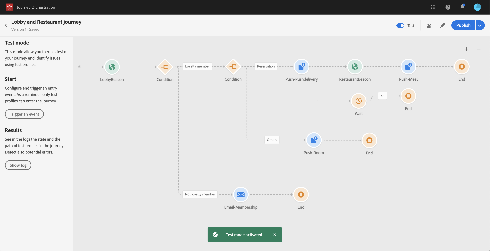

# 고객 여정 구축 {#concept_owm_kdy_w2b}

이제 **비즈니스 사용자가** 고객 여정을 구축할 수 있습니다. Adobe는 다음과 같은 활동을 제공합니다.

* 두 가지 **[!UICONTROL Event]**활동:&quot;LobbyBeacon&quot; 및 &quot;RestaurantBeacon&quot;
* 두 가지 **[!UICONTROL Condition]**활동
* 세 개의 **[!UICONTROL Push]**활동 및 한 개의**[!UICONTROL Email]** 활동(Adobe Campaign Standard 사용)
* 활동 **[!UICONTROL Wait]**활동
* 네 **[!UICONTROL End]**활동

>[!NOTE]
>
>Adobe **[!UICONTROL Push]**Campaign Standard가 있는 경우에만 팔레트에서**[!UICONTROL Email]** 및 활동을 사용할 수 있습니다.

여행 구축 방법에 대한 자세한 내용은 을 참조하십시오 [](../building-journeys/journey.md).

## 첫 번째 단계{#section_ntb_ws1_ffb}

1. 상단 메뉴에서 **[!UICONTROL Home]**탭을 클릭하고 새 경로를**[!UICONTROL Create]** 만듭니다.

   

1. 오른쪽에 표시되는 구성 창에서 경로의 속성을 편집합니다. 이름을 추가하고 1일부터 12월 31일까지 한 달 동안 지속되도록 설정합니다.

   

1. 팔레트에서 캔버스로 &quot;LobbyBeacon&quot; 이벤트를 드래그하여 놓아 여정 디자인을 시작합니다. 팔레트에서 이벤트를 두 번 클릭하여 캔버스에 추가할 수도 있습니다.

   

1. 이제 이 사람이 지난 24시간 동안 연락이 되지 않았는지 확인하고 충성도 회원인지 확인하는 조건을 추가해 봅시다. 고객 여정에 조건 활동을 드래그하여 놓습니다.

   

1. 유형을 **[!UICONTROL Data Source Condition]**선택하고**[!UICONTROL Expression]** 필드를 클릭합니다. 캔버스에서 화살표에 나타날 조건 레이블을 정의할 수도 있습니다. 이 예에서는 &quot;조건 1&quot;을 &quot;충성도 구성원&quot;으로 대체합니다.

   

1. 경험 플랫폼 데이터 소스에서 오는 &quot;timestamp&quot; 및 &quot;directMarketing.sends.value&quot; 필드를 기반으로 다음 조건을 **[!UICONTROL Advanced mode]**클릭하고 정의합니다. 표현식 구문은 다음과 같습니다.

   ```
   count(#{ExperiencePlatformDataSource.MarltonExperience.experienceevent.all(
       currentDataPackField.directMarketing.sends.value > 0 and
       currentDataPackField.timestamp > nowWithDelta(-1, "days")).timestamp}) == 0
   and
       #{ExperiencePlatformDataSource.MarltonProfiles.Profile._customer.marlton.loyaltyMember}
   ```

   

1. 이 **[!UICONTROL Add a path]**버튼을 클릭하여 지난 24시간 동안 연락하지 않은 고객 충성도 회원이 아닌 고객을 위한 두 번째 경로를 만듭니다. 경로 이름을 &quot;충성도 구성원 아님&quot;으로 지정합니다. 표현식 구문은 다음과 같습니다.

   ```
   count(#{ExperiencePlatformDataSource.MarltonExperience.experienceevent.all(
       currentDataPackField.directMarketing.sends.value > 0 and
       currentDataPackField.timestamp > nowWithDelta(-1, "days").timestamp}) == 0
   and not
       #{ExperiencePlatformDataSource.MarltonProfiles.Profile._customer.marlton.loyaltyMember}
   ```

   >[!NOTE]
   >
   >표현식의 두 번째 부분에서 &quot;프로필&quot;은 선택 사항입니다.

1. 네임스페이스를 선택해야 합니다. 스키마 속성을 기반으로 네임스페이스를 미리 선택합니다. 미리 선택된 상태로 둘 수 있습니다. 네임스페이스에 대한 자세한 내용은 를 참조하십시오 [](../event/selecting-the-namespace.md).

사용 사례에서는 이러한 두 가지 조건에만 반응할 수 있으므로 확인하지는 않습니다 **[!UICONTROL Show path for other cases than the one(s) above]**.

조건 뒤에 두 개의 경로가 만들어집니다.

* _지난 24시간 동안 연락을 받지 못하고 충성도 회원인 고객_
* _지난 24시간 동안 연락하지 않고 충성도 회원이 아닌 고객_


## 첫 번째 경로:고객은 충성도 멤버입니다. {#section_otb_ws1_ffb}

1. 첫 번째 경로에서, 그가 예약했는지 확인하기 위해 조건을 추가합시다. 고객 여정에 조건 활동을 드래그하여 놓습니다.

   

1. 유형을 **[!UICONTROL Data Source Condition]**선택하고 예약 시스템에서 검색한 예약 상태 정보를 기준으로 조건을 정의합니다.

   ```
   #{MarltonReservation.MarltonFieldGroup.reservation} == true
   ```

   

1. 외부 데이터 소스에서 필드를 선택하면 화면의 오른쪽 부분에 외부 데이터 소스를 구성할 때 정의된 매개 변수 목록이 표시됩니다(참조 [](../usecase/configuring-the-data-sources.md)). 매개 변수 이름을 클릭하고 예약 시스템 키, 즉 Experience Cloud ID의 값을 정의합니다.

   ```
   @{LobbyBeacon.endUserIDs._experience.mcid.id}
   ```

   

1. 예약하지 않은 손님에게도 조치를 취하시려면 체크박스가 **[!UICONTROL Show path for other cases than the one(s) above]**필요합니다

   

   두 개의 경로가 만들어집니다.

   * _방을 예약한 고객_
   * _방을 예약하지 않은 고객_
   

1. 첫 번째 경로(예약됨)에서 **[!UICONTROL Push]**활동을 삭제하고 모바일 앱과 &quot;환영&quot; 템플릿을 선택합니다.

   

1. 푸시를 전송하는 데 필요한 **[!UICONTROL Target]**필드를 정의합니다.

   * **[!UICONTROL Push platform]**:플랫폼 선택:(**[!UICONTROL Apple Push Notification Server]** Apple) 또는 **[!UICONTROL Firebase Cloud Messaging]**(Android).
   * **[!UICONTROL Registration token]**:고급 모드를 사용하여 다음 표현식을 추가합니다(구성된 이벤트에 따라).

      ```
      @{LobbyBeacon._experience.campaign.message.profileSnapshot.pushNotificationTokens.first().token}
      ``
      
1. 푸시 알림 개인화 필드를 정의합니다. Adobe 예제:성과.

1. &quot;RestaurantBeacon&quot; 이벤트를 추가합니다.

   

1. 새 **[!UICONTROL Push]**활동을 추가하고 &quot;식사 할인&quot; 템플릿을 선택하고**[!UICONTROL Address]** 및 **[!UICONTROL Personalization]**필드를 정의합니다. 활동을**[!UICONTROL End]** 추가합니다.

   

1. 방문 후 6시간 이내에 식사용 할인 푸시 알림을 발송하고 싶습니다. 이를 위해서는 대기 활동을 사용해야 합니다. 시작 푸시 활동에 커서를 놓고 &quot;+&quot; 기호를 클릭합니다. 새 경로에서 대기 활동을 추가하고 기간을 6시간으로 정의합니다. 첫 번째 적격한 활동이 선택됩니다. 시작 푸시 후 6시간 이내에 레스토랑 이벤트가 수신되면 푸시 활동이 전송됩니다. 다음 6시간 이내에 받은 레스토랑 이벤트가 없으면 대기 시간이 선택됩니다. 대기 활동 후에 **[!UICONTROL End]**활동을 배치합니다.

   

1. 예약 조건(예약되지 않은 회의실)을 따르는 두 번째 경로에서 **[!UICONTROL Push]**활동을 추가하고 &quot;회의실 비율&quot; 템플릿을 선택합니다. 활동을**[!UICONTROL End]** 추가합니다.

   

## 두 번째 경로:고객은 충성도 멤버가 아닙니다.{#section_ptb_ws1_ffb}

1. 첫 번째 조건(고객이 충성도 멤버가 아님)을 따르는 두 번째 경로에서 **[!UICONTROL Email]**활동을 추가하고 &quot;충성도 멤버십&quot; 템플릿을 선택합니다.

   

1. 필드의 **[!UICONTROL Address]**데이터 소스에서 이메일 주소를 선택합니다.

   

1. 데이터 소스에서 이름 및 성 개인화 필드를 정의합니다.

   

1. 활동을 **[!UICONTROL End]**추가합니다.

토글을 클릭하고 **[!UICONTROL Test]**여정을 테스트합니다. 오류가 있는 경우 테스트 모드를 비활성화하고 경로를 수정하고 다시 테스트합니다. 테스트 모드에 대한 자세한 내용은 을 참조하십시오[](../building-journeys/testing-the-journey.md).



테스트가 완료되면 오른쪽 상단 드롭다운 메뉴에서 이동을 게시할 수 있습니다.


