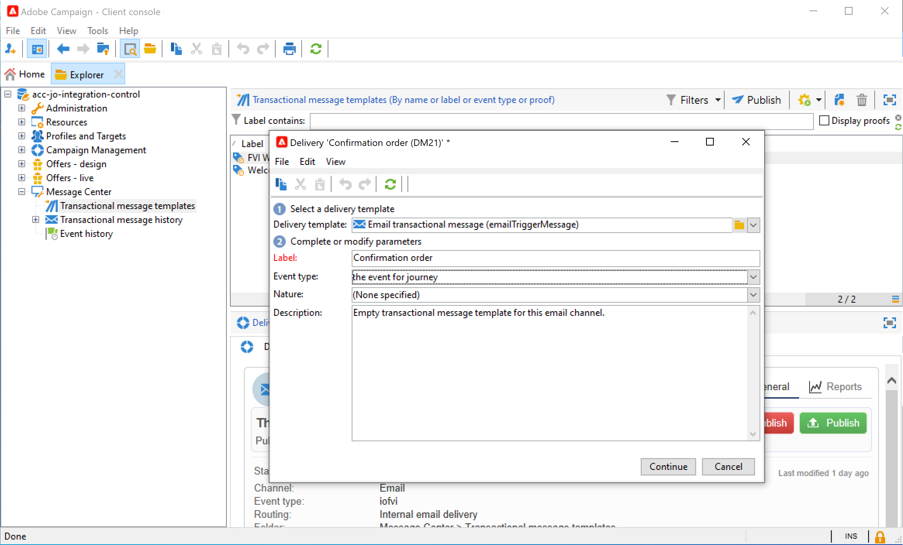

# Campaign v7/v8을 사용하여 메시지 보내기 {#campaign-classic-use-case}

이 사용 사례에서는 Adobe Campaign Classic v7 및 Adobe Campaign v8과의 통합을 사용하여 이메일을 보내는 데 필요한 모든 단계를 설명합니다.

먼저 Campaign에서 트랜잭션 이메일 템플릿을 만듭니다. 그런 다음 Journey Orchestration에서 이벤트, 작업 및 여정 디자인을 만듭니다.

Campaign 통합에 대한 자세한 내용은 다음 페이지를 참조하십시오.

* [Campaign 작업 만들기](../action/acc-action.md)
* [여정에서 작업 사용](../building-journeys/using-adobe-campaign-classic.md).

**Adobe Campaign**

이 통합을 위해 Campaign 인스턴스를 프로비저닝해야 합니다. 트랜잭션 메시지 기능을 구성해야 합니다.

1. Campaign 컨트롤 인스턴스에 로그인합니다.

1. 아래 **관리** > **플랫폼** > **열거형**&#x200B;를 선택하고 **이벤트 유형** (eventType) 열거형 새 이벤트 유형(&quot;이 예제의 경우 &quot;여정-이벤트&quot;)을 만듭니다. 나중에 JSON 파일을 작성할 때 이벤트 유형의 내부 이름을 사용해야 합니다.

   

1. 생성을 위해 인스턴스 연결을 끊고 인스턴스에 다시 연결합니다.

1. 아래 **메시지 센터** > **트랜잭션 메시지 템플릿**, 이전에 만든 이벤트 유형을 기반으로 새 이메일 템플릿을 만듭니다.

   

1. 템플릿 디자인 이 예제에서는 프로필의 이름과 주문 번호에 대한 개인화를 사용합니다. 이름은 Adobe Experience Platform 데이터 소스에 있고 주문 번호는 Journey Orchestration 이벤트의 필드입니다. Campaign에서 올바른 필드 이름을 사용해야 합니다.

   

1. 트랜잭션 템플릿을 게시합니다.

   

1. 이제 템플릿에 해당하는 JSON 페이로드를 작성해야 합니다.

```
{
     "channel": "email",
     "eventType": "journey-event",
     "email": "Email address",
     "ctx": {
          "firstName": "First name", "purchaseOrderNumber": "Purchase order number"
     }
}
```

* 채널의 경우 &quot;email&quot;을 입력해야 합니다.
* eventType의 경우 이전에 만든 이벤트 유형의 내부 이름을 사용합니다.
* 이메일 주소는 변수가 되므로 임의의 레이블을 입력할 수 있습니다.
* ctx에서 개인화 필드도 변수입니다.

**Journey Orchestration**

1. 먼저 이벤트를 만들어야 합니다. purchaseOrderNumber 필드를 포함해야 합니다.

   

1. 그런 다음 Journey Orchestration에서 Campaign 템플릿에 해당하는 작업을 만들어야 합니다. 다음에서 **작업 유형** 드롭다운, 선택 **Adobe Campaign Classic**.

   

1. 다음을 클릭합니다. **페이로드 필드** 이전에 만든 JSON을 붙여 넣습니다.

   

1. 이메일 주소 및 두 개의 개인화 필드에 대해 을(를) 변경합니다. **상수** 끝 **변수**.

   

1. 이제 새 여정을 만들고 이전에 만든 이벤트로 시작합니다.

   

1. 작업을 추가하고 각 필드를 Journey Orchestration의 올바른 필드에 매핑합니다.

   

1. 추가 **종료** 활동을 수행하고 여정을 테스트합니다.

   

1. 이제 여정을 게시할 수 있습니다.
