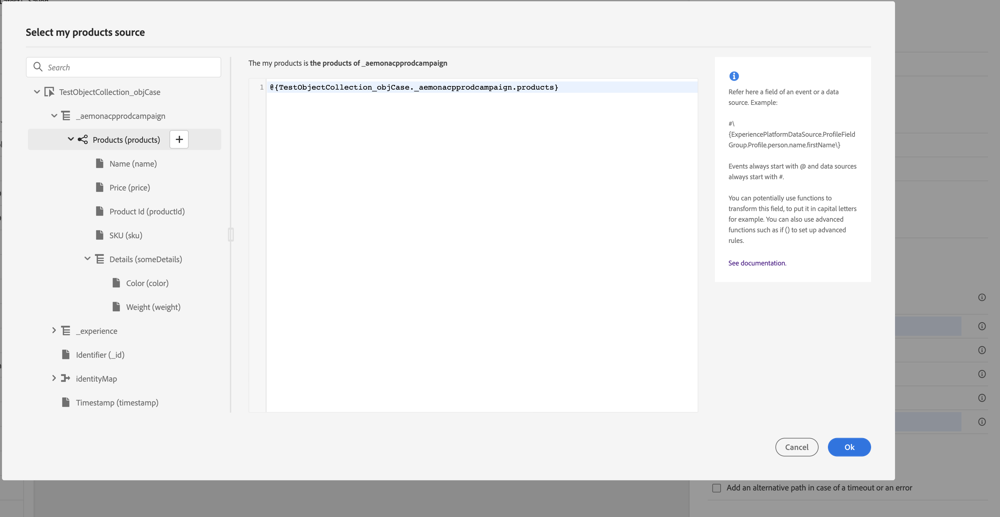
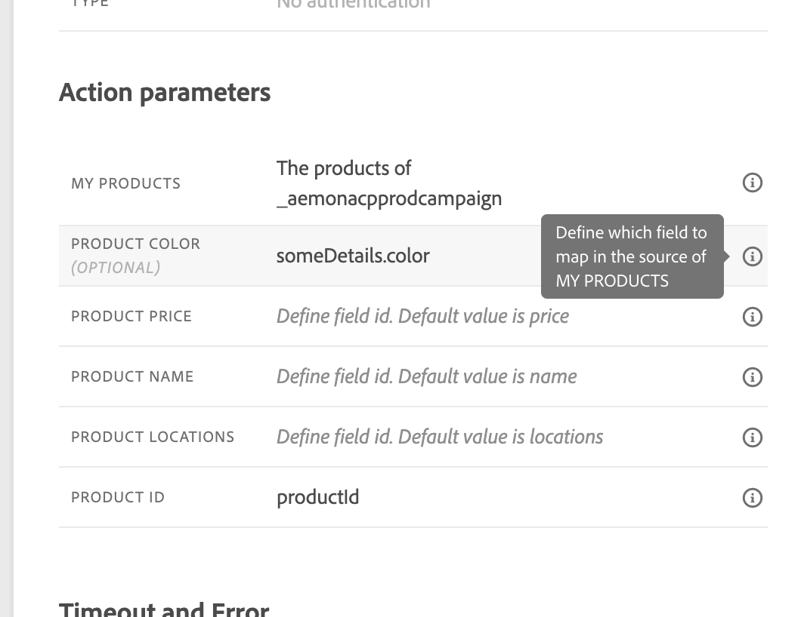

# 사용자 정의 작업으로 컬렉션을 동적으로 보내기{#passing-collection}

런타임 시 동적으로 채워지는 사용자 지정 작업 매개 변수에서 컬렉션을 전달할 수 있습니다. 지원되는 컬렉션은 두 가지입니다.

* 단순 컬렉션: listString과 같은 단순 데이터 유형 배열:

  ```
  {
   "deviceTypes": [
       "android",
       "ios"
   ]
  }
  ```

* 개체 컬렉션: JSON 개체의 배열(예: ).

  ```
  {
  "products":[
     {
        "id":"productA",
        "name":"A",
        "price":20.1
     },
     {
        "id":"productB",
        "name":"B",
        "price":10.0
     },
     {
        "id":"productC",
        "name":"C",
        "price":5.99
     }
   ]
  }
  ```

## 제한 사항 {#limitations}

* 개체 배열 내의 중첩된 개체 배열은 현재 지원되지 않습니다. 예:

  ```
  {
  "products":[
    {
       "id":"productA",
       "name":"A",
       "price":20,
       "locations": [{"name": "Paris"}, {"name": "London"}]
    },
   ]
  }
  ```

* 테스트 모드를 사용하여 컬렉션을 테스트하려면 코드 보기 모드를 사용해야 합니다. 코드 보기 모드는 현재 비즈니스 이벤트에 대해 지원되지 않습니다. 단일 요소가 있는 컬렉션만 보낼 수 있습니다.

## 일반 절차 {#general-procedure}

이 섹션에서는 다음의 JSON 페이로드 예제를 사용합니다. 단순 컬렉션인 필드가 있는 오브젝트 배열입니다.

```
{
  "ctxt": {
    "products": [
      {
        "id": "productA",
        "name": "A",
        "price": 20.1,
        "color":"blue",
        "locations": [
          "Paris",
          "London"
        ]
      },
      {
        "id": "productB",
        "name": "B",
        "price": 10.99
      }
    ]
  }
}
```

&quot;products&quot;는 두 개체의 배열입니다. 하나 이상의 개체가 있어야 합니다.

1. 사용자 지정 작업을 만듭니다. [이 페이지](../action/about-custom-action-configuration.md)를 참조하십시오.

1. **[!UICONTROL Action parameters]** 섹션에 JSON 예제를 붙여 넣습니다. 표시된 구조는 정적입니다. 페이로드를 붙여 넣을 때 모든 필드가 상수로 정의됩니다.

   

1. 필요한 경우 필드 유형을 조정합니다. 컬렉션에는 listString, listInteger, listDecimal, listBoolean, listDateTime, listDateTimeOnly, listDateOnly, listObject 필드 형식이 지원됩니다

   >[!NOTE]
   >
   >페이로드 예제에 따라 필드 유형이 자동으로 유추됩니다.

1. 개체를 동적으로 전달하려면 변수로 설정해야 합니다. 이 예제에서는 &quot;products&quot;를 변수로 설정합니다. 객체에 포함된 모든 객체 필드는 자동으로 변수로 설정됩니다.

   >[!NOTE]
   >
   >페이로드 예제의 첫 번째 객체는 필드를 정의하는 데 사용됩니다.

1. 각 필드에 대해 여정 캔버스에 표시될 레이블을 정의합니다.

   

1. 여정을 만들고 만든 사용자 지정 작업을 추가합니다. [이 페이지](../building-journeys/using-custom-actions.md)를 참조하십시오.

1. **[!UICONTROL Action parameters]** 섹션에서 고급 표현식 편집기를 사용하여 배열 매개 변수(&quot;제품&quot;)를 정의합니다.

   

1. 다음 각 오브젝트 필드에 대해 소스 XDM 스키마의 해당 필드 이름을 입력합니다. 이름이 동일한 경우 이 작업이 필요하지 않습니다. 이 예제에서는 &quot;product id&quot;와 &quot;color&quot;만 정의하면 됩니다.

   

배열 필드의 경우 고급 표현식 편집기를 사용하여 데이터 조작을 수행할 수도 있습니다. 다음 예제에서는 [filter](../functions/functionfilter.md) 및 [intersect](../functions/functionintersect.md) 함수를 사용합니다.


## 특별한 경우{#examples}

이기종 유형 및 배열 배열의 경우 배열은 listAny 형식으로 정의됩니다. 개별 항목만 매핑할 수 있지만 배열을 변수로 변경할 수는 없습니다.


형식이 다른 형식의 예:

```
{
    "data_mixed-types": [
        "test",
        "test2",
        null,
        0
    ]
}
```

배열 배열의 예:

```
{
    "data_multiple-arrays": [
        [
            "test",
            "test1",
            "test2"
        ]
    ]
}
```

**관련 항목**

[사용자 정의 액션 사용](../building-journeys/using-custom-actions.md)
