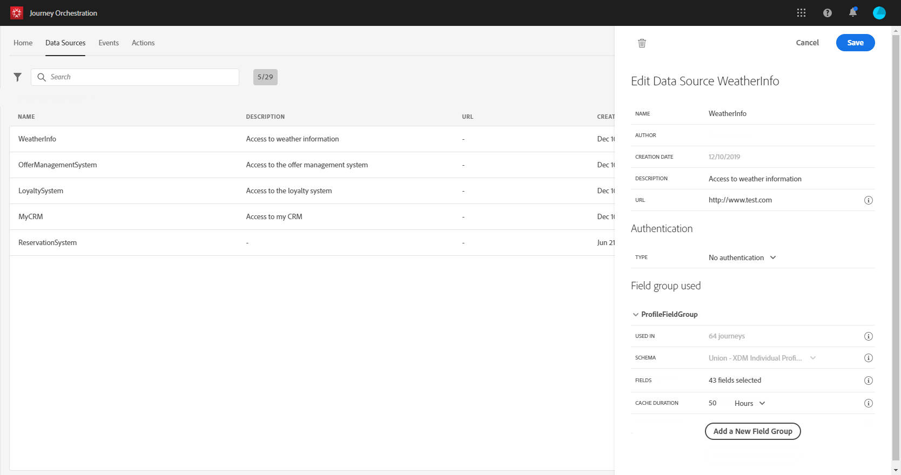

# 데이터 소스 구성{#concept_ax3_bcy_w2b}

>[!CAUTION]
>
>**Adobe Journey Optimizer를 찾고 계신가요**? [여기](https://experienceleague.adobe.com/ko/docs/journey-optimizer/using/ajo-home){target="_blank"}를 클릭하여 Journey Optimizer 설명서를 확인할 수 있습니다.
>
>
>_이 설명서는 Journey Optimizer로 대체된 이전 Journey Orchestration 자료를 참조합니다. Journey Orchestration 또는 Journey Optimizer 액세스에 대한 질문이 있는 경우 계정 팀에 문의하십시오._

사용 사례에서는 메시지에 개인화 데이터를 사용하려고 합니다. 그 사람이 여자인지 확인해야 합니다. 이 정보는 실시간 고객 프로필 데이터베이스에 저장됩니다. **기술 사용자**&#x200B;는 이러한 필드가 기본 제공 Adobe Experience Platform 데이터 원본에 정의되어 있는지 확인해야 합니다.

데이터 원본 구성에 대한 자세한 내용은 [이 페이지](../datasource/about-data-sources.md)를 참조하세요.

1. 메뉴 창에서 **[!UICONTROL Admin]**&#x200B;을(를) 선택합니다. **[!UICONTROL Data sources]** 섹션에서 **[!UICONTROL Manage]**&#x200B;을(를) 클릭합니다.
1. 기본 Adobe Experience Platform 데이터 소스를 선택합니다.

   

1. 필드 그룹에서 다음 필드가 선택되어 있는지 확인합니다.

   * _사용자 > 이름 > 이름_
   * _사용자 > 이름 > 성_
   * _사용자 > 성별_
   * _개인 전자 메일 > 주소_

1. **[!UICONTROL Save]** 아이콘을 클릭합니다.

이제 데이터 소스가 구성되었으며 여정에서 사용할 수 있는 상태가 되었습니다.
