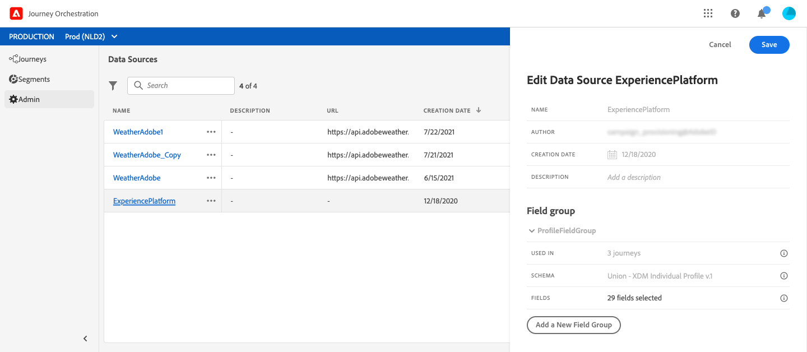

# 데이터 소스 구성 {#concept_vml_hdy_w2b}

사용 사례에서는 메시지에 개인화 데이터를 사용하려고 합니다. 또한 해당 사람이 충성도 멤버이고 지난 24시간 동안 연락을 하지 않았는지 확인해야 합니다. 이 정보는 실시간 고객 프로필 데이터베이스에 저장됩니다. **기술 사용자**&#x200B;는 이러한 필드를 검색하도록 Adobe Experience Platform 데이터 소스를 구성해야 합니다.

데이터 소스 구성에 대한 자세한 내용은 [이 페이지](../datasource/about-data-sources.md)를 참조하십시오.

1. 상단 메뉴에서 **[!UICONTROL Data Sources]** 탭을 클릭하고 내장된 Adobe Experience Platform 데이터 소스를 선택합니다.

   

1. 사전 구성된 그룹 필드에서 다음 필드가 선택되어 있는지 확인합니다.

   * _person > name > firstName_
   * _person > name > lastName_
   * _personalEmail > address_

1. **[!UICONTROL Add a New Field Group]** 을 클릭하고 **[!UICONTROL Profiles]** 스키마를 선택한 다음 조건에 대한 **충성도 멤버** 필드를 추가합니다. **충성도 멤버** 필드는 사용자 지정 필드이며 XDM에 추가되었습니다. &quot;_customer > lmartton > attributesMember&quot;

   

1. **[!UICONTROL Add a New Field Group]** 을 클릭하고 **[!UICONTROL ExperienceEvent]** 스키마를 선택한 다음 지정된 기간에 전송된 메시지 수에 대해 조건에 필요한 필드를 선택합니다. _타임스탬프_(날짜의 경우) 및 _directMarketing > sends > value_)에서 보낸 메시지 수에 대해 설명합니다.

   

1. **[!UICONTROL Save]**&#x200B;을(를) 클릭합니다.

호텔 예약 시스템에 예약하신 분이 있는지 확인해 봐야 합니다 **기술 사용자**&#x200B;는 이 필드를 검색하려면 두 번째 데이터 소스를 구성해야 합니다.

1. 데이터 소스 목록에서 **[!UICONTROL Add]** 를 클릭하여 새 외부 데이터 소스를 추가하여 호텔 예약 시스템에 대한 연결을 정의합니다.

   

1. 데이터 소스의 이름과 외부 서비스의 URL을 입력합니다(예: ). _https://marlton.com/reservation_

   >[!CAUTION]
   >
   >보안상 HTTPS를 사용하는 것이 좋습니다.

1. 외부 서비스 구성에 따라 인증을 구성합니다. **[!UICONTROL No authentication]**, **[!UICONTROL Basic]**, **[!UICONTROL Custom]**, **[!UICONTROL API key]** 중에서 선택할 수 있습니다. 예제에서는 유형에 대해 &quot;기본&quot;을 선택하고 API 호출에 대한 사용자 이름과 암호를 지정합니다.

   

1. 검색할 정보와 API 매개 변수를 정의하려면 **[!UICONTROL Add a New Field Group]** 을 클릭합니다. 예를 들어 매개 변수(id)는 하나만 있으므로 다음 정보를 사용하여 필드 그룹을 하나씩 만들어야 합니다.

   * **[!UICONTROL Method]**: POST 또는 GET 메서드를 선택합니다. 여기서는 GET 메서드를 선택합니다.
   * **[!UICONTROL Cache duration]**: 이것은 API 호출 빈도에 따라 달라집니다. 예약 시스템은 10분마다 갱신됩니다
   * **[!UICONTROL Response Payload]**: 필드 내부 **[!UICONTROL Payload]** 를 클릭하고 페이로드 예제를 붙여넣습니다. 필드 유형이 올바른지 확인합니다. API를 호출할 때마다 시스템은 페이로드 예제에 포함된 모든 필드를 검색합니다. 이 예제의 페이로드에는 예약 상태만 포함됩니다.

   ```
   {
       "reservation" : true
   }
   ```

   * **[!UICONTROL Dynamic Values]**: 각 고객을 식별하는 데 사용되는 키에 해당하는 매개 변수 &quot;id&quot;를 이 예제에서 입력합니다. 이 매개 변수의 값이 여정에 정의됩니다.

   

1. **[!UICONTROL Save]**&#x200B;을(를) 클릭합니다.

   이제 데이터 소스가 구성되었으며 여정에서 사용할 준비가 되었습니다.
