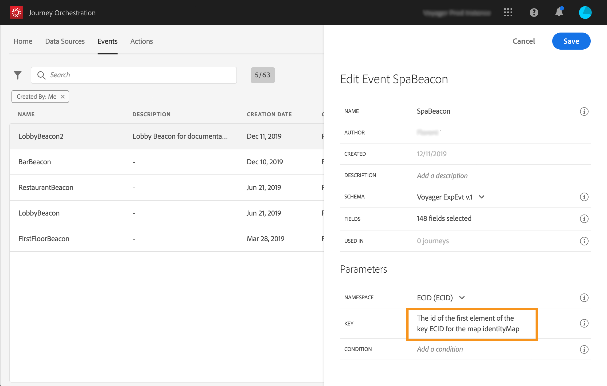

# 이벤트 구성{#concept_y44_hcy_w2b}

시나리오에서, 우리는 한 사람이 스파 옆에 있는 비콘 근처에 걸을 때마다 이벤트를 받아야 합니다. 이 **기술 사용자는** 고객이 귀담아 듣는 이벤트를 구성해야 합니다.

이벤트 구성에 대한 자세한 내용은 를 참조하십시오 .

1. 상단 메뉴에서 **[!UICONTROL Events]** 탭을 클릭하고 아이콘을 클릭하여 새 이벤트 **[!UICONTROL Add]** 를 만듭니다.

   

1. 공백이나 특수 문자 없이 이름을 입력합니다. &quot;SpaBeacon&quot;.

   

   <!--li>Select the **[!UICONTROL Mobile - Streaming Ingestion APIs]** event type. Events are sent from the customers' mobile phone through the Mobile SDK.에 저장됩니다_. 이벤트를 밀어 넣는 시스템은 ID를 생성하지 않아야 하며 페이로드 미리 보기에서 사용할 수 있는 ID를 사용해야 합니다. 사용 사례에서 이 ID는 비콘 위치를 식별하는 데 사용됩니다. 사람이 스파 비콘 가까이 갈 때마다 이 특정 이벤트 ID가 포함된 이벤트가 전송됩니다. 따라서 시스템에서 이벤트 전송을 트리거한 비콘을 알 수 있습니다.

   

   >[!NOTE]
   >
   >필드 목록은 스키마마다 다릅니다. 스키마 정의에 따라 일부 필드는 필수이며 미리 선택될 수 있습니다.

1. 네임스페이스를 선택해야 합니다. 스키마 속성을 기반으로 네임스페이스를 미리 선택합니다. 미리 선택된 상태로 둘 수 있습니다. 네임스페이스에 대한 자세한 내용은 를 참조하십시오 .

   

1. 스키마 속성과 선택한 네임스페이스에 따라 키가 미리 선택됩니다. 보관하셔도 됩니다

   

1. **[!UICONTROL Save]**&#x200B;을 클릭합니다.

1. 시스템에서 필요로 하는 페이로드를 미리 보고 이벤트 전송 책임자와 공유할 수 있습니다. **[!UICONTROL View Payload]** Mobile Services 관리 콘솔의 포스트백에 이 페이로드를 구성해야 합니다.

   

   이 이벤트는 여정에서 사용할 준비가 되었습니다. 이제 모바일 응용 프로그램이 예상 페이로드를 스트리밍 통합 API 끝점으로 보낼 수 있도록 구성해야 합니다. 을 참조하십시오.