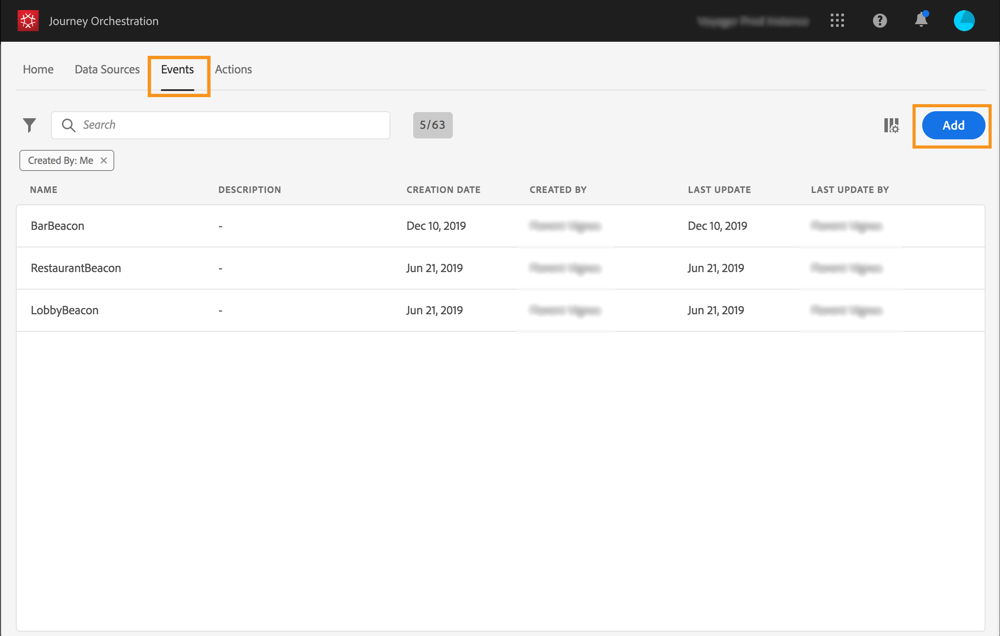

# 이벤트 구성 {#concept_sbp_5cy_w2b}

우리가 시나리오를 하자면, 사람들이 말톤 호텔과 레스토랑에 들어갈 때마다 이벤트를 받아야 한다. **기술 사용자**&#x200B;는 시스템이 여정에서 수신할 두 이벤트를 구성해야 합니다.

이벤트 구성에 대한 자세한 내용은 [이 페이지](../event/about-events.md)를 참조하십시오.

1. 상단 메뉴에서 **[!UICONTROL Events]** 탭을 클릭하고 **[!UICONTROL Add]** 을 클릭하여 새 이벤트를 만듭니다.

   

1. 공백이나 특수 문자가 없는 이름을 입력합니다. &quot;LobbyBeacon&quot;.

   

1. 그런 다음 스키마를 선택하고 이 이벤트에 필요한 페이로드를 정의합니다. XDM 정규화된 모델에서 필요한 필드를 선택합니다. 실시간 고객 프로필 데이터베이스에서 개인을 식별하려면 Experience Cloud ID가 필요합니다. &quot;endUserIDs > _experience > mcid > id&quot;.

   푸시 메시지를 전송하려면 등록 토큰이 필요합니다. &quot;_experience > campaign > 메시지 > 프로필 > pushNotificationTokens > 토큰&quot;

   이 이벤트에 대해 ID가 자동으로 생성됩니다. 이 ID는 **[!UICONTROL eventID]** 필드에 저장됩니다(&quot;_experience > campaign > orchestration > eventID&quot;). 이벤트를 푸시하는 시스템은 ID를 생성하지 않아야 하며 페이로드 미리 보기에서 사용할 수 있는 ID를 사용해야 합니다. 이 사용 사례에서는 이 ID가 비콘 위치를 식별하는 데 사용됩니다. 사람이 로비 비콘 근처에 방문할 때마다 이 특정 이벤트 ID가 포함된 이벤트가 전송됩니다. 동일한 원칙은 레스토랑 비콘 이벤트에 적용됩니다. 이렇게 하면 시스템에서 이벤트 전송을 트리거한 비콘을 알 수 있습니다.

   

   >[!NOTE]
   >
   >필드 목록은 스키마마다 다릅니다. 스키마 정의에 따라 일부 필드는 필수 필드이며 미리 선택되어 있을 수 있습니다.

1. 네임스페이스를 선택해야 합니다. 스키마 속성을 기반으로 네임스페이스를 미리 선택합니다. 미리 선택된 상태로 둘 수 있습니다. 네임스페이스에 대한 자세한 내용은 [이 페이지](../event/selecting-the-namespace.md)를 참조하십시오.

   

1. 키 선택 시 스키마 속성 및 선택한 네임스페이스에 따라 키가 미리 선택됩니다. 보관이 가능합니다

   

1. **[!UICONTROL Save]**&#x200B;을(를) 클릭합니다.

1. **[!UICONTROL View Payload]** 아이콘을 클릭하여 시스템에 필요한 페이로드를 미리 보고 이벤트 전송을 담당하는 사람과 공유할 수 있습니다.  이 페이로드는 Mobile Services 관리 콘솔의 포스트백에 구성해야 합니다.

   

동일한 방법으로 &quot;RestaurantBeacon&quot; 이벤트를 만듭니다. 두 개의 비콘 이벤트가 생성되어 이제 여정에서 사용할 수 있습니다. 이제 예상되는 페이로드를 스트리밍 수집 API 엔드포인트로 보낼 수 있도록 모바일 애플리케이션을 구성해야 합니다. [이 페이지](../event/additional-steps-to-send-events-to-journey-orchestration.md)를 참조하십시오.
