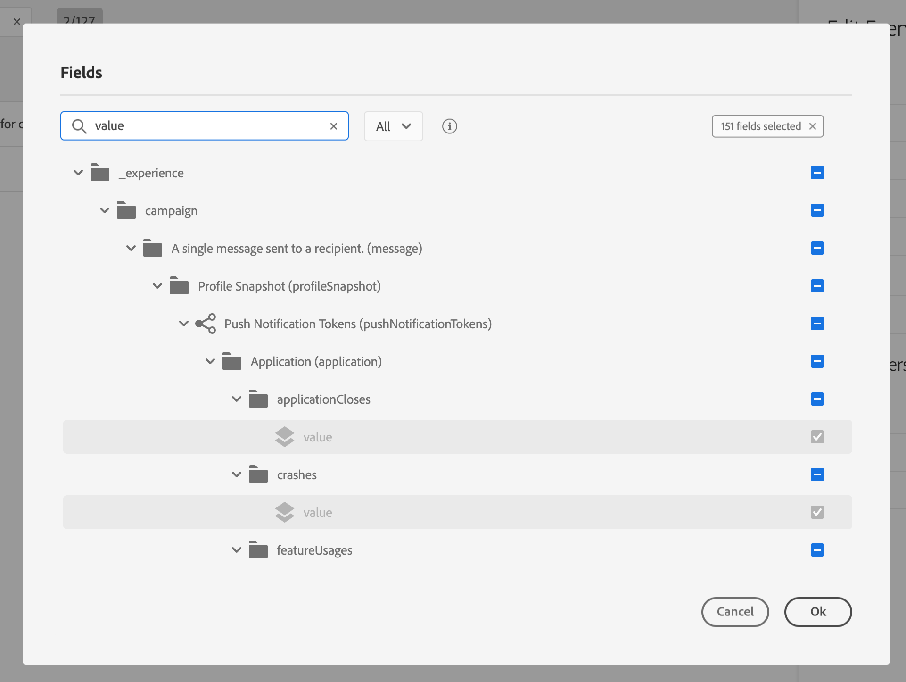

# 이벤트 구성 {#concept_sbp_5cy_w2b}

>[!CAUTION]
>
>**Adobe Journey Optimizer을 찾고 계십니까**? Journey Optimizer 설명서를 보려면 [여기](https://experienceleague.adobe.com/ko/docs/journey-optimizer/using/ajo-home){target="_blank"}를 클릭하십시오.
>
>
>_이 설명서는 Journey Optimizer으로 대체된 기존 Journey Orchestration 자료를 참조합니다. Journey Orchestration 또는 Journey Optimizer 액세스에 대한 질문이 있는 경우 계정 팀에 문의하십시오._

우리의 시나리오에서는 사람이 말튼 호텔과 레스토랑에 들어갈 때마다 이벤트를 받아야 합니다. **기술 사용자**&#x200B;는 시스템이 여정에서 수신할 두 이벤트를 구성해야 합니다.

이벤트 구성에 대한 자세한 내용은 [이 페이지](../event/about-events.md)를 참조하세요.

1. 상단 메뉴에서 **[!UICONTROL Events]** 탭을 클릭하고 **[!UICONTROL Add]**&#x200B;을(를) 클릭하여 새 이벤트를 만듭니다.

   

1. 이름은 공백이나 특수 문자 없이 &quot;LobbyBeacon&quot;으로 입력합니다.

   

1. 그런 다음 스키마를 선택하고 이 이벤트에 필요한 페이로드를 정의합니다. 우리는 XDM 정규화된 모델에서 필요한 필드를 선택합니다. 실시간 고객 프로필 데이터베이스에서 사용자를 식별하려면 Experience Cloud ID가 필요합니다. &quot;endUserIDs > _experience > mcid > id&quot;.

   푸시 메시지를 전송하려면 등록 토큰도 필요합니다. &quot;_experience > campaign > message > 프로필 > pushNotificationTokens > token&quot;

   이 이벤트에 대한 ID가 자동으로 생성됩니다. 이 ID는 **[!UICONTROL eventID]** 필드(&quot;_experience > campaign > orchestration > eventID&quot;)에 저장됩니다. 이벤트를 푸시하는 시스템은 ID를 생성하지 않아야 하며 페이로드 미리 보기에서 사용할 수 있는 ID를 사용해야 합니다. 이 사용 사례에서는 이 ID를 사용하여 비콘 위치를 식별합니다. 사용자가 로비 비콘 근처에 걸을 때마다 이 특정 이벤트 ID가 포함된 이벤트가 전송됩니다. 레스토랑 비콘 이벤트에도 동일한 원칙이 적용됩니다. 이렇게 하면 시스템에서 이벤트 전송을 트리거한 비콘을 알 수 있습니다.

   

   >[!NOTE]
   >
   >필드 목록은 스키마마다 다릅니다. 스키마 정의에 따라 일부 필드는 필수이고 미리 선택될 수 있습니다.

1. 네임스페이스를 선택해야 합니다. 스키마 속성을 기반으로 네임스페이스를 미리 선택합니다. 미리 선택된 상태로 둘 수 있습니다. 네임스페이스에 대한 자세한 내용은 [이 페이지](../event/selecting-the-namespace.md)를 참조하세요.

   

1. 스키마 속성 및 선택한 네임스페이스를 기반으로 키를 미리 선택합니다. 가져도 돼요

   

1. **[!UICONTROL Save]**&#x200B;을(를) 클릭합니다.

1. **[!UICONTROL View Payload]** 아이콘을 클릭하여 시스템에서 예상하는 페이로드를 미리 보고 이벤트 전송을 담당하는 사람과 공유합니다.  이 페이로드는 Mobile Services 관리 콘솔의 포스트백에서 구성해야 합니다.

   

같은 방법으로 &quot;RestaurantBeacon&quot; 이벤트를 만듭니다. 두 개의 비콘 이벤트가 생성되었으며 이제 여정에서 사용할 수 있습니다. 이제 스트리밍 수집 API 엔드포인트에 예상 페이로드를 전송할 수 있도록 모바일 애플리케이션을 구성해야 합니다. [이 페이지](../event/additional-steps-to-send-events-to-journey-orchestration.md)를 참조하십시오.
