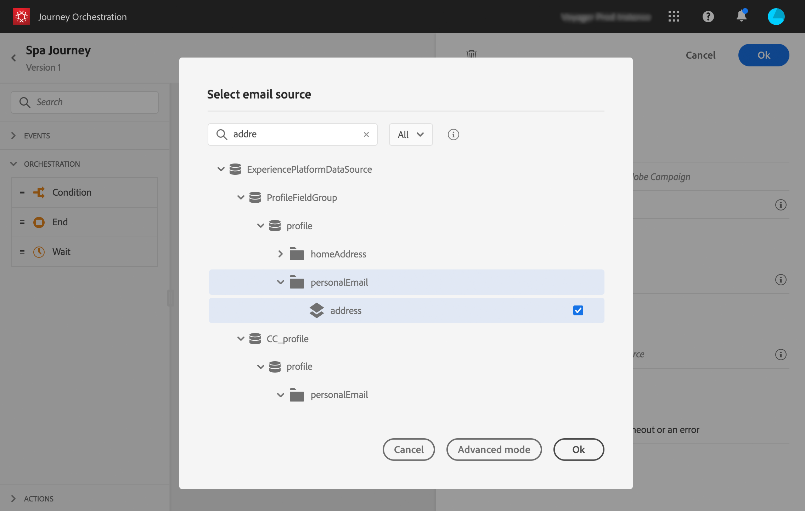

# 여정 구축{#concept_eyw_mcy_w2b}

이제 **비즈니스 사용자가** 고객 여정 구축 다음 활동이 포함된 하나의 경로만 Adobe에 포함됩니다.

* &quot;SpaBeacon&quot; **[!UICONTROL Event]**: 스파 비콘 등을 산책하면 자동으로 이벤트를 받게 되고, 그 사람을 위한 여정이 시작된다.
* 그 사람이 여자인지 확인하는 **[!UICONTROL Condition]** 활동
* 활동(Adobe Campaign Standard 사용) **[!UICONTROL Email]**
* 활동 **[!UICONTROL End]**

>[!NOTE]
>
>Adobe Campaign Standard이 있는 경우 **[!UICONTROL Push]** 및 **[!UICONTROL Email]** 활동은 팔레트에서만 사용할 수 있습니다.

여정을 구성하는 방법에 대한 자세한 내용은 를 참조하십시오 .

1. 상단 메뉴에서 **[!UICONTROL Home]** 탭을 클릭하고 새 경로 **[!UICONTROL Create]** 를 만듭니다.

   

1. 오른쪽에 표시되는 구성 창에서 경로 속성을 편집합니다. 우리는 그것을 &quot;스파 여행&quot;이라고 명하며, 1일부터 12월 31일까지 한 달 동안 지속되도록 설정합니다.

   

1. 팔레트에서 캔버스로 &quot;SpaBeacon&quot; 이벤트를 드래그하여 놓아 여행 디자인을 시작합니다. 팔레트에서 이벤트를 두 번 클릭하여 캔버스에 추가할 수도 있습니다.

   

1. 이제 그 사람이 여성인지 확인하는 조건을 추가합시다. 조건 활동을 여정에 드래그하여 놓습니다.

   

1. 유형을 **[!UICONTROL Data Source Condition]** 선택하고 **[!UICONTROL Expression]** 필드를 클릭합니다. 캔버스에서 화살표에 나타날 조건 레이블을 정의할 수도 있습니다.

   

1. 간단한 표현식 편집기를 사용하여 성별 필드(_사람 > 성별_)를 찾아 오른쪽에 놓아 다음 조건을 만듭니다. &#39;성별&#39;은 &#39;여성&#39;과 같다.

   

1. 활동을 **[!UICONTROL Email]** 중단하고 &quot;Spa Discount&quot; 트랜잭션 메시지 템플릿을 선택합니다. 이 템플릿은 Adobe Campaign을 사용하여 디자인되었습니다. 이 [페이지를 참조하십시오](https://docs.adobe.com/content/help/ko-KR/campaign-standard/using/communication-channels/transactional-messaging/about-transactional-messaging.html).

   

1. 필드 내부를 **[!UICONTROL Email]** 클릭하고 데이터 소스에서 이메일 주소를 선택합니다.

   

1. 동일한 방식으로 데이터 소스에서 이름 및 성 개인화 필드를 정의합니다.

   

1. 활동을 **[!UICONTROL End]** 삭제합니다.

   

1. 테스트 프로필을 사용하여 전환 **[!UICONTROL Test]** 및 테스트를 클릭합니다. 오류가 있는 경우 테스트 모드를 비활성화하고 경로를 수정한 후 다시 테스트하십시오. 테스트 모드에 대한 자세한 내용은 을 참조하십시오 .

   

1. 테스트가 확정되면 오른쪽 상단 드롭다운 메뉴에서 여정을 게시할 수 있습니다.

   

다음번에는 스파 비콘 등을 걸으면 바로 개인화된 이메일을 받게 된다.
